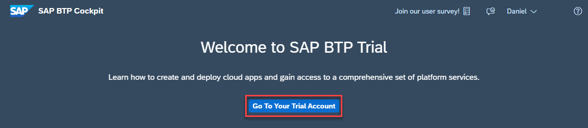

# Session DA262 - SAP HANA Cloud from an administrator's perspective

## Description

This repository contains the material for the SAP TechEd 2023 session called DA262 - SAP HANA Cloud from an administrator's perspective.  

## Overview

This session introduces attendees to the end-to-end picture of operations required for running the SAP HANA Cloud database, using the Web-based tools SAP HANA Cloud Central and SAP HANA database explorer. 

## Requirements

To complete this workshop, you need access to an SAP Business Technology Platform (SAP BTP) account. You can access SAP HANA Cloud from within SAP BTP and you can use a trial, free tier,  or productive version of SAP HANA Cloud.  **This workshop assumes that you already have a SAP BTP account and an SAP HANA Cloud database.**  If not, you can register for free at https://www.sap.com/cmp/td/sap-hana-cloud-trial.html.  The exercises make use of a **trial account**, but a [free tier](https://developers.sap.com/tutorials/btp-free-tier-account.html) account can also be used.  A benefit of using free tier is that the account can be upgraded to a paid service plan without having to re-create the account but may take longer to signup.

After registering for a trial account using the link above, open your SAP BTP Cockpit and get started by creating a SAP HANA Cloud instances.

1. Open the [welcome page](https://account.hanatrial.ondemand.com/trial/#/home/trial) and go to your trial account.
    

2. Enter the subaccount.

    

3. Navigate to **Instances and Subscriptions** and then add a subscription to the **SAP HANA Cloud tooling**.  

    

    For the service select **SAP HANA Cloud** and for the plan select **tools**.

    

    A new subscription to SAP HANA Cloud Central will appear.

    

4. To access the tools three roles are provided:

    * SAP HANA Cloud Administrator 

    *  SAP HANA Cloud Security Administrator - provides the ability to reset the DBADMIN and HDLADMIN passwords

    * SAP HANA Cloud Viewer - provides read-only access to SAP HANA Cloud Central

    Navigate to **Security > Users** and click on your user.  

    
    
    Click on **Assign Role Collection**.

    
    
     Add the role collection **SAP HANA Cloud Administrator**.

5.	Under Instances and Subscriptions, open SAP HANA Cloud Central.

    

6.	Click the button **Create** in the top right and select SAP HANA Cloud, SAP HANA Database to invoke the Create Instance wizard.  
    > Only one instance of a HANA Cloud database can be created in trial or free tier accounts.  If you already have an SAP HANA Cloud database instance created, it can be used.
    
    

7.  Choose **SAP HANA Cloud, SAP HANA Database** and click the button **Next Step**.

8.  Use default values for the remainder of the wizard, with the following exceptions:
    * In Step 2 (General), enter **DEMO_HANA_DB** for the instance name. Enter and confirm your administrator password – ***PLEASE REMEMBER IT AND/OR WRITE IT DOWN!***
    * In Step 6 (Data Lake), turn on the toggle switch to Create Data Lake. Enter **DEMO_HANA_HDL** for the instance name.

9.	Complete the wizard.

    The SAP HANA Cloud instances DEMO_HANA_DB and DEMO_HANA_HDL will be created, and this process may take  approx. 10 minutes.  The frequency of updates to the page can be set using the auto-refresh feature in the top right.  Once the instances are created, their status will change to RUNNING.

    

## Exercises

Provide the exercise content here directly in README.md using [markdown](https://guides.github.com/features/mastering-markdown/) and linking to the specific exercise pages, below is an example.

- [Getting Started](exercises/ex0/)
- [Exercise 1 - First Exercise Description](exercises/ex1/)
    - [Exercise 1.1 - Exercise 1 Sub Exercise 1 Description](exercises/ex1#exercise-11-sub-exercise-1-description)
    - [Exercise 1.2 - Exercise 1 Sub Exercise 2 Description](exercises/ex1#exercise-12-sub-exercise-2-description)
- [Exercise 2 - Second Exercise Description](exercises/ex2/)
    - [Exercise 2.1 - Exercise 2 Sub Exercise 1 Description](exercises/ex2#exercise-21-sub-exercise-1-description)
    - [Exercise 2.2 - Exercise 2 Sub Exercise 2 Description](exercises/ex2#exercise-22-sub-exercise-2-description)

  
**OR** Link to the Tutorial Navigator for example...

Start the exercises [here](https://developers.sap.com/tutorials/abap-environment-trial-onboarding.html).

**IMPORTANT**

Your repo must contain the .reuse and LICENSES folder and the License section below. DO NOT REMOVE the section or folders/files. Also, remove all unused template assets(images, folders, etc) from the exercises folder. 

## Contributing
Please read the [CONTRIBUTING.md](./CONTRIBUTING.md) to understand the contribution guidelines.

## Code of Conduct
Please read the [SAP Open Source Code of Conduct](https://github.com/SAP-samples/.github/blob/main/CODE_OF_CONDUCT.md).

## How to obtain support

Support for the content in this repository is available during the actual time of the online session for which this content has been designed. Otherwise, you may request support via the [Issues](../../issues) tab.

## License
Copyright (c) 2023 SAP SE or an SAP affiliate company. All rights reserved. This project is licensed under the Apache Software License, version 2.0 except as noted otherwise in the [LICENSE](LICENSES/Apache-2.0.txt) file.
