# Exercise 1 - Launch the SAP HANA Database Explorer

In addition to browsing schema objects and executing SQL, the SAP HANA database explorer enables importing and exporting data with wizards, debugging SQLScript, working with multi-model data such as graph, spatial and JSON collections,  viewing trace files, and creating remote sources.  It also offers support for data lake Relational Engine and data lake Files connections.  Additional information including [what's new](https://help.sap.com/whats-new/2495b34492334456a49084831c2bea4e?Category=SAP%2520HANA%2520Database%2520Explorer&locale=en-US) can be found by consulting the product documentation from the help icon.

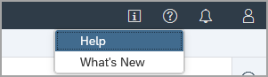

In this exercise, we will launch an instance of the SAP HANA database explorer and walk through some of the features relating to HANA database connections.  In later exercises, the Catalog Browser, SQL console, and the database explorer extension will be covered. 

## Exercise 1.1 Open the SAP HANA Database Explorer

1. From either the SAP BTP Cockpit or from SAP HANA Cloud Central, select the SAP HANA instance and choose **Open in SAP HANA Database Explorer**.

    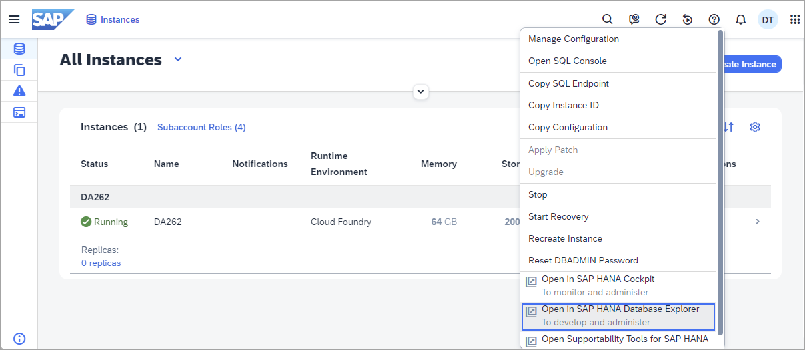

    You may be prompted to enter database login credentials at this point. Enter **DBADMIN** for the user and the password that was specified in the SAP HANA instance creation wizard.

    >Credentials for a cockpit database can be persisted by setting them within the SAP HANA cockpit which is covered later in this workshop.  
    >
    >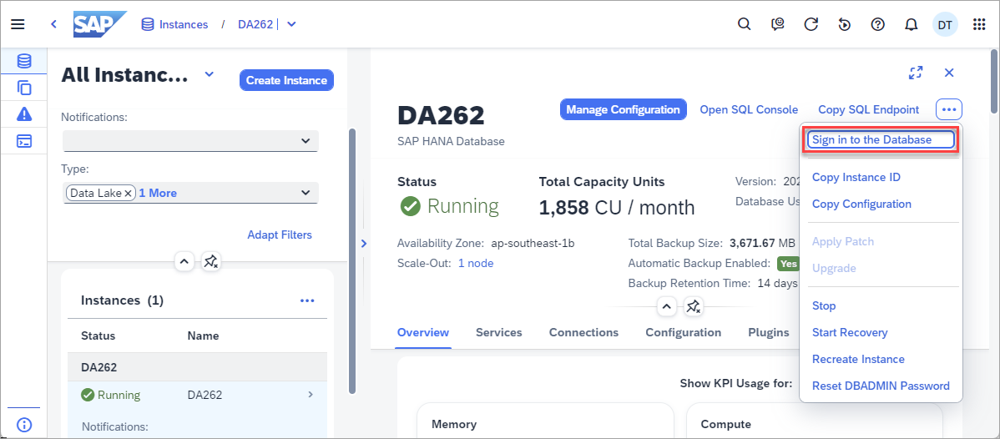
    
## Exercise 1.2 Examine the Database Instance

1. Hover over your instance to show the context menu. A summary should appear that identifies the type as a cockpit database.

    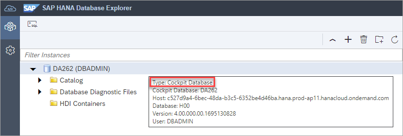

     Right-click on the instance name and select **Show Overview**. The release your instance belongs to can be identified by looking at the version fields.

    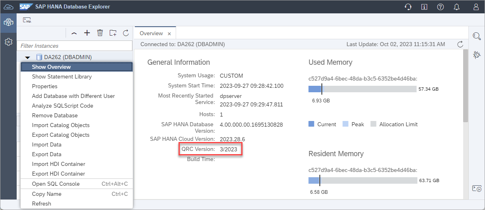

    *In this example, the instance is the QRC 3 2022 release.*

## Exercise 1.3 Search For a View Using a Schema Filter

1. Click the arrow next to the database icon to expand the object hierarchy for the instance. You will see that it holds catalog objects and database diagnostic files (trace files, or log files), and with the appropriate permissions, a list of HDI containers contained in the instance.  Expand **Catalog** then select **Views**.

    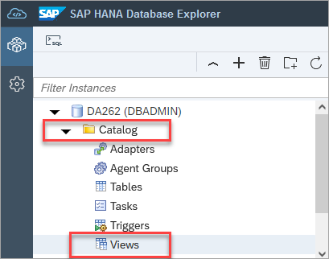

      Directly above the list of views are search bars for schema and objects. Use the schema and object search  at the bottom left of your screen to search for the **SYS** schema and views that begin with **M_HOST**. 
    
    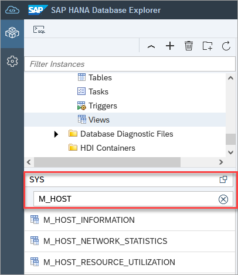
    
    Right-click on the view **M_HOST_INFORMATION** and select **Open Data** to see the data of a view.  
    
    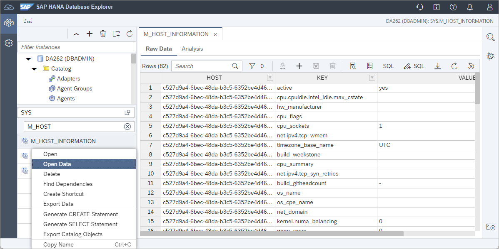

    More information on the SAP HANA monitoring views can be found at [Monitoring Views](https://help.sap.com/viewer/c1d3f60099654ecfb3fe36ac93c121bb/2021_3_QRC/en-US/d3c10d23e8334a35afa8d9bdbc102366.html). 

## Exercise 1.4 Set the Instance's Usage

1. Users may benefit from visual clues identifying  production instance. This next step will demonstrate how to label production instances, and how to remove the production label from an instance. To enable this, use the SQL console to run the statements below and refresh your browser.
   
    >To open the SQL console, right-click on the instance and select **Open SQL Console** or click on the toolbar icon in the top left after selecting an instance.  

    >To execute SQL commands, click on the green run arrow.

    >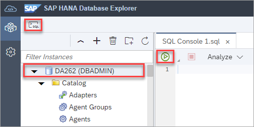

    ```SQL
    SELECT * FROM M_INIFILE_CONTENTS WHERE KEY = 'usage';
    ALTER SYSTEM ALTER CONFIGURATION ('global.ini', 'DATABASE') SET ('system_information', 'usage') = 'production' WITH RECONFIGURE;
    ```

    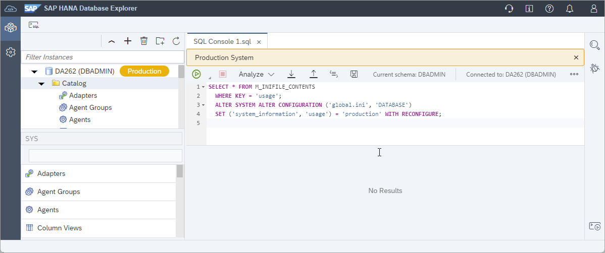

    >Note: Remember to refresh your browser window once you've run the above statement.

    As this instance is not a production instance, we can turn off this setting by executing the below SQL statement.

    ```SQL
    ALTER SYSTEM ALTER CONFIGURATION ('global.ini', 'DATABASE') SET ('system_information', 'usage') = 'custom' WITH RECONFIGURE;
    ```

## Exercise 1.5 Add the Instance to a Group

1. Instances can be organized by creating groups. Use the folder icon  to create a new group and drag and drop the connection into it.

    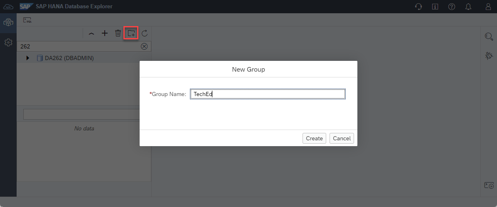

    An instance can be quickly found using the filter as shown below.
    
    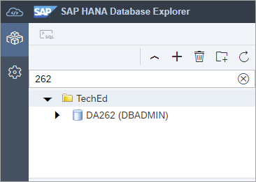

This concludes the exercise on launching and exploring instances in the SAP HANA database explorer.

Continue to - [Exercise 2 - Catalog Browser and Object Search](../ex2/README.md)
