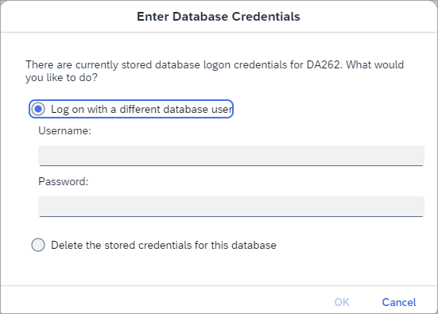
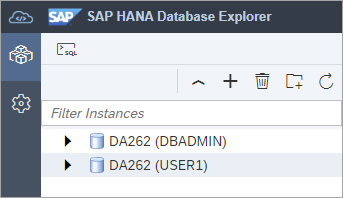
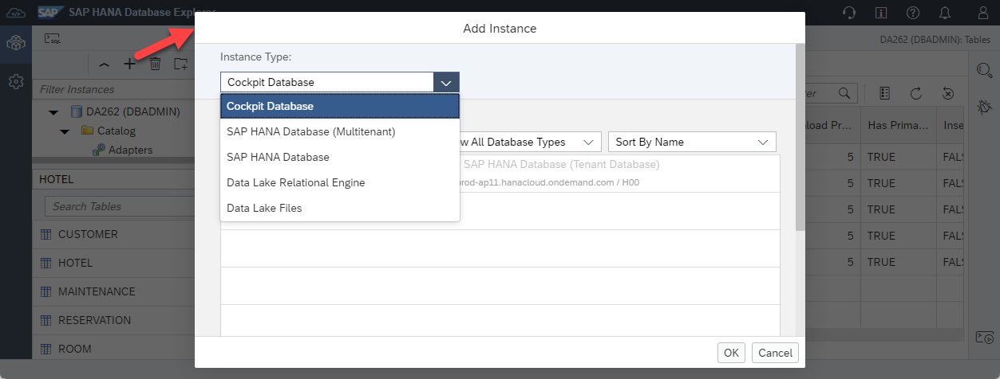
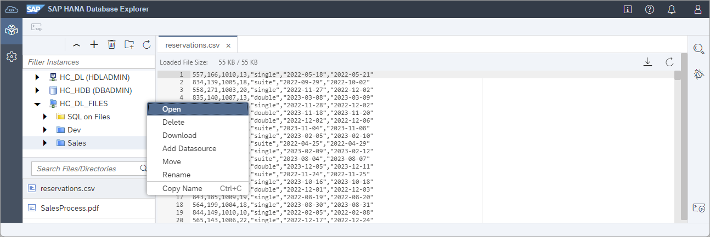

# Exercise 1 - Instances in the SAP HANA Database Explorer

The SAP HANA database explorer enables schema browsing and contains a SQL Console with slightly different functionality from SAP HANA Cloud Central.  The SAP HANA database explorer enables importing and exporting data with wizards, debugging SQLScript, working with multi-model data such as graph, spatial and JSON collections,  viewing trace files, and creating remote sources.  It also offers support for data lake Relational Engine and data lake Files connections.  Additional information including [what's new](https://help.sap.com/whats-new/2495b34492334456a49084831c2bea4e?Category=SAP%2520HANA%2520Database%2520Explorer&locale=en-US) can be found by consulting the product documentation from the help icon.


In this exercise, we will launch an instance of the SAP HANA database explorer and walk through some of the features relating to HANA database connections.  In later exercises, the Catalog Browser and SQL console will be covered. 

## Exercise 1.1 Open the SAP HANA Database Explorer

1. From SAP HANA Cloud Central, select the SAP HANA instance and choose **Open in SAP HANA Database Explorer**.

    

    You may be prompted to enter database login credentials at this point. Enter **DBADMIN** for the user and the password that was provided in the workshop or specified in the SAP HANA instance creation wizard.

    >Credentials for a database opened from SAP HANA Cloud Central are managed by SAP HANA Cloud Central.  
    >
    >
    >
    >
    
## Exercise 1.2 Examine the Database Instance

1. Hover over your instance to show the context menu. A summary should appear that identifies the type as a Cockpit Database.

    

     Right-click on the instance name and select **Show Overview**. The release your instance belongs to can be identified by looking at the QRC Version field.

    

    *In this example, the instance is the QRC 3 2023 release.*

## Exercise 1.3 Set the Instance's Usage
Users may benefit from visual clues identifying  production instances. This next step will demonstrate how to label production instances, and how to remove the production label from an instance. 

1. Use the SQL console to run the statements below and refresh your browser.
   
    >To open the SQL console, right-click on the instance and select **Open SQL Console** or click on the toolbar icon in the top left after selecting an instance.  

    >To execute SQL commands, click on the green run arrow.

    >

    ```SQL
    SELECT * FROM M_INIFILE_CONTENTS WHERE KEY = 'usage';
    ALTER SYSTEM ALTER CONFIGURATION ('global.ini', 'DATABASE') SET ('system_information', 'usage') = 'production' WITH RECONFIGURE;
    ```

    

    >Remember to refresh your browser window once you've run the above statement.

    As this instance is not a production instance, we can turn off this setting by executing the below SQL statement.

    ```SQL
    ALTER SYSTEM ALTER CONFIGURATION ('global.ini', 'DATABASE') SET ('system_information', 'usage') = 'custom' WITH RECONFIGURE;
    ```

## Exercise 1.4 Add the Instance to a Group
Instances can be organized by creating groups. 

1. Use the folder icon  to create a new group and drag and drop the connection into it.

    

    An instance can be quickly found using the filter as shown below.
    
    

## Exercise 1.5 Add an Instance with Different Credentials

1. Add a new instance with a different set of credentials.

    

    Provide the user name and password.
    
    Name | Value
    ------ | ------
    User ID | USER1 |
    Password | Password1 |
    
    Update the **Display Name** to DA262 (USER1). 

    

    After clicking OK, a new instance is added that is using a different set of credentials.

    

## Exercise 1.6 Data lake Relational Engine and data lake Files Connections
 
Additional instance connection types can be added using the **Add Instance Dialog** as shown below.



A data lake Relational Engine connection enables the database explorer to connect to an instance that is disk based and can store and query large amounts of structured data.

A data lake Files connection enables the browsing and management of semi and unstructured files as shown below.



Additional details can be found in the tutorial [Add Databases to the SAP HANA Database Explorer](https://developers.sap.com/tutorials/hana-dbx-connections.html).

This concludes the exercise on launching and exploring instances in the SAP HANA database explorer.

Continue to - [Exercise 2 - Catalog Browser and Object Search](../ex2/README.md)
