# Exercise 2 - Catalog Browser and Object Search

In this exercise, we will explore some of the functionality that the catalog browser and object search provide when working with database objects.

## Exercise 2.1 Viewing a List of Database Objects

1. Database objects can be viewed in the catalog browser as shown below after selecting the HDI container connection and then **Tables**.

    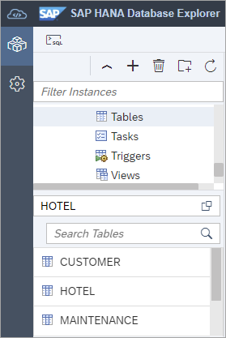

    Alternatively, a table can be found by selecting **Tables** and choosing **Show Tables** from the context menu.
    
    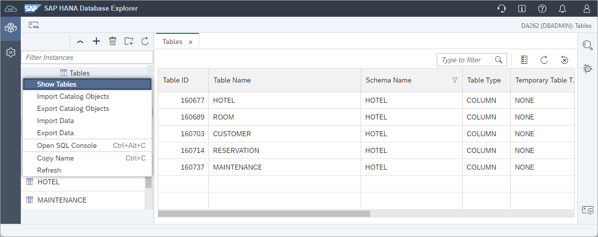

    *Additional filters can be applied in this view by clicking on the column header and the list of columns displayed can specified.*

## Exercise 2.2 Viewing a Database Object's SQL

1. A create, select, or insert statement can be generated as shown below.

    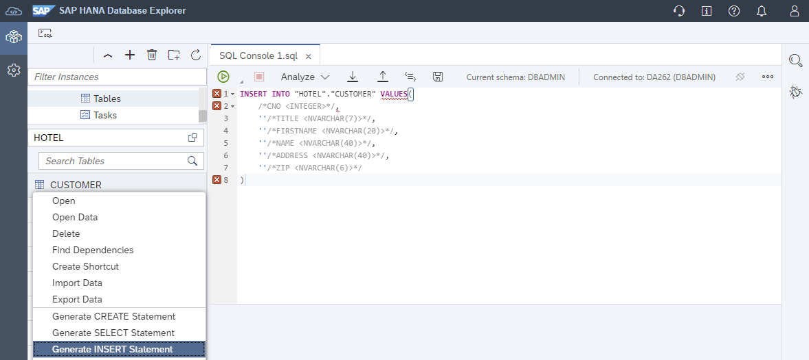

2. A stored procedure's create statement can be viewed on its properties page.

    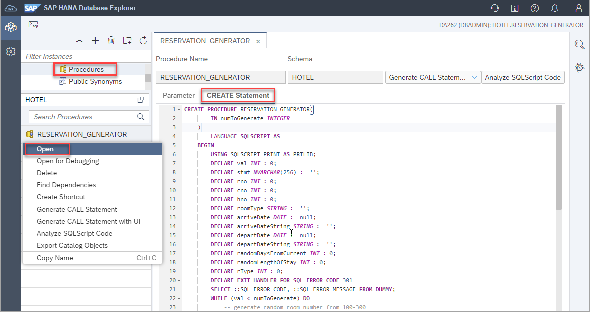

## Exercise 2.3 Debugging a Stored Procedure

1. A graphical debugger can be used.  Add a breakpoint on line 19.

    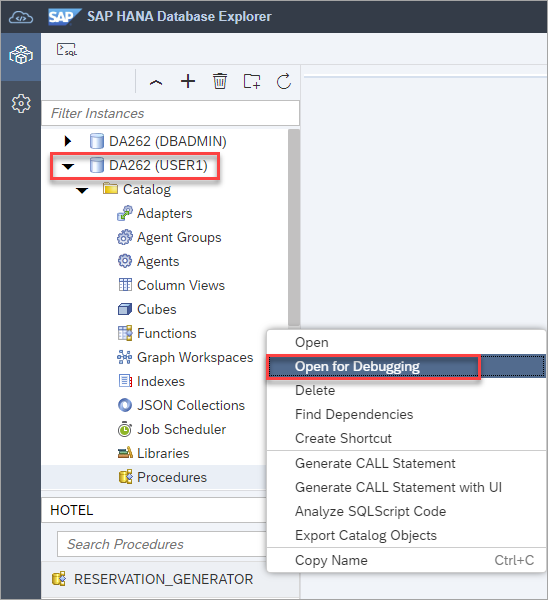
  
2. To trigger the breakpoint, call the stored procedure.

    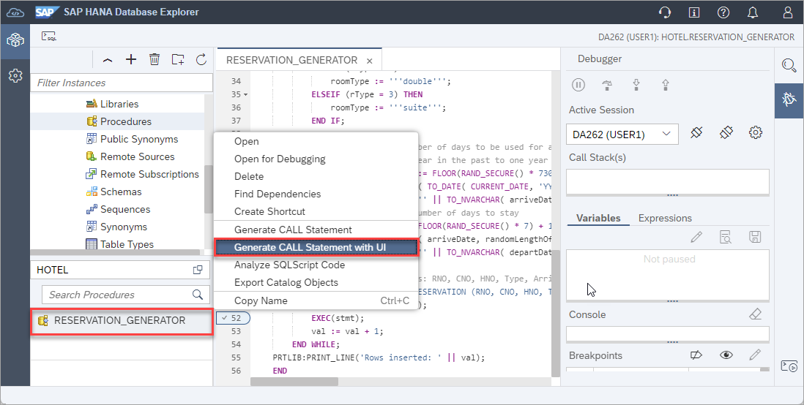

3. Once the breakpoint has been hit, the variables can be examined, and the code stepped through.

    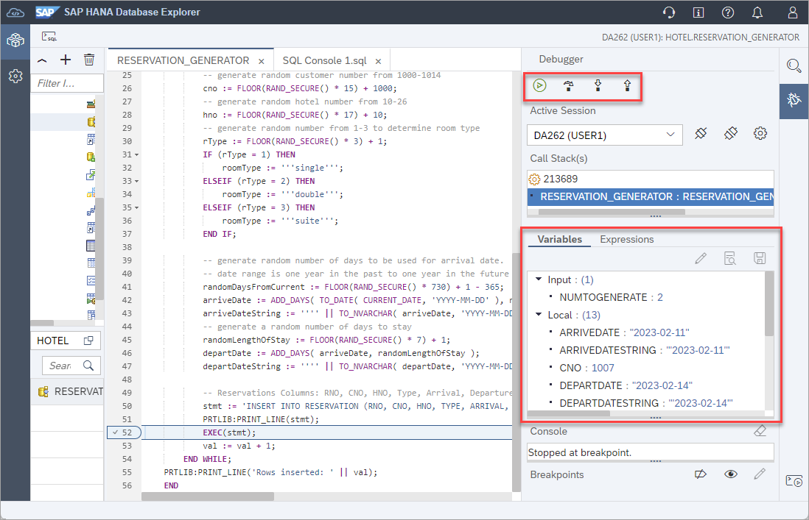

## Exercise 2.4 Analyzing Stored Procedures

1. The source code for a specific stored procedure, for all stored procedures in a schema, or for all stored procedures in a database can also be analyzed.  This can provide suggestions for code quality, security, or performance.

    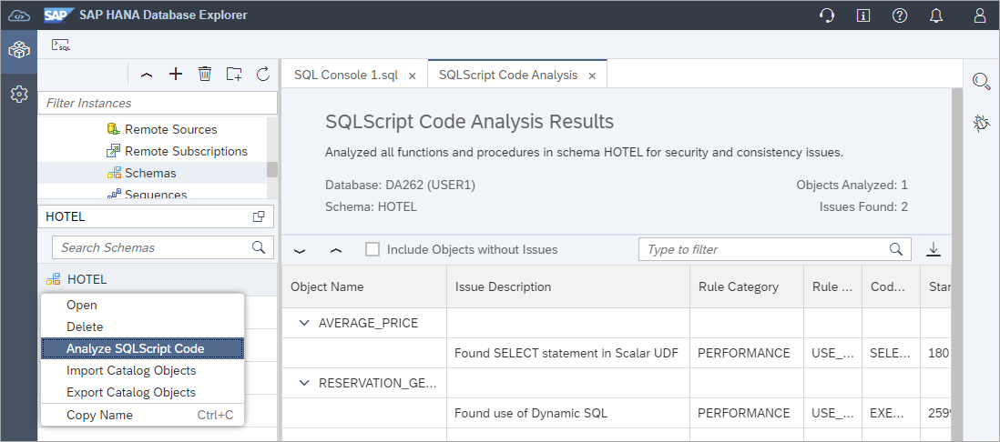

    To view more details, double click on a row.

    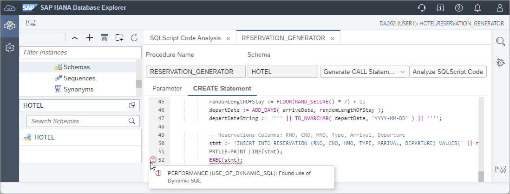
    
    *Note that the input parameter is not referenced.*

## Exercise 2.5 Using Object Search

1. Database objects can also be found using **Object Search**.  The search shown below looks for any objects that use FLIGHTRESERVATION in their schema name in the HDI container. 

    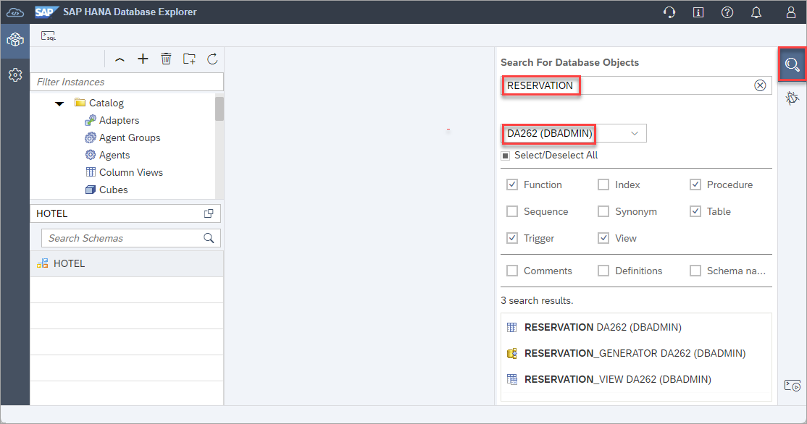

    A found object can be double clicked on to open its properties page.

    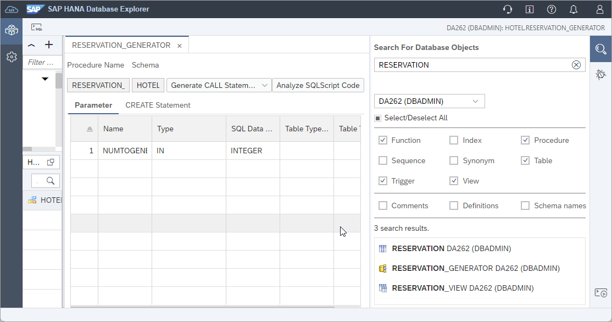
    
    It is also possible to reveal the item in the Catalog Browser after selecting **Display in Database Browser**.

## Exercise 2.6 Database Diagnostic Files

1. Database diagnostic files can also be viewed or downloaded. 

    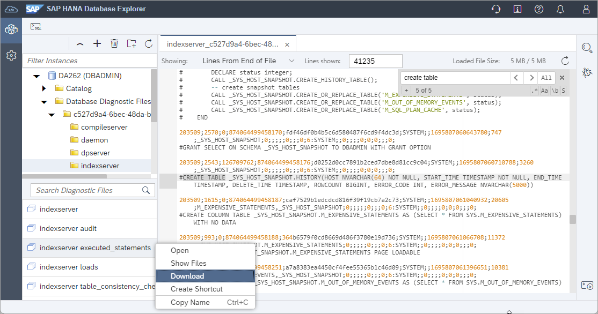

    Additional instructions showing how to enable a SQL and expensive statement trace are available in the tutorial [Troubleshoot SQL with SAP HANA Database Explorer](https://developers.sap.com/tutorials/hana-dbx-troubleshooting.html).  For more on executed statement tracing see [SAP Note: 2366291 - FAQ: SAP HANA Executed Statements Trace](https://launchpad.support.sap.com/#/notes/2366291).

This concludes the exercises on the catalog browser and object search.

Continue to - [Exercise 3 - Using the SQL Console](../ex3/README.md)