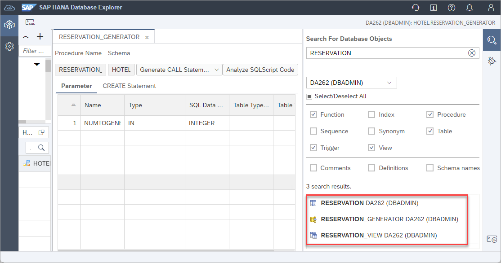

# Exercise 2 - Catalog Browser and Object Search

In this exercise, we will explore some of the functionality that the catalog browser and object search provide when working with database objects.

## Exercise 2.1 Viewing a List of Database Objects
Database objects such as tables, views, functions, and procedures can be viewed in the catalog browser.

1. Expand the **Catalog** and select **Views**.  

    

2. Directly above the list of views are filters for schema name and object name. Use the schema and object filters to search for the view **M_HOST_INFORMATION**. 
    
    
    
3. Right-click on the view **M_HOST_INFORMATION** and select **Open Data** to see the data of this view.  
    
    

    More information on the SAP HANA monitoring views can be found at [Monitoring Views](https://help.sap.com/viewer/c1d3f60099654ecfb3fe36ac93c121bb/2021_3_QRC/en-US/d3c10d23e8334a35afa8d9bdbc102366.html). 

4. A table can be found by selecting **Tables** and choosing **Show Tables** from the context menu.
    
    

5. Additional filters can be applied in this view by clicking on the column header.  Click on **Schema Name** and specify **HOTEL**.

    

## Exercise 2.2 Viewing a Database Object's SQL

1. A create, select, or insert statement can be generated as shown below for a table.

    

2. A stored procedure's create statement can be viewed on its properties page.

    

## Exercise 2.3 Debugging a Stored Procedure
A graphical debugger can be used to step through the code in a stored procedure, function, or anonymous block.  

1. In the instance connection that uses USER1, open the stored procedure `RESERVATION_GENERATOR` for debugging.

    

2. The Debugger Attach Options dialog will appear after a few moments. Press **OK**.

    

3. Set a breakpoint on line 52.

    
  
4. To trigger the breakpoint, call the stored procedure using **Generate CALL Statement with UI**.

    

    Provide a value such as 2 for the input parameter and execute the procedure using the input parameter.
    
    

5. Once the breakpoint has been hit, the variables can be examined, and the code can be stepped through.

    

6. When finished debugging, the debugger can be disconnected, and the view closed.

    

## Exercise 2.4 Analyzing Stored Procedures
The source code for a specific stored procedure, for all stored procedures in a schema, or for all stored procedures in a database can also be analyzed.  This can provide suggestions for code quality, security, or performance.

1. Select the schema `HOTEL` and choose **Analyze SQLScript Code** from the context menu.

    

    To view more details of a found issue, double click on a row which will show the source code of the object with a marker.

    
    
## Exercise 2.5 Using Object Search
Database objects can also be found using **Object Search**.  

1. Perform a search for any objects that use RESERVATION in their name that are functions, procedures, tables, or views. 

    

    A found object can be double clicked on to open its properties page.

    
    
    It is also possible to reveal the item in the Catalog Browser after selecting **Display in Database Browser**.

## Exercise 2.6 Database Diagnostic Files

1. Database diagnostic files can also be viewed or downloaded as shown below.

    

    Additional instructions showing how to enable a SQL and expensive statement trace are available in the tutorial [Troubleshoot SQL with SAP HANA Database Explorer](https://developers.sap.com/tutorials/hana-dbx-troubleshooting.html).  For more on executed statement tracing see [SAP Note: 2366291 - FAQ: SAP HANA Executed Statements Trace](https://launchpad.support.sap.com/#/notes/2366291).

This concludes the exercises on the catalog browser and object search.

Continue to - [Exercise 3 - Using the SQL Console](../ex3/README.md)