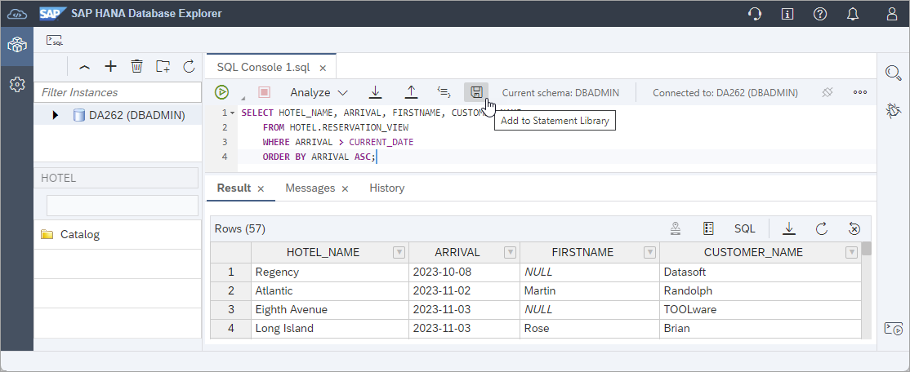
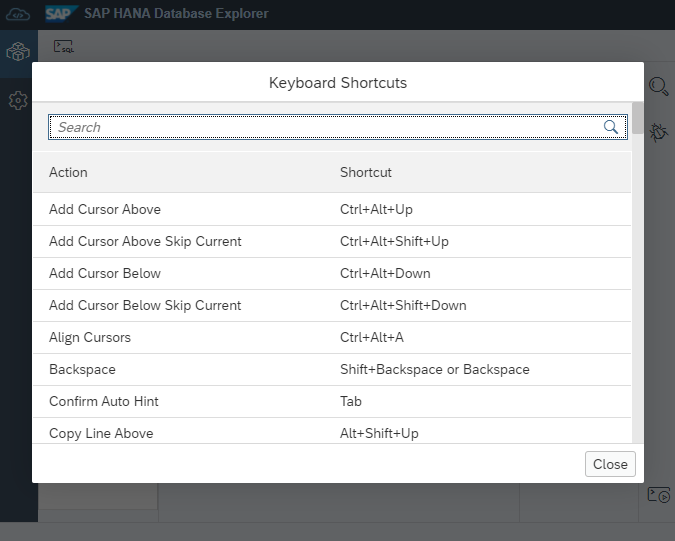
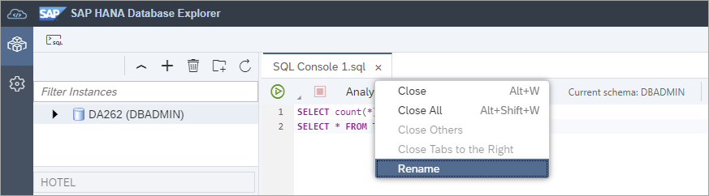

# Exercise 3 - Using the SQL Console
In this exercise, we will explore some of the functionality in the SAP HANA database explorer's SQL console that is unique to the SQL Console in the SAP HANA database explorer.  Please follow the examples shown below.

## Exercise 3.1 Autocompletion

1. The SQL console can autocomplete statements.  Enter the statement below into the SQL console, position the cursor on the **C** and press **Ctrl + space**.  Select **COUNTRY** to complete the SQL query.

    

    ```SQL
    SELECT 	NAME, ADDRESS, C, FLDATE, SEAT
        FROM 
            PASSENGERS AS P,
            FLIGHTRESERVATION AS F
        WHERE P.PASSENGERID = F.PASSENGERID
        ORDER BY NAME ASC;
    ```

## Exercise 3.2 Statement Library

1. Commonly used statements can be saved to or retrieved from the statement library.  

    

    Statements added to the statement library can viewed and opened by selecting **Show Statement Library**.  
    
    

    In this dialog it is also possible to export selected statements or import statements from a zip file such as the diagnostic SQL statements downloaded from [SAP Note 1969700 - SQL Statement Collection for SAP HANA](https://launchpad.support.sap.com/#/notes/1969700).

 ## Exercise 3.3 SQL Console Preferences

1. Examine the SQL console preferences.  Navigate to the database explorer preferences icon on the left of your screen and select **SQL Console**. Examine the available settings.  

    A few notable settings are:
    * Byte limit for the size of a returned value
    * Max number of rows to display
    * Indicate potential SQL errors can be used to enable or disable the syntax parser
    * Auto-save contents of SQL consoles
   
    

    >If changes are made to this screen, the Save button must be pressed for the changes to be set.

 
 2. An example of a query that returns more than 1000 rows is shown below.  The setting Max number of rows to display could be updated to display the full result.

           

    ```SQL
    SELECT count(*) FROM TABLE_COLUMNS;
    SELECT * FROM TABLE_COLUMNS;
    ```

## Exercise 3.4 SQL Console Shortcut Keys

1.  A list of keyboard shortcuts can be found by right-clicking and selecting **Keyboard Shortcuts** within the SQL console window.

    

    

    Here is a list of common keyboard shortcuts for future reference:
    
    Action | Shortcut
    ------ | ------
    Add Comment Block | Ctrl+Shift+/
    Comment/Uncomment Line | Ctrl+/
    Format Code	|Ctrl+B
    Go to Next Error | Alt+E
    Go to Previous Error | Alt+Shift+E
    Go to Line | Ctrl+L
    Increase/Decrease Font Size | Ctrl+Shift+Up  or Ctrl+Shift+Down
    Jump to Matching Brackets | Ctrl+P
    Run All | F8
    Run Statement |	F9
    Switch tabs	|Ctrl+Alt+Pageup  or Ctrl+Alt+Pagedown
    Text Completion | Ctrl+Space (requires two characters to be entered)

    >The shortcut keys may vary depending on the browser used.

## Exercise 3.5 Additional SQL Console Tab Features 

1. A SQL console tab or a sub tab such as Results, or Messages, can enter or exit full screen mode, by double tapping on its tab.  

    

2. A context menu is available on SQL console tabs.  You may wish to provide a more descriptive tab name for a SQL console.

    

## Exercise 3.6 Background Execution

1. Statements that may take a while to execute can be optionally run in the background.

    ```SQL
    DO BEGIN
    -- Wait for a few seconds
    USING SQLSCRIPT_SYNC AS SYNCLIB;
    CALL SYNCLIB:SLEEP_SECONDS( 5 );  --wait 5 secs
    -- Now execute a query
    SELECT * FROM PASSENGERS;
    END;
    ```

    

    A benefit of running a statement in the background is that the result can be examined later even from another laptop.

      
  
2. Once the status has changed to SUCCESS, the results can be viewed.
    
    >Optionally press the refresh button to update the status sooner.

    >Notice that the original SQL console and the one opened to view the results are both in a disconnected state and would need to be re-connected before executing another statement.

    

## Exercise 3.7 Run on Multiple Databases

1. SQL statements can also be executed against multiple databases.  Paste in the below SQL into the SQL console and from the **Run** icon select **Run on Multiple Databases**. 

    ```SQL
    SELECT CURRENT_USER FROM DUMMY;
    ```

    

    Select two or more databases.

    

    Once the query completes, select the queries whose results should be provided into a downloadable JSON file.

    

    An example of the results file is shown below.

    

## Exercise 3.8 Import and Export

1.  Wizards are provided that can be used to import data or to export the data from a table, view or from multiple objects and include their schema and data (catalog import/export).

    

    Further details on how to configure the SAP HANA database explorer to be used with cloud storage providers can be found at [Export and Import Data and Schema with SAP HANA Database Explorer](https://developers.sap.com/tutorials/hana-dbx-export-import.html).

## Exercise 3.9 Data Viewers

1. An additional data viewer supported by the SQL Console in the SAP HANA database explorer is a spatial viewer.  Execute the below SQL, select a value from the results tab and choose **View data**. 

    ```SQL
    SELECT NEW ST_Point('POINT (-80.55100416451384 43.48025646678657)', 4326) FROM DUMMY;
    ```

    
    
    Further details on how the SAP HANA database explorer can be used with multi-model features including graph, JSON, and spatial can be found at [Try Out Multi-Model Functionality with the SAP HANA Database Explorer](https://developers.sap.com/tutorials/hana-dbx-multi-model.html).

This concludes the exercise on the using SQL console.  Optionally, view additional content in [Appendix 1 - SAP HANA Database Explorer Extension](../ex4/README.md).

Optionally continue to - [SAP HANA Cockpit - Exercise 1 - The Database Overview Page](../../hana_cockpit/ex1/README.md)
