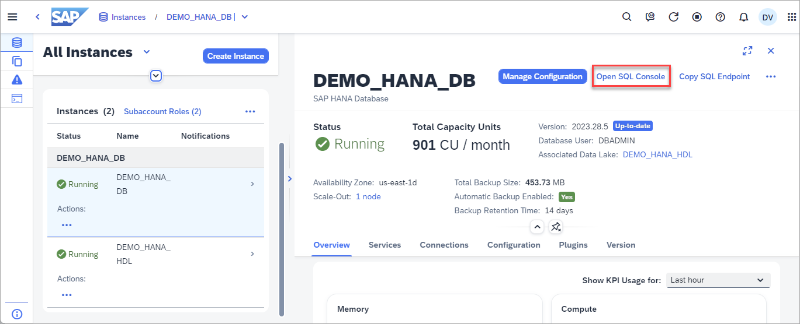

# SQL Console

This exercise will demonstrate the functionality in the SQL Console that is included in SAP HANA Cloud Central.  

1. The SQL Console can be opened in multiple ways as shown below.  Select one of the methods and open the SQL Console.

    * It can be opened from the apps sidebar.
    
    

    * It can be opened from the actions menu.

    

    * It can be opened from details page.

     

2. Demonstrate how to connect

3. Mention how to load or export SQL statements.   Note that unlike the SAP HANA database explorer, the SQL Console tabs are not currently preserved between browser reloads.

4. Execute the below SQLScript to create a usergroup, two users, two roles, a schema, a few tables, views, stored procedures, and functions.

    ```SQL
    CREATE USERGROUP HOTEL_USER_GROUP SET PARAMETER 'minimal_password_length' = '8', 'force_first_password_change' = 'FALSE';
    CREATE USER USER1 PASSWORD Password1 no force_first_password_change SET USERGROUP HOTEL_USER_GROUP;
    CREATE USER USER2 PASSWORD Password2 no force_first_password_change SET USERGROUP HOTEL_USER_GROUP;

    GRANT CREATE SCHEMA TO USER1;
    CREATE ROLE HOTEL_ADMIN;
    CREATE ROLE HOTEL_READER;
    GRANT RESOURCE ADMIN TO HOTEL_ADMIN; --allow viewing of diagnostic files
    GRANT CATALOG READ TO HOTEL_ADMIN;   --allow access to system views
    GRANT HOTEL_ADMIN TO USER1;
    GRANT HOTEL_READER TO USER2;

    CONNECT USER1 PASSWORD Password1;
    CREATE SCHEMA HOTEL;
    GRANT ALL PRIVILEGES ON SCHEMA HOTEL TO HOTEL_ADMIN;
    GRANT SELECT ON SCHEMA HOTEL TO HOTEL_READER;

    SET SCHEMA HOTEL;

    CREATE COLUMN TABLE HOTEL(
        hno INTEGER PRIMARY KEY,
        name NVARCHAR(50) NOT NULL,
        address NVARCHAR(40) NOT NULL,
        city NVARCHAR(30) NOT NULL,
        state NVARCHAR(2) NOT NULL,
        zip NVARCHAR(6),
        location ST_Point(4326)
    );

    CREATE COLUMN TABLE ROOM(
        hno INTEGER,
        type NVARCHAR(6),
        free NUMERIC(3),
        price NUMERIC(6, 2),
        PRIMARY KEY (hno, type),
        FOREIGN KEY (hno) REFERENCES HOTEL
    );

    CREATE COLUMN TABLE CUSTOMER(
        cno INTEGER PRIMARY KEY,
        title NVARCHAR(7),
        firstname NVARCHAR(20),
        name NVARCHAR(40) NOT NULL,
        address NVARCHAR(40) NOT NULL,
        zip NVARCHAR(6)
    );

    CREATE COLUMN TABLE RESERVATION(
        resno INTEGER NOT NULL GENERATED BY DEFAULT AS IDENTITY,
        rno INTEGER NOT NULL,
        cno INTEGER,
        hno INTEGER,
        type NVARCHAR(6),
        arrival DATE NOT NULL,
        departure DATE NOT NULL,
        PRIMARY KEY (
            "RESNO", "ARRIVAL"
        ),
        FOREIGN KEY(cno) REFERENCES CUSTOMER,
        FOREIGN KEY(hno) REFERENCES HOTEL
    );

    CREATE COLUMN TABLE MAINTENANCE(
        mno INTEGER PRIMARY KEY,
        hno INTEGER,
        description NVARCHAR(100),
        date_performed DATE,
        performed_by NVARCHAR(40)
    );

    CREATE OR REPLACE VIEW RESERVATION_VIEW AS
        SELECT
            R.RESNO,
            H.NAME AS HOTEL_NAME,
        R.ARRIVAL,
        R.DEPARTURE,
            CUS.TITLE,
            CUS.FIRSTNAME,
            CUS.NAME AS CUSTOMER_NAME,
            CUS.ADDRESS AS CUSTOMER_ADDRESS
        FROM RESERVATION R
            LEFT JOIN HOTEL H ON H.HNO = R.HNO
            LEFT JOIN CUSTOMER CUS ON CUS.CNO = R.CNO
        ORDER BY H.NAME, R.ARRIVAL DESC;

    CREATE OR REPLACE FUNCTION AVERAGE_PRICE(room_type CHAR(6))
    RETURNS avg_price NUMERIC(6, 2)
    AS
    BEGIN
        DECLARE EXIT HANDLER FOR SQLEXCEPTION avg_price := '-1';
        SELECT TO_DECIMAL(ROUND(sum(PRICE)/COUNT(*), 2, ROUND_HALF_UP)) INTO avg_price FROM ROOM WHERE TYPE = :room_type GROUP BY TYPE;
    END;

    CREATE OR REPLACE PROCEDURE RESERVATION_GENERATOR(
        IN numToGenerate INTEGER
    )
        LANGUAGE SQLSCRIPT AS
    BEGIN
        USING SQLSCRIPT_PRINT AS PRTLIB;
        DECLARE val INT :=0;
        DECLARE stmt NVARCHAR(256) := '';
        DECLARE rno INT :=0;
        DECLARE cno INT :=0;
        DECLARE hno INT :=0;
        DECLARE roomType STRING := '';
        DECLARE arriveDate DATE := null;
        DECLARE arriveDateString STRING := '';
        DECLARE departDate DATE := null;
        DECLARE departDateString STRING := '';
        DECLARE randomDaysFromCurrent INT :=0;
        DECLARE randomLengthOfStay INT :=0;
        DECLARE rType INT :=0;
        DECLARE EXIT HANDLER FOR SQL_ERROR_CODE 301
        SELECT ::SQL_ERROR_CODE, ::SQL_ERROR_MESSAGE FROM DUMMY;
        WHILE (val < numToGenerate) DO
            -- generate random room number from 100-300
            rno := FLOOR(RAND_SECURE() * 201) + 100;
            -- generate random customer number from 1000-1014
            cno := FLOOR(RAND_SECURE() * 15) + 1000;
            -- generate random hotel number from 10-26
            hno := FLOOR(RAND_SECURE() * 17) + 10;
            -- generate random number from 1-3 to determine room type
            rType := FLOOR(RAND_SECURE() * 3) + 1;
            IF (rType = 1) THEN
                roomType := '''single''';
            ELSEIF (rType = 2) THEN
                roomType := '''double''';
            ELSEIF (rType = 3) THEN
                roomType := '''suite''';
            END IF;

            -- generate random number of days to be used for arrival date.  
            -- date range is one year in the past to one year in the future
            randomDaysFromCurrent := FLOOR(RAND_SECURE() * 730) + 1 - 365;
            arriveDate := ADD_DAYS( TO_DATE( CURRENT_DATE, 'YYYY-MM-DD' ), randomDaysFromCurrent );
            arriveDateString := '''' || TO_NVARCHAR( arriveDate, 'YYYY-MM-DD' ) || '''';
            -- generate a random number of days to stay
            randomLengthOfStay := FLOOR(RAND_SECURE() * 7) + 1;
            departDate := ADD_DAYS( arriveDate, randomLengthOfStay );
            departDateString := '''' || TO_NVARCHAR( departDate, 'YYYY-MM-DD' ) || '''';

            -- Reservations Columns: RNO, CNO, HNO, Type, Arrival, Departure
            stmt := 'INSERT INTO RESERVATION (RNO, CNO, HNO, TYPE, ARRIVAL, DEPARTURE) VALUES(' || rno || ',' || cno || ',' || hno || ',' || roomType || ',' || arriveDateString || ',' || departDateString || ');';
            PRTLIB:PRINT_LINE(stmt);
            EXEC(stmt);
            val := val + 1;
        END WHILE;
    PRTLIB:PRINT_LINE('Rows inserted: ' || val);
    END;
    ```

5. Execute the following SQL statements to add some data to the tables.

    ```SQL
    INSERT INTO HOTEL VALUES(10, 'Congress', '155 Beechwood St.', 'Seattle', 'WA', '98121', NEW ST_POINT('POINT(-122.347340 47.610546)', 4326));
    INSERT INTO HOTEL VALUES(11, 'Regency', '477 17th Avenue', 'Seattle', 'WA', '98177', NEW ST_POINT('POINT(-122.371104 47.715210)', 4326));
    INSERT INTO HOTEL VALUES(12, 'Long Island', '1499 Grove Street', 'Long Island', 'NY', '11716', NEW ST_POINT('POINT(-73.133741 40.783602)', 4326));
    INSERT INTO HOTEL VALUES(13, 'Empire State', '65 Yellowstone Dr.', 'Albany', 'NY', '12203', NEW ST_POINT('POINT(-73.816182 42.670334)', 4326));
    INSERT INTO HOTEL VALUES(14, 'Midtown', '12 Barnard St.', 'New York', 'NY', '10019', NEW ST_POINT('POINT(-73.987388 40.766153)', 4326));
    INSERT INTO HOTEL VALUES(15, 'Eighth Avenue', '112 8th Avenue', 'New York', 'NY', '10019', NEW ST_POINT('POINT(-73.982495 40.767161)', 4326));
    INSERT INTO HOTEL VALUES(16, 'Lake Michigan', '354 OAK Terrace', 'Chicago', 'IL', '60601', NEW ST_POINT('POINT(-87.623608 41.886403)', 4326));
    INSERT INTO HOTEL VALUES(17, 'Airport', '650 C Parkway', 'Rosemont', 'IL', '60018', NEW ST_POINT('POINT(-87.872209 41.989378)', 4326));
    INSERT INTO HOTEL VALUES(18, 'Sunshine', '200 Yellowstone Dr.', 'Clearwater', 'FL', '33755', NEW ST_POINT('POINT(-82.791689 27.971218)', 4326));
    INSERT INTO HOTEL VALUES(19, 'Beach', '1980 34th St.', 'Daytona Beach', 'FL', '32018', NEW ST_POINT('POINT(-81.043091 29.215968)', 4326));
    INSERT INTO HOTEL VALUES(20, 'Atlantic', '111 78th St.', 'Deerfield Beach', 'FL', '33441', NEW ST_POINT('POINT(-80.106612 26.312141)', 4326));
    INSERT INTO HOTEL VALUES(21, 'Long Beach', '35 Broadway', 'Long Beach', 'CA', '90804', NEW ST_POINT('POINT(-118.158403 33.786721)', 4326));
    INSERT INTO HOTEL VALUES(22, 'Indian Horse', '16 MAIN STREET', 'Palm Springs', 'CA', '92262', NEW ST_POINT('POINT(-116.543342 33.877537)', 4326));
    INSERT INTO HOTEL VALUES(23, 'Star', '13 Beechwood Place', 'Hollywood', 'CA', '90029', NEW ST_POINT('POINT(-118.295017 34.086975)', 4326));
    INSERT INTO HOTEL VALUES(24, 'River Boat', '788 MAIN STREET', 'New Orleans', 'LA', '70112', NEW ST_POINT('POINT(-90.076919 29.957531)', 4326));
    INSERT INTO HOTEL VALUES(25, 'Ocean Star', '45 Pacific Avenue', 'Atlantic City', 'NJ', '08401', NEW ST_POINT('POINT(-74.416135 39.361078)', 4326));
    INSERT INTO HOTEL VALUES(26, 'Delta', '110 Erb St. W', 'Waterloo', 'ON', 'N2L0C6', NEW ST_POINT('POINT(-80.528404 43.463327)', 4326));

    INSERT INTO ROOM VALUES(10, 'single', 20, 135.00);
    INSERT INTO ROOM VALUES(10, 'double', 45, 200.00);
    INSERT INTO ROOM VALUES(12, 'single', 10, 70.00);
    INSERT INTO ROOM VALUES(12, 'double', 13, 100.00);
    INSERT INTO ROOM VALUES(13, 'single', 12, 45.00);
    INSERT INTO ROOM VALUES(13, 'double', 15, 80.00);
    INSERT INTO ROOM VALUES(14, 'single', 20, 85.00);
    INSERT INTO ROOM VALUES(14, 'double', 35, 140.00);
    INSERT INTO ROOM VALUES(15, 'single', 50, 105.00);
    INSERT INTO ROOM VALUES(15, 'double', 230, 180.00);
    INSERT INTO ROOM VALUES(15, 'suite', 12, 500.00);
    INSERT INTO ROOM VALUES(16, 'single', 10, 120.00);
    INSERT INTO ROOM VALUES(16, 'double', 39, 200.00);
    INSERT INTO ROOM VALUES(16, 'suite', 20, 500.00);
    INSERT INTO ROOM VALUES(17, 'single', 4, 115.00);
    INSERT INTO ROOM VALUES(17, 'double', 11, 180.00);
    INSERT INTO ROOM VALUES(18, 'single', 15, 90.00);
    INSERT INTO ROOM VALUES(18, 'double', 19, 150.00);
    INSERT INTO ROOM VALUES(18, 'suite', 5, 400.00);
    INSERT INTO ROOM VALUES(19, 'single', 45, 90.00);
    INSERT INTO ROOM VALUES(19, 'double', 145, 150.00);
    INSERT INTO ROOM VALUES(19, 'suite', 60, 300.00);
    INSERT INTO ROOM VALUES(20, 'single', 11, 60.00);
    INSERT INTO ROOM VALUES(20, 'double', 24, 100.00);
    INSERT INTO ROOM VALUES(21, 'single', 2, 70.00);
    INSERT INTO ROOM VALUES(21, 'double', 10, 130.00);
    INSERT INTO ROOM VALUES(22, 'single', 34, 80.00);
    INSERT INTO ROOM VALUES(22, 'double', 78, 140.00);
    INSERT INTO ROOM VALUES(22, 'suite', 55, 350.00);
    INSERT INTO ROOM VALUES(23, 'single', 89, 160.00);
    INSERT INTO ROOM VALUES(23, 'double', 300, 270.00);
    INSERT INTO ROOM VALUES(23, 'suite', 100, 700.00);
    INSERT INTO ROOM VALUES(24, 'single', 10, 125.00);
    INSERT INTO ROOM VALUES(24, 'double', 9, 200.00);
    INSERT INTO ROOM VALUES(24, 'suite', 78, 600.00);
    INSERT INTO ROOM VALUES(25, 'single', 44, 100.00);
    INSERT INTO ROOM VALUES(25, 'double', 115, 190.00);
    INSERT INTO ROOM VALUES(25, 'suite', 6, 450.00);

    INSERT INTO CUSTOMER VALUES(1000, 'Mrs', 'Jenny', 'Porter', '1340 N. Ash Street, #3', '10580');
    INSERT INTO CUSTOMER VALUES(1001, 'Mr', 'Peter', 'Brown', '1001 34th St., APT.3', '48226');
    INSERT INTO CUSTOMER VALUES(1002, 'Company', NULL, 'Datasoft', '486 Maple St.', '90018');
    INSERT INTO CUSTOMER VALUES(1003, 'Mrs', 'Rose', 'Brian', '500 Yellowstone Drive, #2', '75243');
    INSERT INTO CUSTOMER VALUES(1004, 'Mrs', 'Mary', 'Griffith', '3401 Elder Lane', '20005');
    INSERT INTO CUSTOMER VALUES(1005, 'Mr', 'Martin', 'Randolph', '340 MAIN STREET, #7', '60615');
    INSERT INTO CUSTOMER VALUES(1006, 'Mrs', 'Sally', 'Smith', '250 Curtis Street', '75243');
    INSERT INTO CUSTOMER VALUES(1007, 'Mr', 'Mike', 'Jackson', '133 BROADWAY APT. 1', '45211');
    INSERT INTO CUSTOMER VALUES(1008, 'Mrs', 'Rita', 'Doe', '2000 Humboldt St., #6', '97213');
    INSERT INTO CUSTOMER VALUES(1009, 'Mr', 'George', 'Howe', '111 B Parkway, #23', '75243');
    INSERT INTO CUSTOMER VALUES(1010, 'Mr', 'Frank', 'Miller', '27 5th St., 76', '95054');
    INSERT INTO CUSTOMER VALUES(1011, 'Mrs', 'Susan', 'Baker', '200 MAIN STREET, #94', '90018');
    INSERT INTO CUSTOMER VALUES(1012, 'Mr', 'Joseph', 'Peters', '700 S. Ash St., APT.12', '92714');
    INSERT INTO CUSTOMER VALUES(1013, 'Company', NULL, 'TOOLware', '410 Mariposa St., #10', '20019');
    INSERT INTO CUSTOMER VALUES(1014, 'Mr', 'Antony', 'Jenkins', '55 A Parkway, #15', '20903');

    INSERT INTO RESERVATION VALUES(1, 100, 1000, 11, 'single', '2020-12-24', '2020-12-27');
    INSERT INTO RESERVATION VALUES(2, 110, 1001, 11, 'double', '2020-12-24', '2021-01-03');
    INSERT INTO RESERVATION VALUES(3, 120, 1002, 15, 'suite', '2020-11-14', '2020-11-18');
    INSERT INTO RESERVATION VALUES(4, 130, 1009, 21, 'single', '2019-02-01', '2019-02-03');
    INSERT INTO RESERVATION VALUES(5, 150, 1006, 17, 'double', '2019-03-14', '2019-03-24');
    INSERT INTO RESERVATION VALUES(6, 140, 1013, 20, 'double', '2020-04-12', '2020-04-30');
    INSERT INTO RESERVATION VALUES(7, 160, 1011, 17, 'single', '2020-04-12', '2020-04-15');
    INSERT INTO RESERVATION VALUES(8, 170, 1014, 25, 'suite', '2020-09-01', '2020-09-03');
    INSERT INTO RESERVATION VALUES(9, 180, 1001, 22, 'double', '2020-12-23', '2021-01-08');
    INSERT INTO RESERVATION VALUES(10, 190, 1013, 24, 'double', '2020-11-14', '2020-11-17');

    INSERT INTO MAINTENANCE VALUES(10, 24, 'Replace pool liner and pump', '2019-03-21', 'Discount Pool Supplies');
    INSERT INTO MAINTENANCE VALUES(11, 25, 'Renovate the bar area.  Replace TV and speakers', '2020-11-29', 'TV and Audio Superstore');
    INSERT INTO MAINTENANCE VALUES(12, 26, 'Roof repair due to storm', null, null);
    ```

6. Demonstrate how to connect with a different user

7. Demonstrate how to change the schema

8. Demonstrate settings

9. If an error occurs while executing SQL statements, a dialog will appear enabling you to choose to continue or stop.  
    
    ```SQL

    ```

    The error details can be seen in the following ways.  Demonstrate error markers and shortcut key to navigate between errors.  Also mention the error is shown in the messages.

10. Demonstrate calling a function and a stored procedure.  Parameters can be provided when executing a query.

    ```SQL
    SELECT AVERAGE_PRICE('single') from dummy;
    SELECT AVERAGE_PRICE(?) from dummy;  --parameters entry appears, enter suite
    CALL RESERVATION_GENERATOR(NUMTOGENERATE => 10);
    CALL RESERVATION_GENERATOR(NUMTOGENERATE => ?); --parameters entry appears, enter 100
    ```

11. Demonstrate statement help

12. Demonstrate the result tabs

13. Shortcut keys

14. Exporting results

15. Show the integration when using Search Commands in HCC

## Summary

You now have an overview of the featurs of the SQL Console in SAP HANA Cloud Central.  Further details can be found in the tutorial learning journey [Query Databases Using the SQL Console in SAP HANA Cloud Central](https://developers.sap.com/tutorials/hana-dbx-hcc.html).

Continue to - [Exercise 1 - Overview of the SAP HANA database explorer](../../database_explorer/ex1/README.md)

