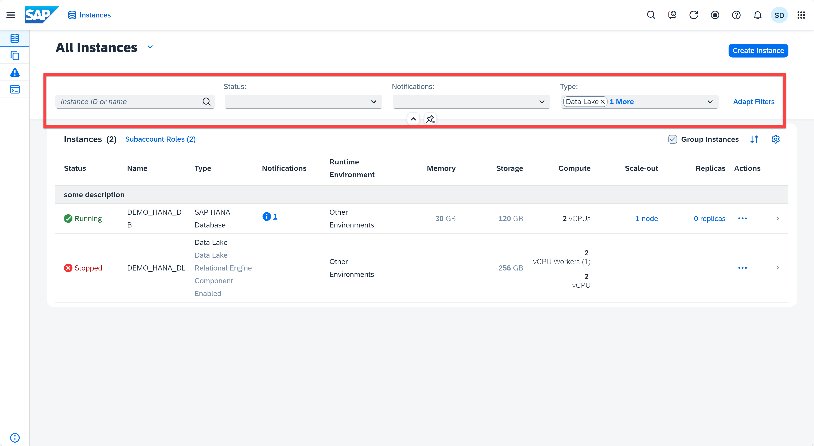
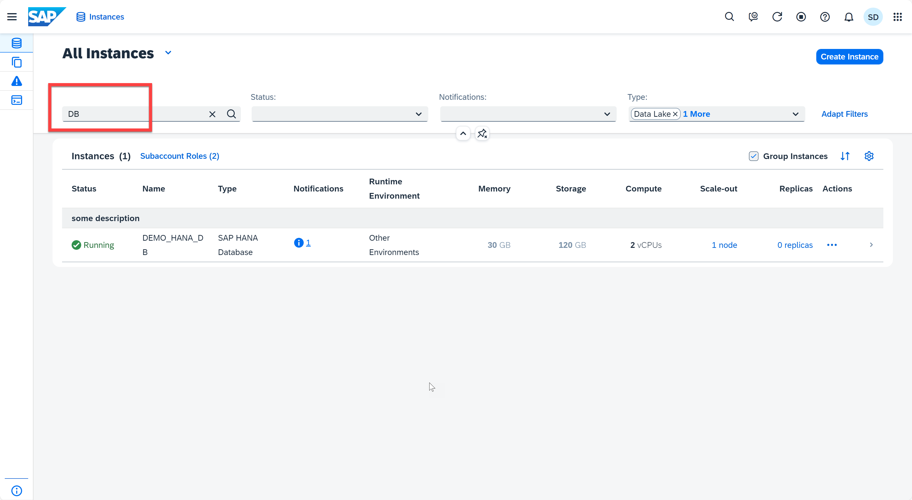
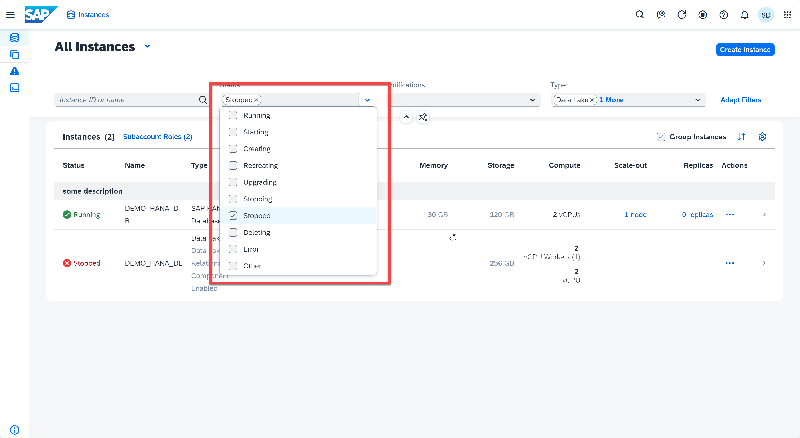
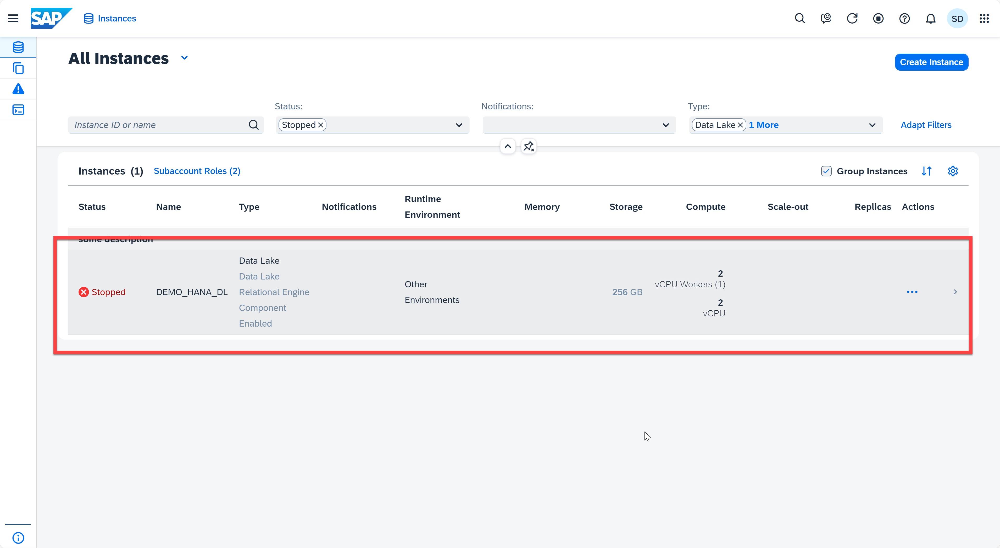
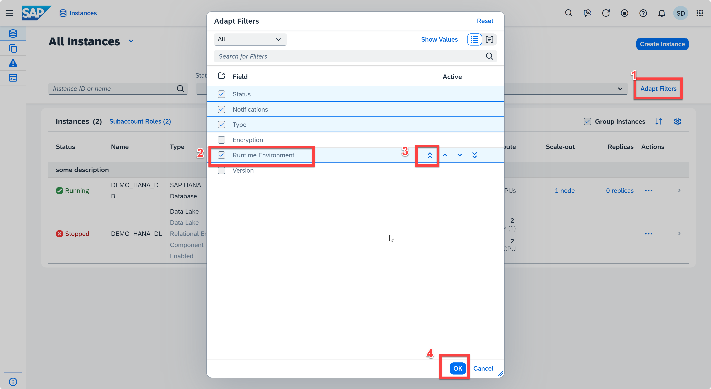
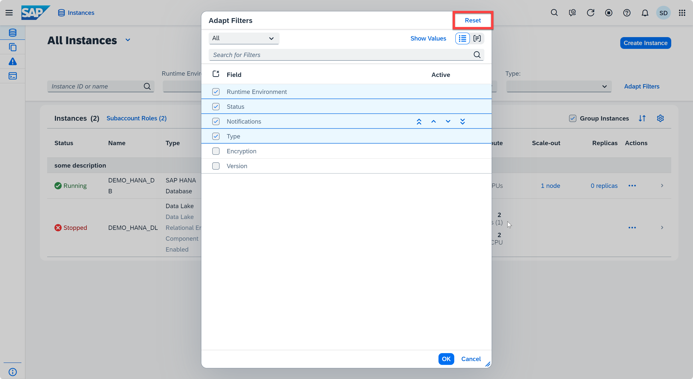

# Appendix 1: Searching and Filtering

This exercise will teach you the basics of searching and filtering instances in SAP HANA Cloud Central.

1. Navigate to your SAP HANA Cloud Central. You see the HANA Cloud Central collapsible header, where you can search or filter instances.
    <kbd>
    
    </kbd>

2. You can instances by instance ID or name. Type "DB" in the searching bar.
    <kbd>
    
    </kbd>

3. You can also filter instances by status, notifications, type and more. For example, we can filter the instances with stopped status. Click on **Status**, select **Stopped**, and then click any empty space to apply the filter. 
    <kbd>
    
    </kbd>
    <kbd>
    
    </kbd>

4. The filter fields are adjustable. Click **Adapt Filters** button, you can activate fields based on your interest. Once you select a field, you can also change the priority for it by clicking the arrows on the right. Select the **Runtime Environment**, click **Move to the Top** arrow, click **OK**.
    <kbd>
    
    </kbd>

5. You can always revert back to the selected view by clicking the **Reset** button.
    <kbd>
    
    </kbd>

Continue to - [Appendix 2 - Toolbar](../appendix2-Toolbar/README.md)
