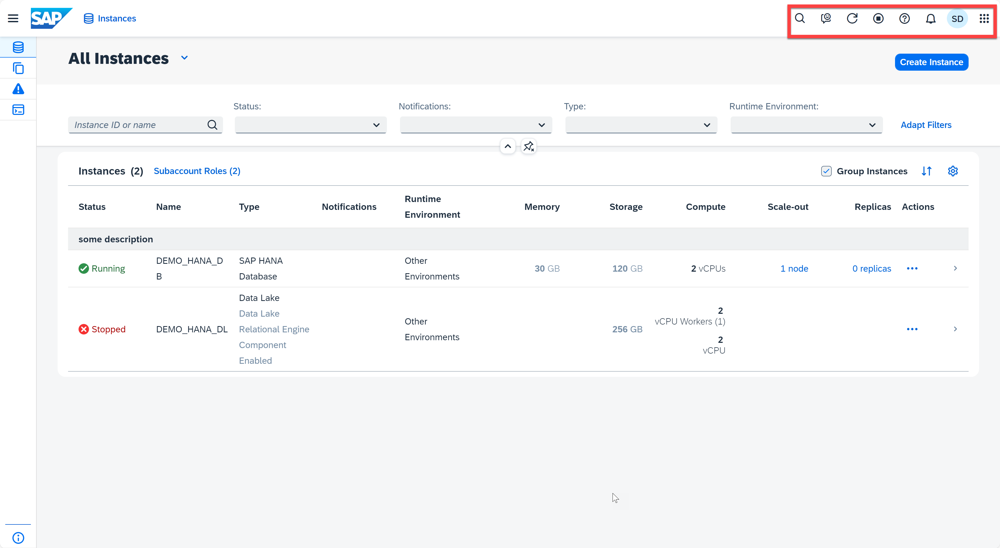
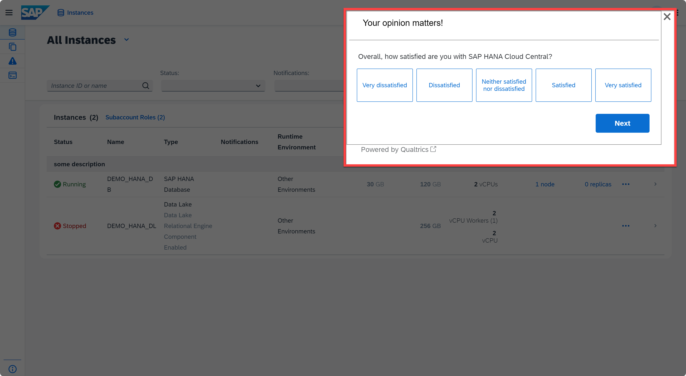
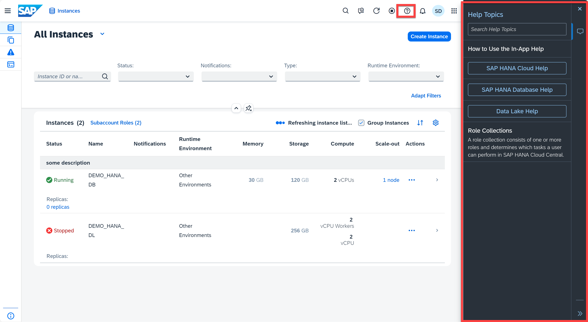
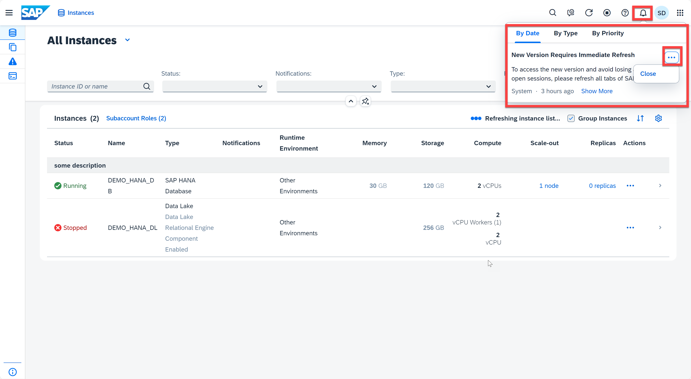

# Appendix 2: Toolbar

In this exercise, we will introduce the toolbar for you.

1. Open the SAP HANA Cloud Central. At the top you will find the tool bar.
    <kbd>
    
    </kbd>

2. The first one from left is the **Command Palette** (search icon), which is covered in exercise 5. The second button is **Give Feedback**. Click it, a survey pops up. You can rate SAP HANA Cloud Central in several perspectives, as well as provide comments or suggestions on our product. You can do this survey unlimited times.
    <kbd>
    
    </kbd>

3. Beside the **Feedback** button, you can see the **Refresh** and **Auto-Refresh** buttons, which are covered in exercise 2. Then you see a **Help** button. Click it, you will see the *In-App Help*, where you can search for help topics to improve user experience.
    <kbd>
    
    </kbd>

4. The next tool is **Notifications**. Click it, you are able to see the notifications by date, type, and priority. You can also click the "..." to close the notification.
    <kbd>
    
    </kbd>

5. You can access the settings by clicking the profile icon. In settings, you can see your personal information, change preferred theme and region, and enable/ disable display basic setup notifications.
    <kbd>
    
    </kbd>  

6. The last tool in the toolbar allow you to switch to the SAP BTP Cockpit. SAP BTP Cockpit will open in a new tab if you click the button.
    <kbd>
    
    </kbd>  

Continue to - [Appendix 3: Views](../appendix3-Views/README.md)
