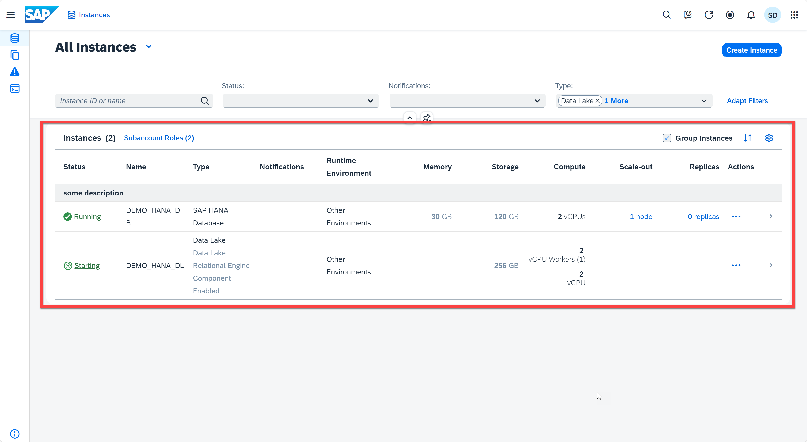
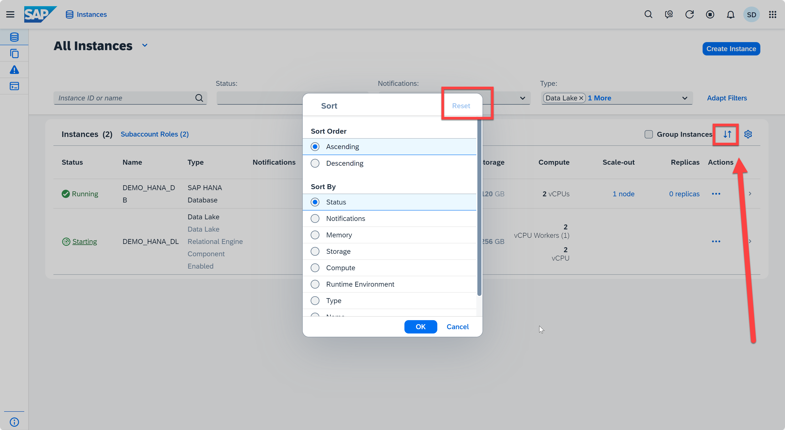
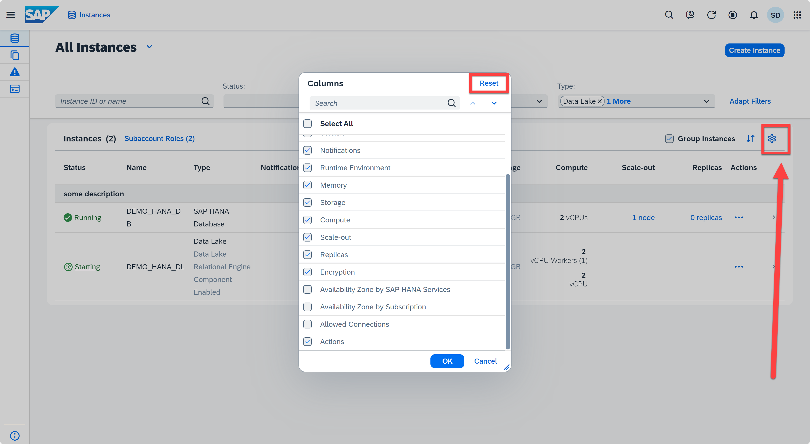

# Appendix 3: Views

In this exercise, we will continue introduce the SAP HANA Cloud Central application.

1. Open the SAP HANA Cloud Central. In SAP HANA Cloud Central, the bottom panel displays all your instances, with the option to group the list by instances and personalize the view.
    <kbd>
    
    </kbd>

2. On the top right of this panel, click the *Sort* icon, you can sort instances ascending or descending by status, notifications, memory, etc. You can always reset to default by clicking the **Reset** button.
    <kbd>
    
    </kbd>

3. In addition, you can adjust the columns that you prefered by clicking the *gear* icon. The available columns include instance ID, availability zone by SAP HANA Services, availability zone by subscription, allowed connections and more. You can always reset to default by clicking the **Reset** button.
    <kbd>
    
    </kbd>

Continue to - [Appendix 4 - Migration](../appendix4-Migration/README.md)
