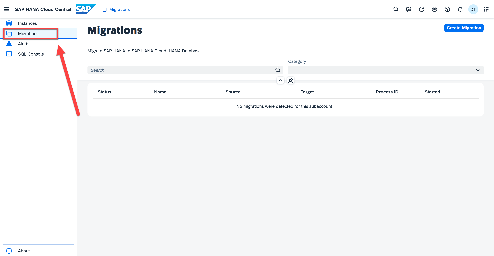
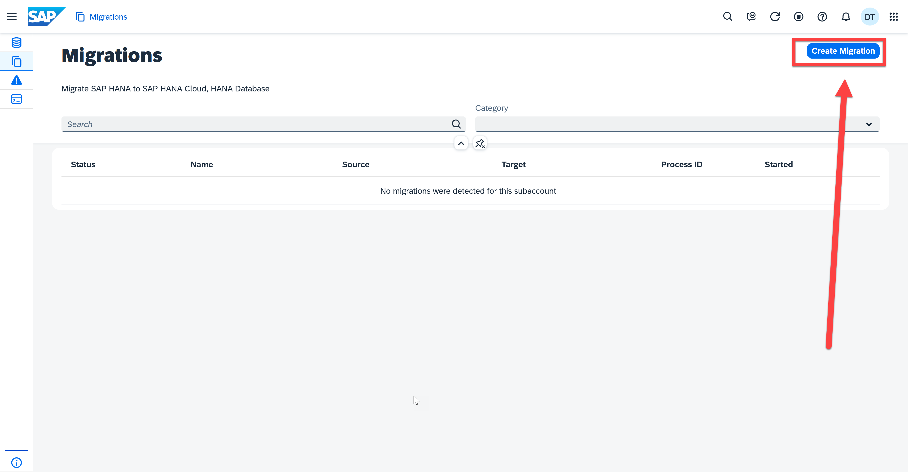

# Appendix 4: Migration

SAP HANA Cloud offers you many advantages you don't have with SAP HANA Service. For example, with SAP HANA Cloud, you have the flexibility to scale your data management infrastructure. You also get the elasticity that allows you to pay only for the compute and storage you need. With SAP HANA Cloud, you can take advantage of the powerful, built-in SAP HANA Cloud data lake.

SAP HANA Cloud also offers high availability and uses a multi-cloud strategy that allows you to choose between Microsoft Azure, Amazon Web Services (AWS), and Google Cloud hyperscalers. The Self-Service Migration tool can be used to migrate SAP HANA Service databases to SAP HANA Cloud. It automates the migration process and can reduce the cost and effort of a migration. It is a free service and SAP manages the temporary storage used during the migration. This tool is accessed from SAP HANA Cloud Central, the main tool for creating and configuring SAP HANA Cloud instances.

> **Note**
The Self-Service Migration tool is supported in free tier but not in trial.

In this exercise, you will learn how to use the self-migration tool.

1. Open the SAP HANA Cloud Central. On the left tool bar you can see a **Migration** button. Clicking it brings you to our self-migration tool.
    <kbd>
    
    </kbd>

2. In Migration application, you can search a migration or filter it by category. You can also create a migration by clicking the **Create Migration** button on the top right corner.
    <kbd>
    
    </kbd>

3. Further details on how to migrate from an on-premise SAP HANA database to an SAP HANA Cloud can be found at [Migrate to SAP HANA Cloud from SAP HANA Platform](https://developers.sap.com/tutorials/hana-cloud-migration.html#931ed467-9339-4569-926a-eab23170dd6d). 

4. Go back to the Database Overview page for the next exercise.

Continue to - [Appendix 5 - Data Replication](../appendix5-DataReplication/README.md)
