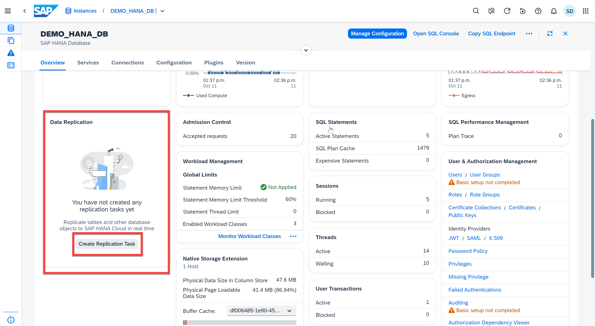
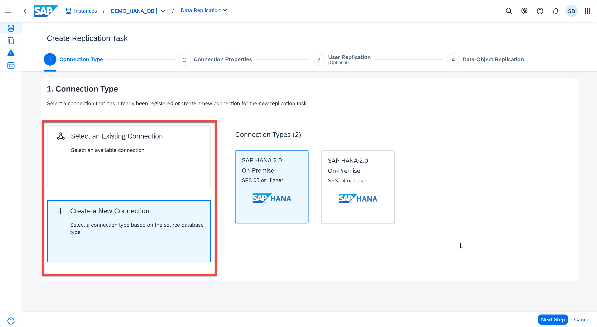
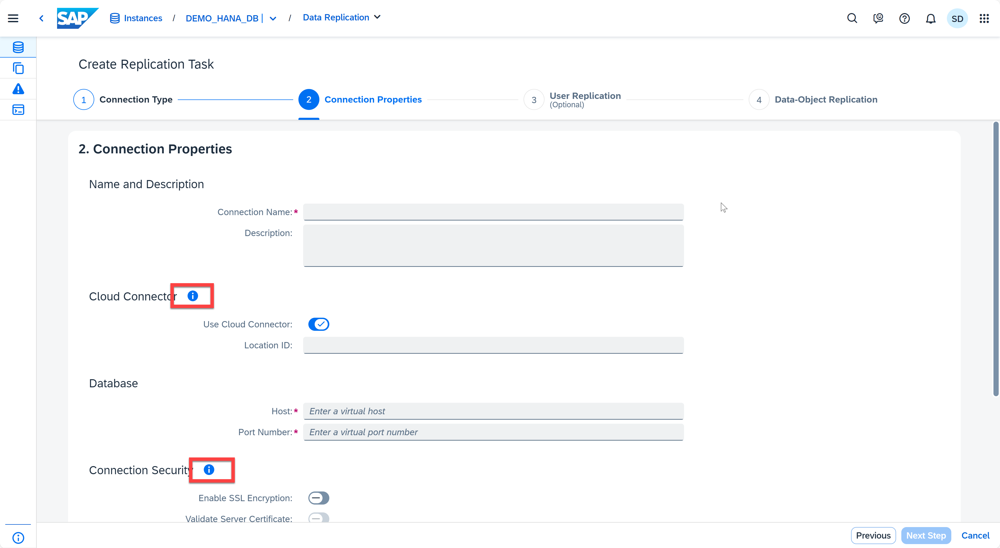

# Appendix 5: Data Replication

The data replication application in SAP HANA Cloud Central lets you replicate selected users (including their privileges), tables, SQL views, and calculation views from an on-premise SAP HANA system to the SAP HANA database in SAP HANA Cloud.

The data replication application supports hybrid scenarios by allowing you to replicate a subset of data to the SAP HANA database in SAP HANA Cloud. This is an alternative approach to a full migration of your existing on-premise SAP HANA system. When the real-time replication option is selected, data updates in the on-premise system can also be captured and applied in SAP HANA Cloud.

1. Open the Database Overview page for any instance. Locate the **Data Replication** card. Click on **Create Replication Task**.
    <kbd>
    
    </kbd>

2. Now you are in the Data Replication application. On step 1, you can choose one of the following options:
    * **Select an Existing Connection:** Select an available connection and specify the name of the technical user on the on-premise database
    * **Create a New Connection:** Select a connection type based on the source database type.
    <kbd>
    
    </kbd>

3. Click **Next Step**. If you are creating a new connection, you need to fill in the connection properties. You can always click the *information* icon for help.  
    <kbd>
    
    </kbd>

4. Click **Next Step**. Further details on creating a data replication task can be found at [Create a Data Replication Task](https://help.sap.com/docs/hana-cloud-database/sap-hana-cloud-sap-hana-database-data-access-guide/create-data-replication-task?version=2023_3_QRC). More tutorials on Data Replication application can be found at [Data Replication and Data Virtualization](https://developers.sap.com/group.hana-cloud-extend-2-data-replication.html).

5. After creating a data replication task, the monitoring page displays the "Loading" status for the new replication task. Return to the Database Overview page for the next exercise.

Continue to - [Appendix 6 - Admission Control](../appendix6-AdmissionControl/README.md)
