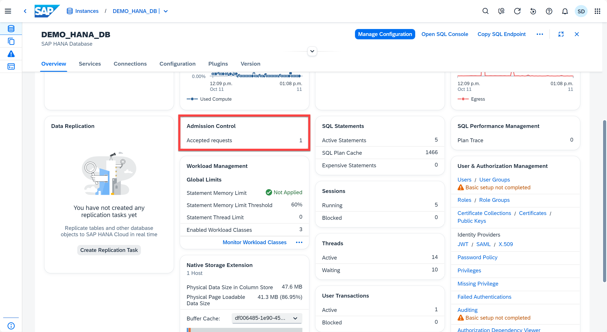
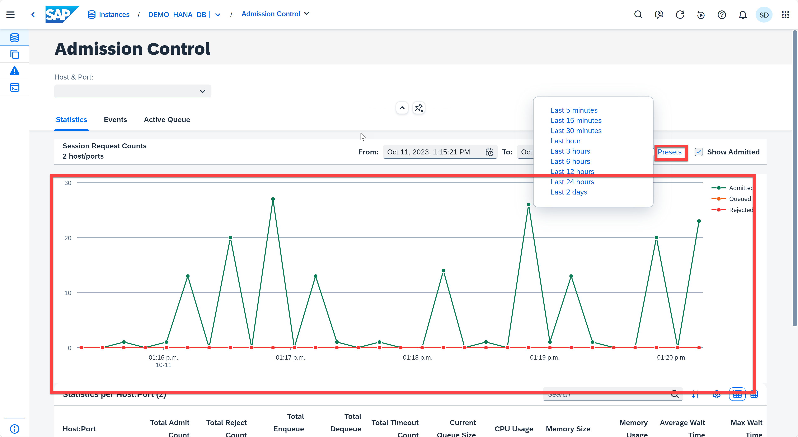
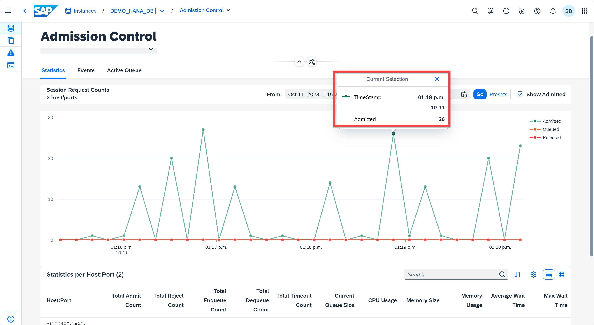
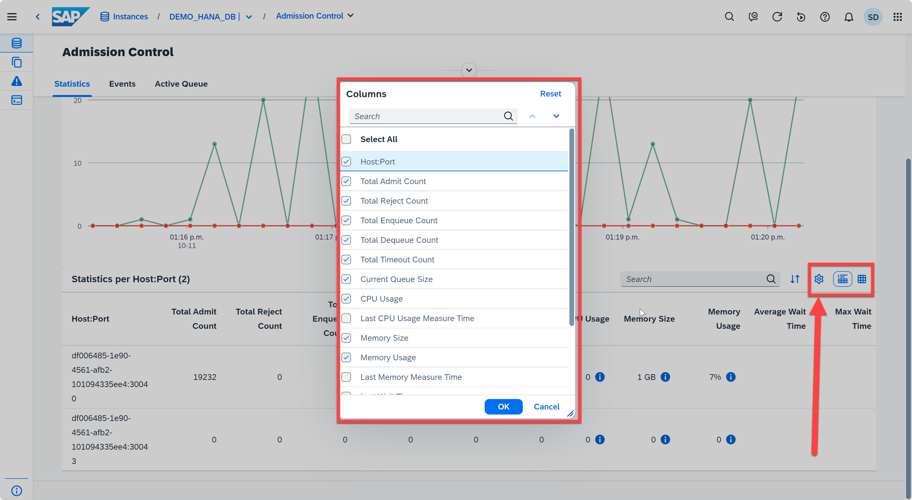
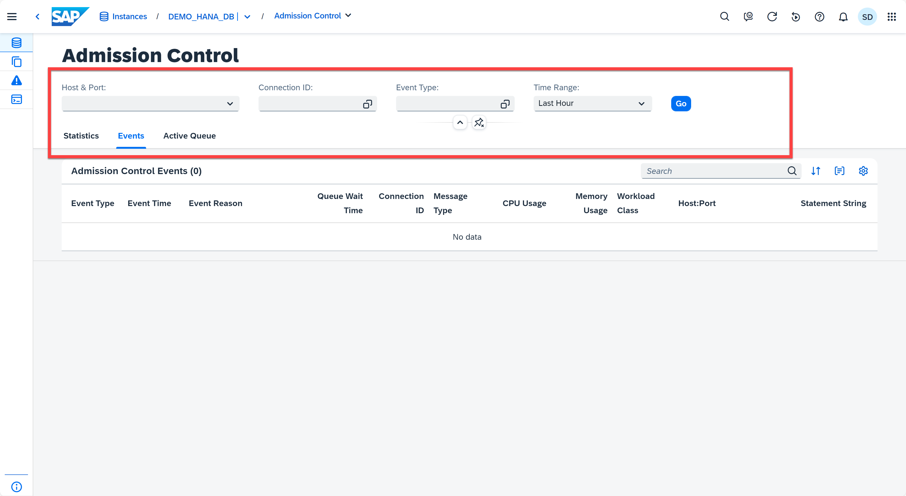
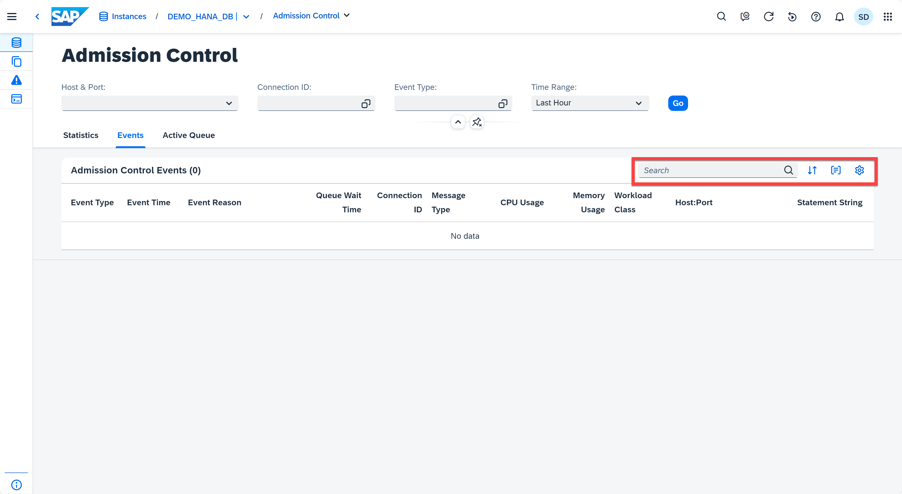
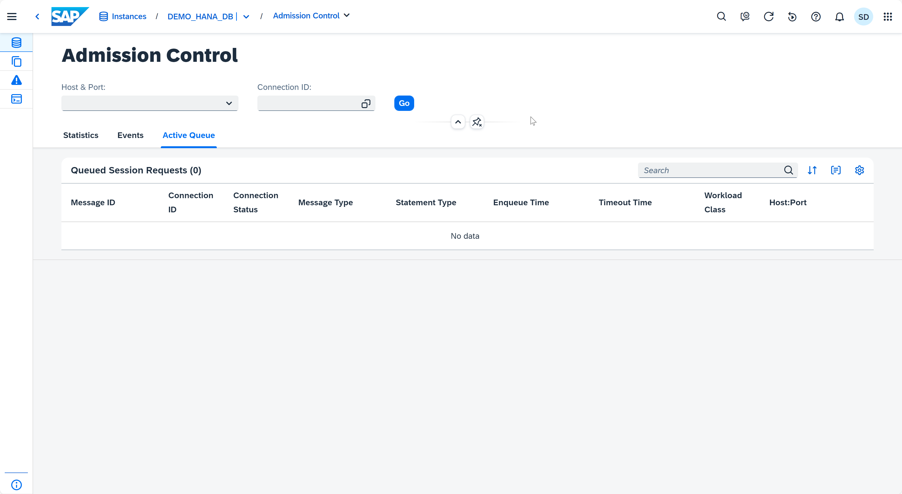

# Appendix 6: Admission Control

The Admission Control feature manages load on the database when the database is close to the point of saturation. Predefined limits determine how to handle new requests when either the percentage of used memory or the percentage of used CPU capacity is close to overload. In these cases incoming requests are either queued until the load level reduces (or until a timeout is reached) or rejected. Separate threshold values are defined for each of these event types.

1. Open the **Database Overview page** for any instance. Click the **Admission Control** card. 
    <kbd>
    
    </kbd>

2. Now you are in the Admission Control application. There are 3 tabs in this application. The **Statistics** tab shows the admitted, queued, and rejectd requests over time. You can select a time period either from the list of Presets or enter dates manually.
    <kbd>
    
    </kbd>

3. Clicking anywhere on the Admitted line graph shows you the number of admitted sessions for the selected time.
    <kbd>
    
    </kbd>

4. You can view the session request counts statistics in either chart or table form and customize both according to your preferences using the *gear* icon.
    <kbd>
    
    </kbd>

5. On the **Event** tab, you can see the list of admission control events. You can filter and customize the events table to show only specific types of events, or only events from a specific Host:Port or connection ID, over a specified time range.
    <kbd>
    
    </kbd>

6. You can also search, group, sort, and customize the table by clicking the icons on the top right of the table.
    <kbd>
    
    </kbd>

7. On the **Active Queue** tab, you can see the list of queued session requests. You can also filter these requests by Host & Port or connection ID.
    <kbd>
    
    </kbd>

Continue to - [Appendix 7 - Native Storage Extension](../appendix7-NSE/README.md)
