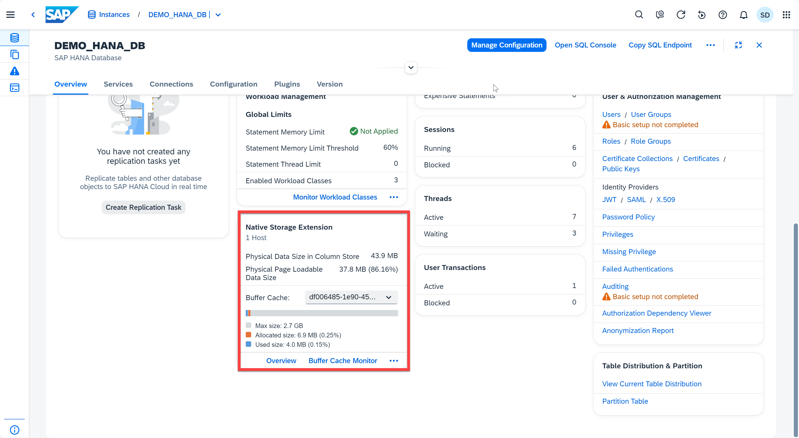
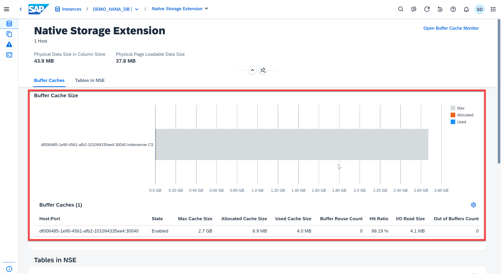
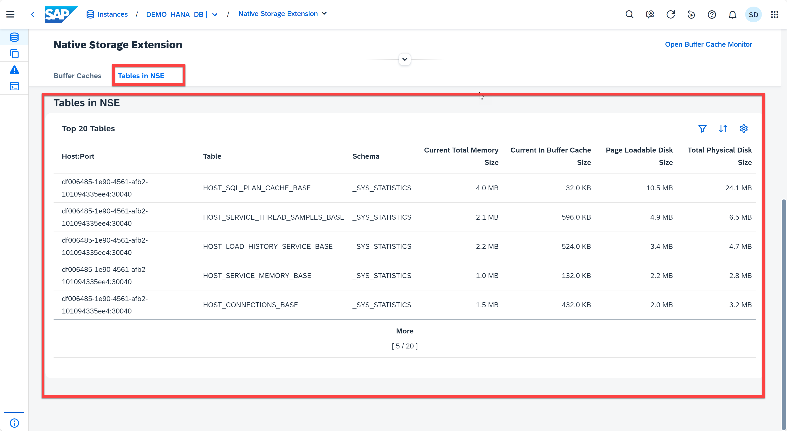
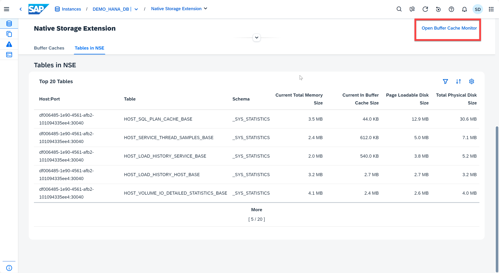
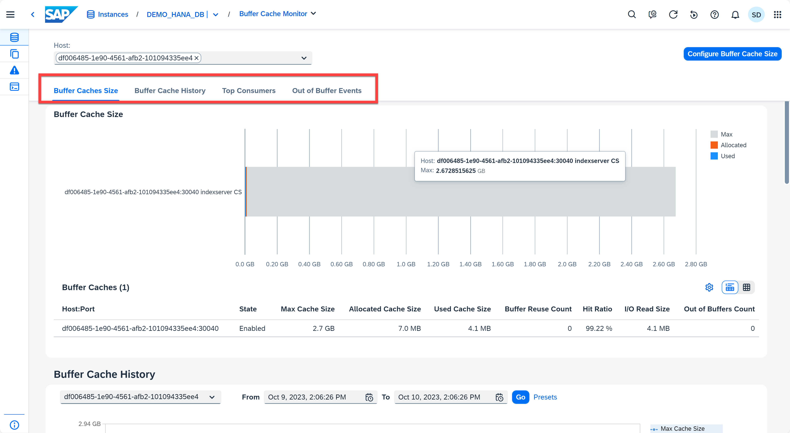

# Appendix 7: Native Storage Extension

SAP HANA Native Storage Extension (NSE) is a general-purpose, built-in warm data store in SAP HANA that lets you manage less-frequently accessed data without fully loading it into memory. It integrates disk-based or flash-drive based database technology with the SAP HANA in-memory database for an improved price-performance ratio. All SAP HANA Native Storage Extension (NSE) administrative tasks are moved to a dedicated card in the SAP HANA Cloud Central Database Overview page. A dedicated NSE card simplifies administration and improves the user experience by enabling cockpit users to manage all NSE operations from a centralized application.

1. Open Database Overview Page for instance *DEMO_HANA_DB*. Located the **Native Storage Extension** card. The card provides the following functionality:
    * Display the host count
    * Monitor the total data size on disk of all column store tables and the total page loadable data size on disk that could be loaded into buffer cache
    * Monitor the buffer cache size information of the selected host
  
    There are other actions you can take from the *Native Storage Extension* card, such as directly into the overview page, or the *Buffer Cache Monitor*, as well as *Load Unit Configuration* by clicking "...".
    <kbd>
    
    </kbd>

2. Click **Overview** to open the overview page. You are now in the Native Storage Extension app. It provides you the max, allocated, and used storage in the buffer cache. 
    <kbd>
    
    </kbd>

3. Another tab in this application is **Tables in NSE**. It will list up to the top 20 tables.
    <kbd>
    
    </kbd>

4. You can open the *Buffer Cache Monitor* by clicking the **Open Buffer Cache Monitor** button on the top right corner, or you can click the Buffer Cache section in the Native Storage Extension card.
    <kbd>
    
    </kbd>

5. The Buffer Cache Monitor also has many different tools such as listing the Buffer Cache Size, and Buffer Cache History, as well as the top consumers and the outer buffer events. 
    <kbd>
    
    </kbd>

Continue to - [Appendix 8 - Table Partition](../appendix8-TablePartition/README.md)
