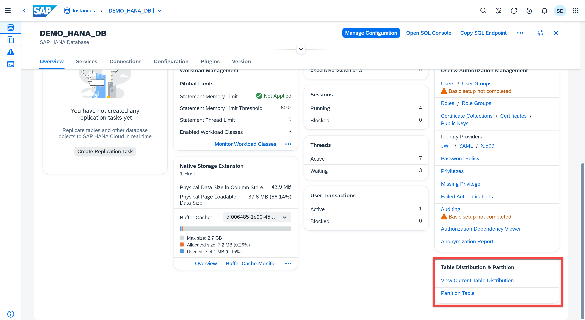
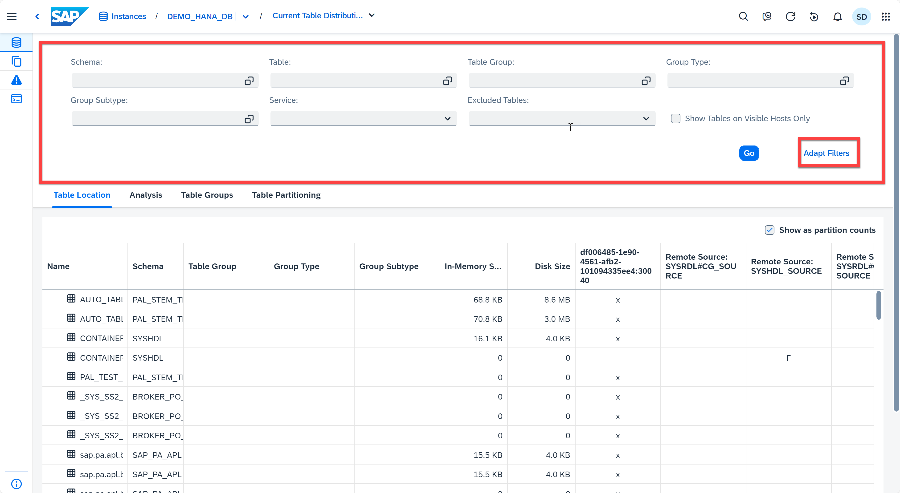
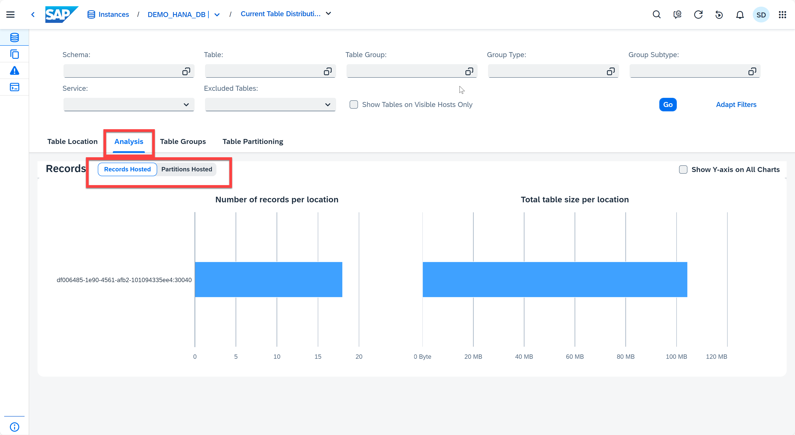
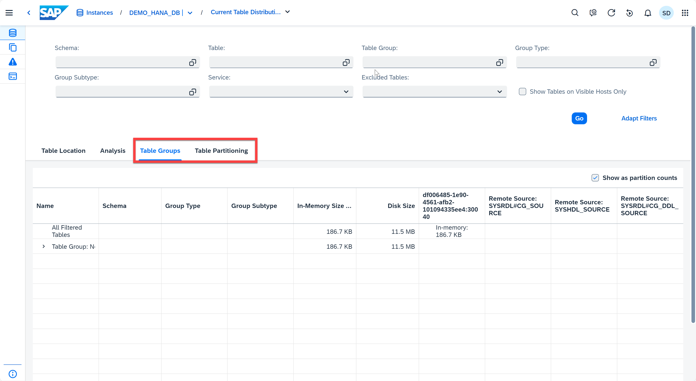

# Appendix 8: Table Distribution and Partition

Tables and table partitions can be distributed across multiple hosts. The location of the tables and partitions can affect performance when, for example, queries need to access several distributed tables. You may want to use table redistribution to automatically redistribute the tables or partitions to specific hosts in order to optimize query performance, or you may want to add a new host to a scale-out system and therefore need to redistribute the tables so that some will reside on the new host.

This exercise will walk you through the table distribution and partition feature in SAP HANA Cloud Central.

1. Open the Datavase Overview Page for *DEMO_HANA_DB*. Locate the **Table Distribution & Partition** card. Click *View Current Table Distribution* to open the Table Distribution app.
    <kbd>
    
    </kbd>

2. Now you are in the Table Distribution app. On the top you can see several fields. You can filter these tables by schema, group subtype, table, service, table group, group type and more. You can also exclued empty, loaded, temporary tables, or tables with LOB files. In addition, you can adjust filter fields based on your preference by clicking the **Adapt Filters** to make changes.
    <kbd>
    
    </kbd>

3. There are 4 tabs in this application. You can see the number of records per location and total table size per location by clicking the **Analysis** tab. You can also switch between the hosted records and hosted partitions.
    <kbd>
    
    </kbd>

4. There are lists of table groups and table partitioning available in the **Table Groups**, **Table Partition**.
    <kbd>
    
    </kbd>

This completes the appendices on the SAP HANA Cloud Central.

Back to - [DA262 - SAP HANA Cloud from an administrator's perspective](../../../README.md)

Optionally continue to [SAP HANA Database Explorer - Exercise 1 - Instances in the SAP HANA Database Explorer](../../sap_btp/ex1/README.md)