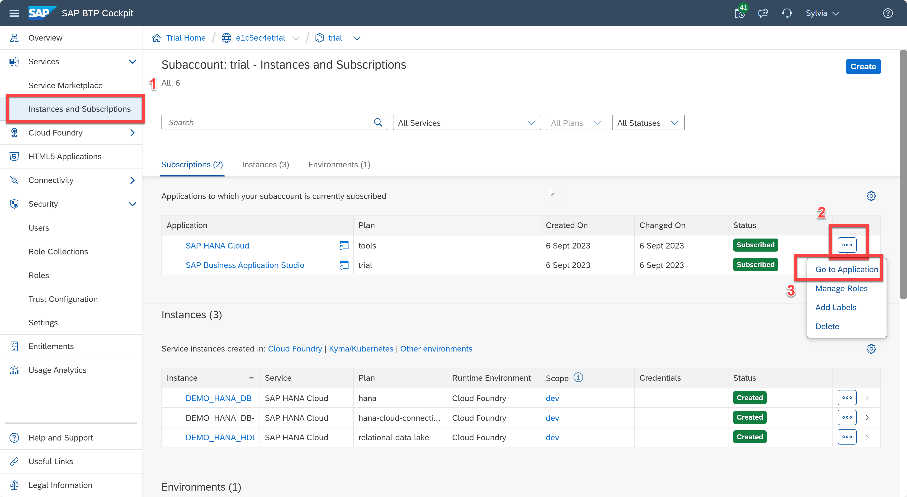
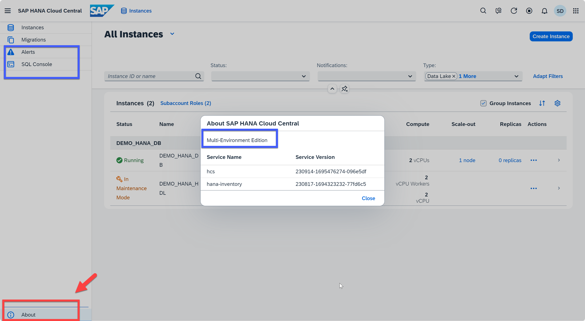

# Exercise 1: Overview of SAP HANA CLoud Central

The SAP HANA Cloud Central can be used to administer data lake, but this exercise will focus on SAP HANA database. With the SAP HANA Cloud Central, you can monitor resource utilization (memory, CPU and disk), alerts, table usage, database services, SAP HANA native storage extensions (NSE), and database performance metrics (threads, sessions, SQL statements, workload classes and connections). You can also view backups, manage configuration parameters, manage table distribution, administer smart data access (SDA) and administer smart data integration (SDI). Finally, you can perform security tasks such as user and role management, data encryption, auditing, data anonymization and trust configuration.

This exercise will teach you the basics of navigating the Database Overview Page and how to find the information you need as a database administrator. To begin, ensure you have logged in to the SAP BTP Cockpit and you have navigated to the "SAP HANA Cloud" page.

1. Open **SAP BTP Cockpit** -> Click **Instance and Subscriptions** under **Services** on the left nav bar -> CLick **Go to Application** button from SAP HANA Cloud Application
    <kbd>
    
    </kbd>

2. SAP HANA Cloud Central is launched in a new tab. **Note:** We are using the Multi-Environment Edition for this workshop. To verify that you are in the correct landscape, click the **i** button in the lower left corner. 
    <kbd>
    
    </kbd>
* An Alternative way is to check the left navigation bar: The **Alerts** and **SQL Console** buttons are only available in Multi-Environment Edition of HANA Cloud Central.

The SAP HANA Cloud Central tool is divided into several sections:

 * The left panel allows navigation between your SAP HANA Cloud instances and the Migrations application used to migrate SAP HANA Service databases to SAP HANA Cloud. You can also manage alerts using Alert application, as well as open SQL console.
 * The top panel offers different views and filters you can use to customize how your instances list is displayed, as well as providing search capability
 * The bottom panel displays all your instances, with the option to group the list by instances and personalize the view

As an SAP HANA Cloud administrator, you will likely spend a lot of time monitoring all your instances in SAP HANA Cloud Central.  From the instances list, you'll be able to see computing details of your databases, whether they are running or stopped, review their notifications, and perform actions on them.

Continue to - [Exercise 2: Refresh and Auto-refresh](../ex2-Refresh/README.md)

