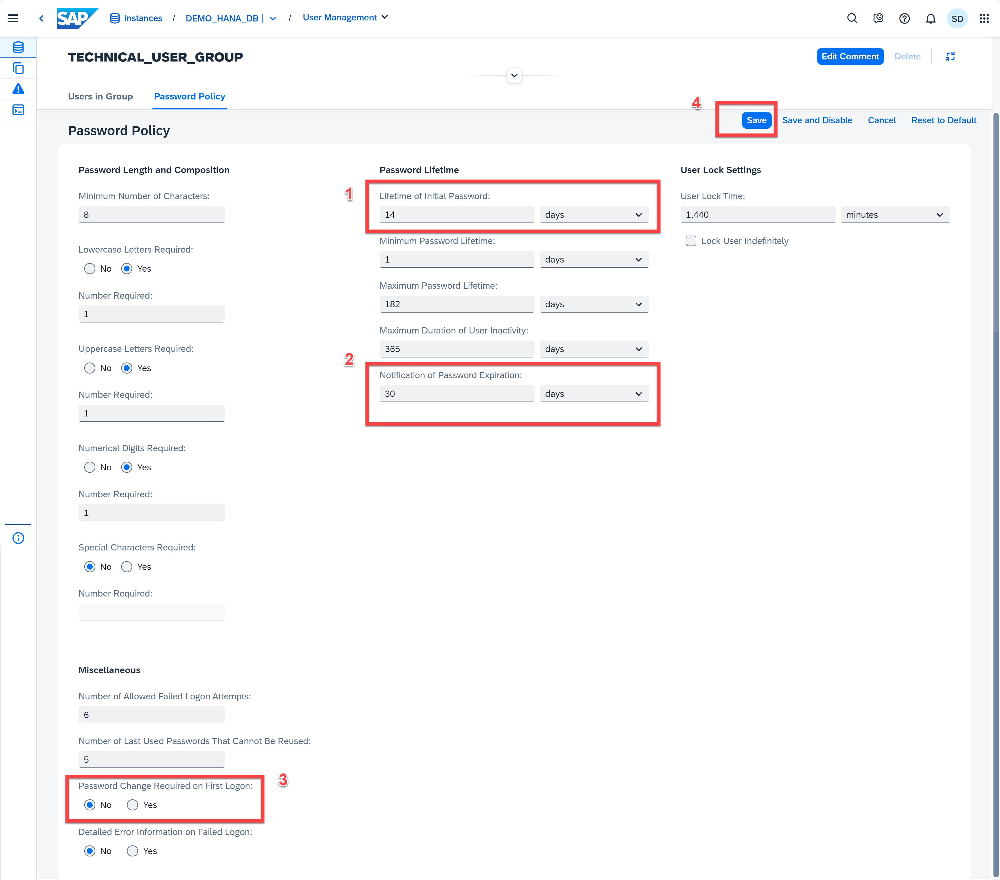
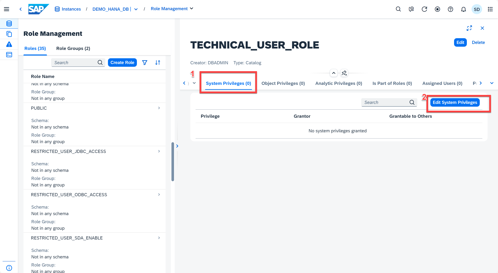

# Exercise 10: Security Basics
Security administration encompasses a wide range of topics, from monitoring critical security settings, to auditing activity in the SAP HANA instance, to managing SAP HANA users and roles. This exercise concentrates on user, role and user group management to provide you with a basic understanding of this important task of database administration.

Every user who wants to work with the SAP HANA instance must have a database user. As the database administrator, you create and provision the required users, as well as perform other tasks related to user administration. Roles are the standard mechanism of granting privileges to SAP HANA database users. It is recommended that you assign roles to users instead of granting privileges individually. User groups are a mechanism to organize users with similar roles or purposes.

In this exercise, you'll create a new user, a new role and a new user group.

1. In Database Overview page, located the User & Authorization Management card.  Let's first create a new user group. We have 3 ways to do that:
   1. Click the *User Groups* hyperlink -> Click *Create User Group*
    <kbd>
    
    </kbd>
    
        User groups can group together users with similar roles and enforce a specific password policy on the group.
    <kbd>
    
    </kbd>

    2. We can also use the Command Palette to open the User Management app:
    Click the Search icon on the top -> type " User Groups" -> Click "Show User Groups" under the DEMO_HANA_DB (or DA262 if you are using a SAP BTP Shared Subaccount). It opens the User Management app for you. Click *Create User Group*
    <kbd>
    
    </kbd>

    3. You may notice that there is a *Create User Groups* command when searching for "User Groups" in Command Palette. Click it, it then opens the *Create User Group* app for you.
    <kbd>
    
    </kbd>

2. Now we are in the *Create User Group* page. Enter TECHNICAL_USER_GROUP in the Name text field. 
   
    > **Note**
    If you are using the SAP BTP Shared Subaccount for DA262, you can put the name as *Your First Name + Some Random Number + _Group*. i.e. SYLVIA123_Group

   Leave the rest of the options in their default settings. Click **Save**. Then you can see the basic information about this newly created user group.
    <kbd>
    
    </kbd>
    <kbd>
    
    </kbd>

3. Let's explore what we can do with our newly created user group. Click the TECHNICAL_USER_GROUP row will bring you to the same page we have in last step. Enter the full-screen mode. 
   <kbd>
    
    </kbd>

4. From here you can move existing users to this user group. We haven't created our technical user yet so we won't do this from this page. We can also create a new user to assign to this user group.
    <kbd>
    
    </kbd>
5. We'll change this user groups' password policy. Click the **Password Policy** tab and click on **Edit**.
     <kbd>
    
    </kbd>

6. The password policy can be configured to be different from the database's password policy and will be applied to any users belonging to this user group. From here you can change password policies, such as length requirements, character requirements, password lifetime, user Lock Settings and expiry, etc. Make the following changes:

    * Lifetime of initial password: 14 days
    * Password change required on first logon: No
    * Notification of password expiration: 30 days

    Click the **Save** button.
    <kbd>
    
    </kbd>

7. Let's now create a new user. Click the **Create User** button. Enter the full-screen mode.
   <kbd>
    
    </kbd>

8. You are now in the User Management app and can provide the details for the new user. Notice the user group field is pre-populated and that's because we navigated here from the User Group Management app. Create a new user with the following attributes:

    * User name: TECHNICAL_USER or *Your First Name + Some random number* 
    * Select the password authentication mechanism check box
    * Password: Abcd1234
    * Password confirmation: Abcd1234
    * Force password change on next logon: No
   
    Click **Save** in the bottom right corner.
    <kbd>
    
    </kbd>

9.  On the drop-down menu from the SAP HANA Cloud Central's toolbar (top left), click on **User Management** and select **Role Management** from the menu to navigate to that app.
    <kbd>
    
    </kbd>

10. You are now in the **Role Management** app. Click the **Create Role** and create a new role with the following attributes:
    * Role: TECHNICAL_USER_ROLE or *Your First Name + Random Number_ROLE*
    <kbd>
    
    </kbd>

11. You can now add privileges to this user role. Click the **System Privileges** tab and click the **Edit System Privileges** button.
    <kbd>
    
    </kbd>

12. Click **Add** button and type *Catalog* in to the search bar. Select the **CATALOG_READ** system privilege. Click the **SELECT** button to dismiss the dialog.
    <kbd>
    
    </kbd>

13.  Click the **Save** button. 
    <kbd>
    
    </kbd>

14. Notice the number in the parentheses besides **System Privileges** is now one. The parentheses beside the privilege type shows the number privileges granted to this role. Click the **Object Privileges** tab and click the **Edit Object Privileges** button.
    <kbd>
    
    </kbd>

15. Click the **Add Object** button and search for the **_SYS_STATISTICS** object. Notice you can also filter by object type and schema. Select the object **_SYS_STATISTICS** and Click the **SELECT** button to dismiss the dialog.
    <kbd>
    
    </kbd>

16. Now from the **Add Objects with Privileges** dialog, scroll down until you see **SELECT** and check it. Click **OK** to return to the **Role Management** app.
    <kbd>
    
    </kbd>

17. Click the **Save** button to complete the operation of adding the object privilege.
    <kbd>
    
    </kbd>
18. Let's now assign the newly created *TECHNICAL_USER* to our user *TECHNICAL_USER_ROLE* . Click on **Assigned Users** and then click **Edit Assigned Users**.
    <kbd>
    
    </kbd>
19. Click the **Assign User** button and search for the user you just created i.e.*TECHNICAL_USER*. Select it and Click the **Select** button to dismiss the dialog
    <kbd>
    
    </kbd>

20. Click the **Save** button to complete the operation
    <kbd>
    
    </kbd>
21. Alternatively, we can also do the same via the User Management app when editing an existing user by assigning the newly created *TECHNICAL_USER_ROLE* to our user *TECHNICAL_USER*. On the drop-down menu from the toopbar, click on User Management.
     <kbd>
    
    </kbd>

22. You are now in the **User Management** app. Search for and click the user *TECHNICAL_USER* 
    <kbd>
    
    </kbd>

23. Click the **Role Assignment** button
     <kbd>
    
    </kbd>
24. Click the **Edit Assigned Roles** button
     <kbd>
    
    </kbd>
25. Click the **Add** button and search for the role *TECHNICAL_USER_ROLE* that we created earlier. Select that role and click the **Select** button
     <kbd>
    
    </kbd>

26. Click the **Save** button to complete the operation of assigning the role to the user
     <kbd>
    
    </kbd>
Click the *DEMO_HANA_DB* (or *DA262*) on the top left toolbar to go to the database overview page for next exercise.

Continue to - [Exercise 11 - Managing Workload Classes](../ex11-Workload/README.md)
