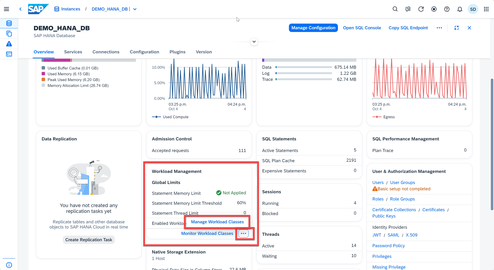
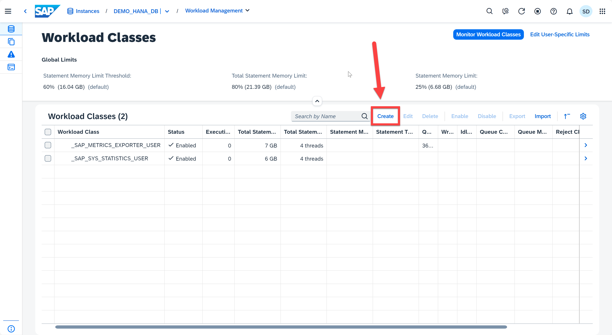
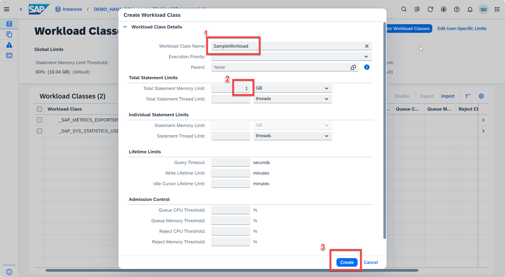
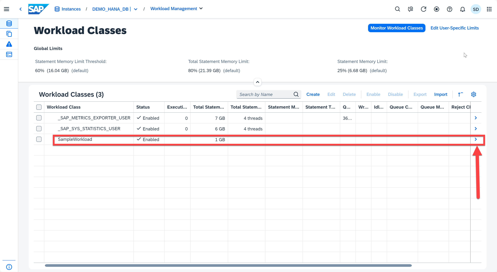
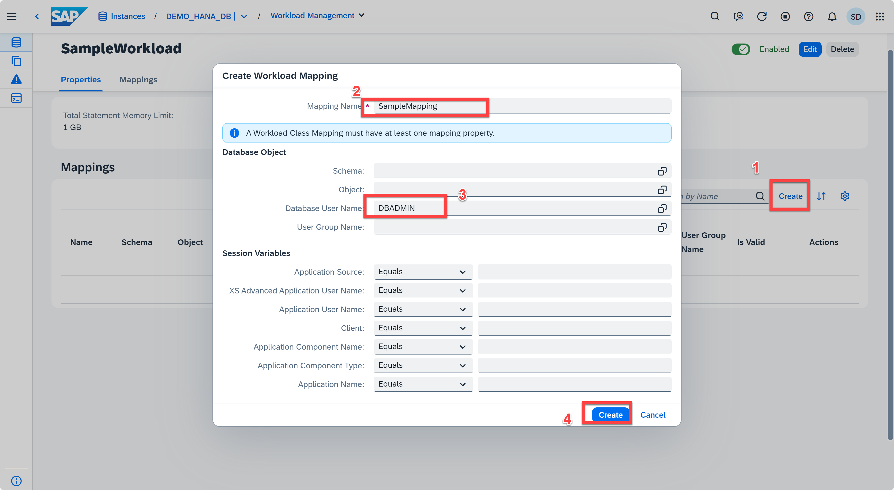
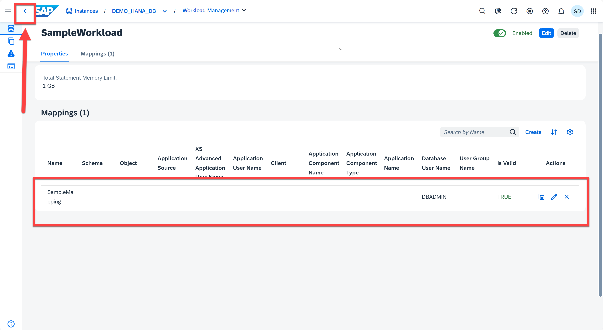

# Exercise 11: Managing Workload Classes
We manage workload in SAP HANA by creating workload classes and workload class mappings. Appropriate workload parameters are then dynamically applied to each client session. You can classify workloads based on user and application context information and apply configured resource limitations (for example, a statement memory limit). Workload classes allow SAP HANA to influence dynamic resource consumption on the session or statement level. In this exercise you will learn how to create workload classes and how to monitor them.

1. In the Database Overview Page, locate the **Workload Management** card. CLick "...", and then click the **Manage Workload Classes**. Another way to open the *Workload Management* app is using the Command Palette. You can search for "Workload Classes" and then click *Show Workload Classes*, which can bring you to the Workload Management app.
    <kbd>
    
    </kbd>
2. Now you are in the *Workload Classes* application. The *Workload Classes* application displays the parameters for every workload class in the system and this is where you can create a new workload class. Click the **Create** button.
   <kbd>
    
    </kbd>

3. You can create a workload class by entering a class name, execution priority, limit type, statement memory limit, and statement thread limit. You also have the option to map workload classes to user groups in the Mapping Details section of the dialog. Create a new workload class with the following details:

    * Workload Class Name: SampleWorkload 
  
    > **Note**
    If you are using the SAP BTP Shared Subaccount for DA262, you can name the sample workload as SampleWorkload_*YourFirstName_RandomNumber* to avoid having same workload name as others.

  
    * Total Statement Memory Limit: 1 GB

    We're defining a workload class named "SampleWorkload" as a parent workload, meaning that it can have child workloads that inherit its limits (i.e. SAP HANA supports hierarichal workload classes). The statement memory limit for this workload class is 1 GB. Click the **Create** button.
     <kbd>
    
    </kbd>

4. The newly created workload class appears in the table. You can assign a mapping. The assignment can be done when the workload class is created, or by clicking on the right arrow button at the end of the workload class row. Click on the right arrow to assign a mapping.
    <kbd>
    
    </kbd>

5. Click the **Create** button from the *Workload Classes* app and provide the following details for the mapping:

    * Mapping Name: SampleMapping
    > **Note**
    If you are using the SAP BTP Shared Subaccount for DA262, you can name the mapping as SampleMapping_*YourFirstName_RandomNumber*.

    * Database User Name: DBADMIN
  
    This mapping associates the database user DBADMIN to the workload we created earlier, limiting its statement limit to 1 GB. Click the Create button from the Create Workload Mapping dialog.
    <kbd>
    
    </kbd>

6. The newly created mapping appears in the table. Click the **Back** button to return to the table displaying the workload classes.
   <kbd>
    
    </kbd>
7. Other operations you can perform from this application include:

    * Enable/disable/delete an existing workload class
    * Import/export workload classes as compressed ZIP files
    * Define user-specific parameters (execution priority, statement limit and statement thread limit)
    * Monitor workload classes

8. Click the **Back** button twice to return to the Database Overview page.

Continue to - [Exercise 12 - Analyzing SQL Performance](../ex12-Thread/README.md)
