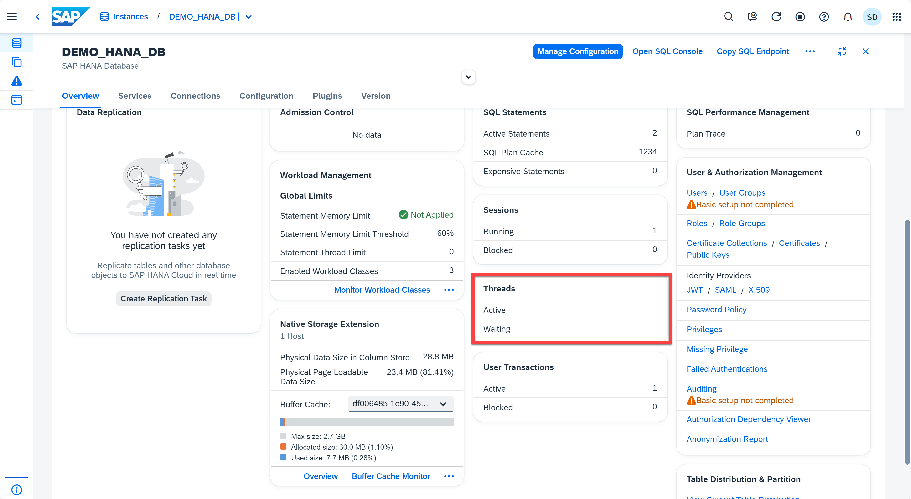
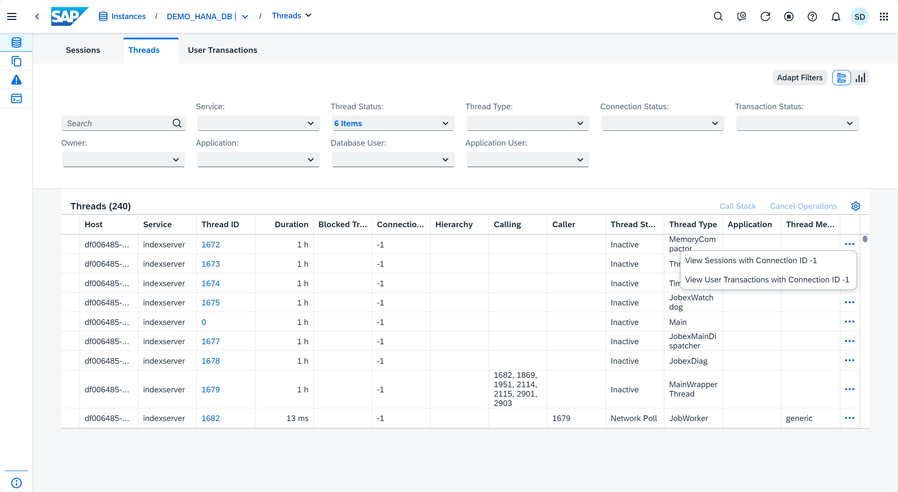
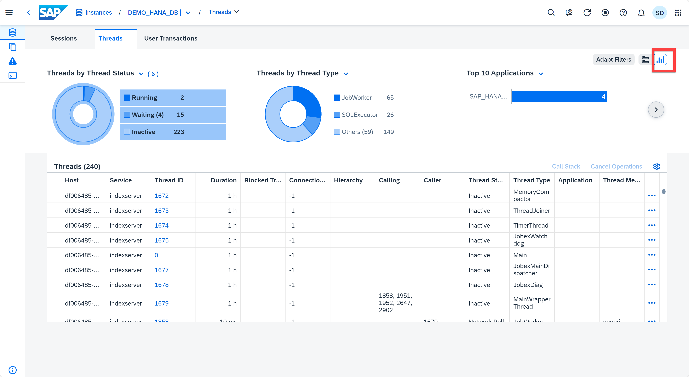
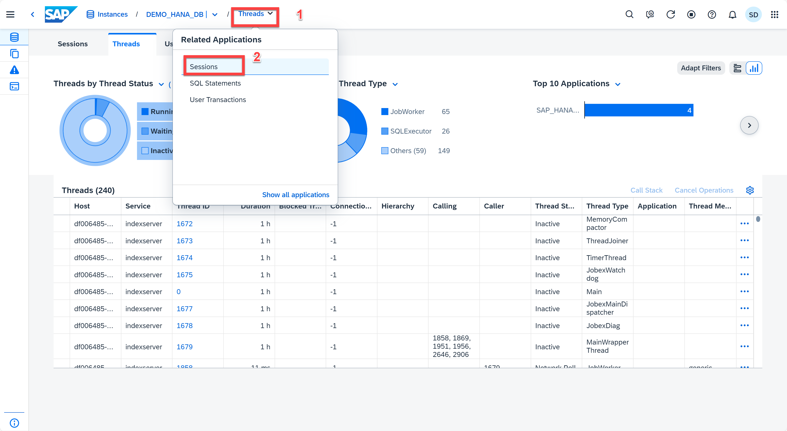
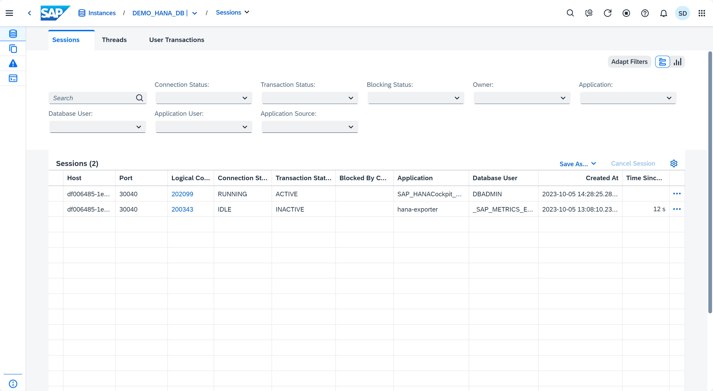
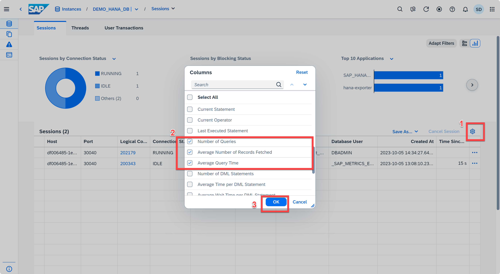
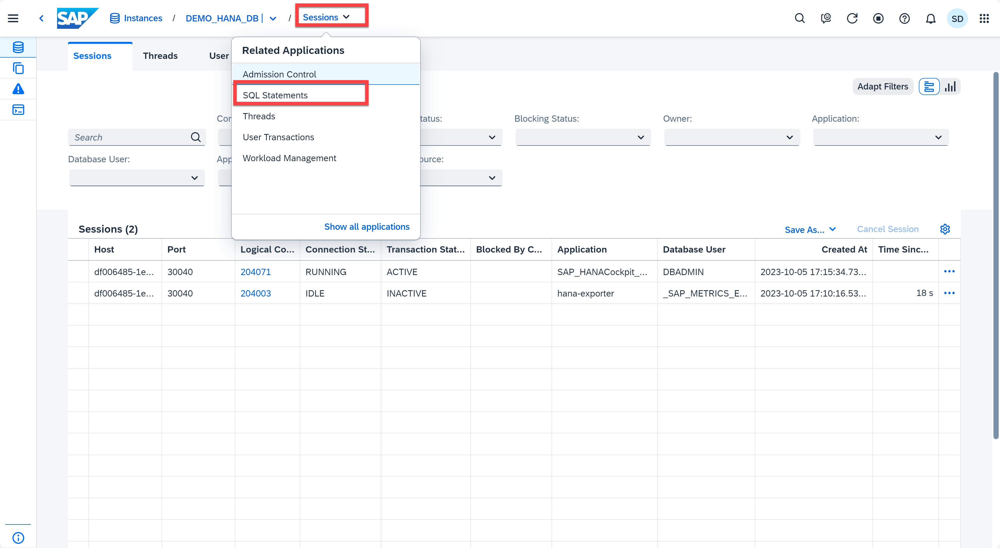
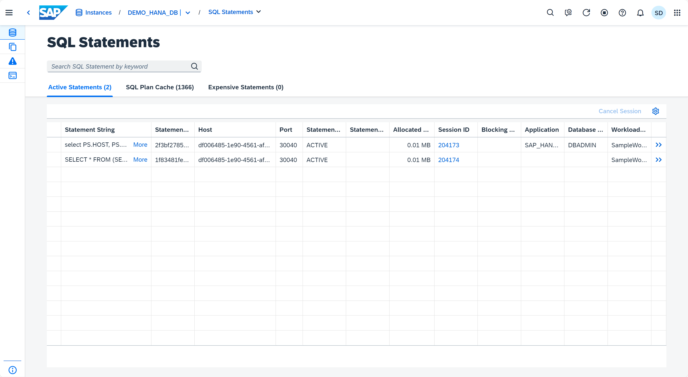
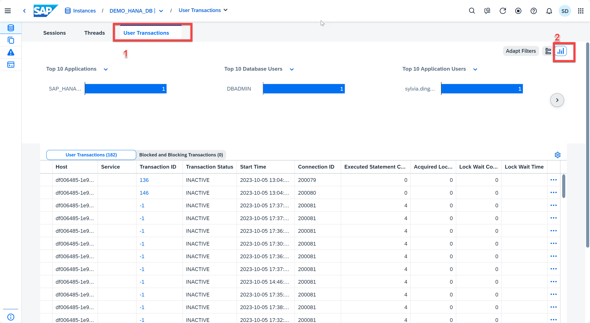

# Exercise 12: Analyzing SQL Performance
Managing and monitoring past and current information about the performance of the SAP HANA instance is important for root-cause analysis and the prevention of future performance issues. In this exercise, you'll explore the additional performance management tools available in the SAP HANA cockpit.

1. Locate the **Threads** card. This card shows the number of active and blocked threads in the database. Clicking on it takes you to the **Threads** app, which is used to monitor the longest-running threads active in your system. It may be useful to see, for example, how long a thread is running, or if a thread is blocked for an inexplicable length of time.
   <kbd>
    
    </kbd>

2. Click on the **Threads** card or use the **Command Palette** to launch the Threads application. When you launch this app, you'll see detailed information for approximately 1,000 longest-running threads currently active in the database.

    For each statement, you can see the duration, as well as the name of the service that is executing the thread. You can identify the host, and the thread type, whether the statement is related to a blocking transaction, and much more. Clicking on a thread gives the option to navigate to the sessions or blocked transactions associated with that connection ID. If a thread is involved in a blocked transaction or using an excessive amount of memory, you can cancel the operation executing the thread. You can view the call stack for this thread, although that is typically only useful to SAP Support when analyzing incidents.  You can view more details on the threads by adding columns to the table via the Settings button.
    <kbd>
    
    </kbd>

3.  Click the **bar-chart** icon. In addition to the thread details, you can see the distribution of threads by thread status, and by thread type. You can also see the summary of top 10 applications, application users, and database users. 
    <kbd>
    
    </kbd>

4. On the drop-down menu from the toolbar (top left), click on **Threads** and select **Sessions** from menu to navigate to that app. You can also click the **Sessions** card in the Database Overview page.
   <kbd>
    
    </kbd>
5. This app allows you to monitor all sessions in the database. It can be used to see whether a session is blocked and, if so, which session is blocking it. Similar to the Threads app, you can see a summary of the top users, applications and sessions. When a session row is selected, you can navigate to threads and blocked transactions with a specific connection ID. You can cancel a session. 
    <kbd>
    
    </kbd>

6. Let's add a few columns to the table. Click the **Settings** (gear) button above and to the right of the table and check the following columns:

    * Database User
    * Number of Queries
    * Average Number Of Records Fetched
    * Average Query Time (ms)
        <kbd>
        
        </kbd>

    Click OK. You added columns to see the database user, the number of queries in this session, along with its average number of records fetched and query time. By examining these metrics, you can determine whether the queries in this session are returning the expected number of rows and are executing in the expected amount of time.

7. On the drop-down menu from the toolbar (top left), click on **Sessions** and select **SQL Statements** from menu to navigate to that app. You can also click the **SQL Statements** card in the Database Overview page to launch the *SQL Statements* application, where you can have a look at an overview of the statements, active statements, SQL plan cache and expensive statements.
    <kbd>
    
    </kbd>

8. This app shows the 100 most critical statements currently active in the database. For each statement, you can see the full statement string, as well as the ID of the session in which the statement is running. You can identify the application, the application user and the database user running the statement, and whether the statement is related to a blocking transaction. You can see the entire SQL statement by clicking the "More" link. You can view the session the statement is running in. If a statement is involved in a blocked transaction or using an excessive amount of memory, you can cancel the session the statement is running in (or the blocking session).
   <kbd>
    
    </kbd>

9. Click the **User Transactions** button to open the *User Transactions* app. This app allows you to monitor all user transactions in the database. Similar to the Threads app, you can see the distribution of transactions by transaction status, blocking status, and a summary of top 10 applications, database users, and application users by clicking the *bar-chart* icon.
    <kbd>
    
    </kbd>

10. Click the **DEMO_HANA_DB** on the top-left toolbar to navigate to the Database Overview page for next exercise.
    

Continue to - [Exercise 13 - Plan Trace](../ex13-PlanTrace/README.md)
