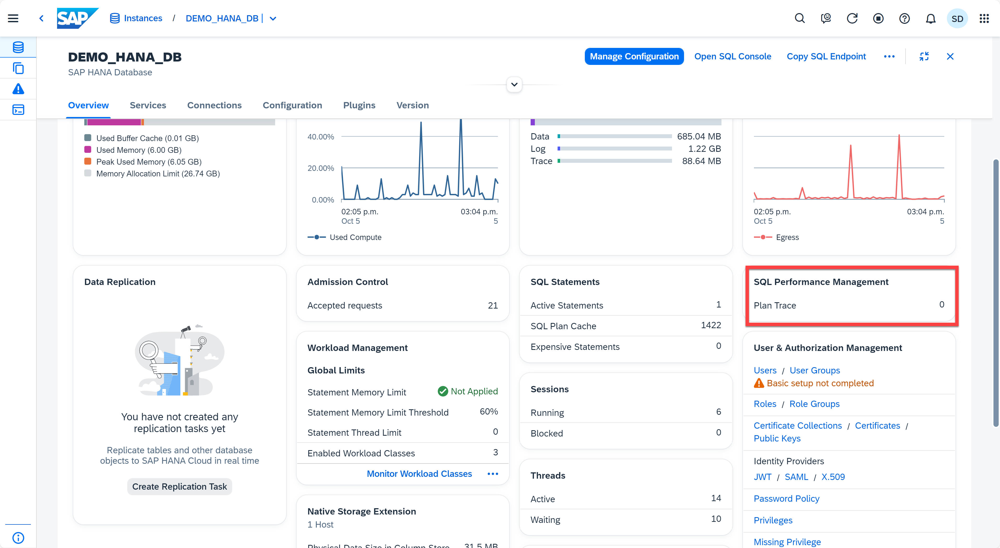
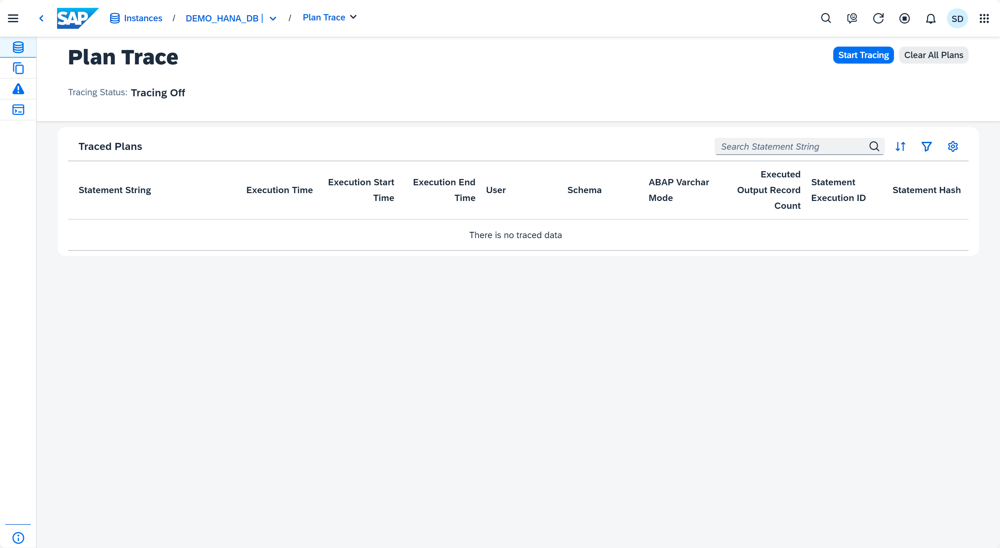
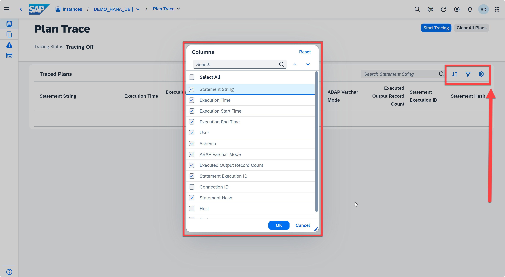
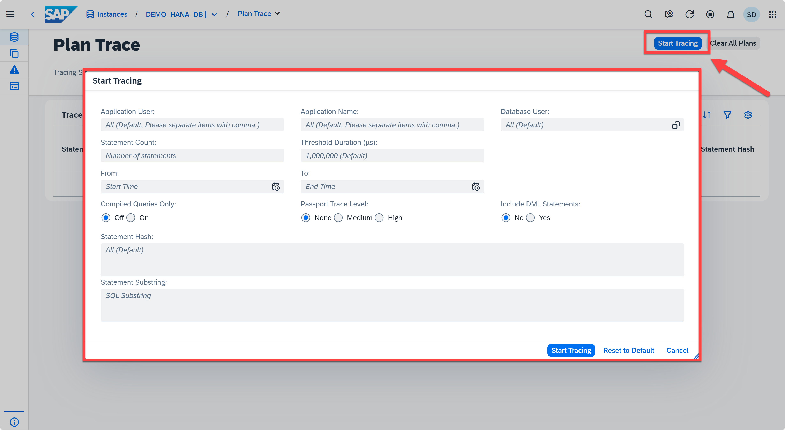

# Exercise 13: Plan Trace
Plan trace enables users to collect SQL queries and their execution plans, executed in a given time frame.

1. Locate the **SQL Performance management** card in the Database Overview page. This card shows the number of plans that has been traced. Clicking on the **Plan Trace** takes you to the **Plan Trace** app. 
    <kbd>
    
    </kbd>
2. Now you are in the **Plan Trace** app. Trace Query List display a set of statistics for each SQL statement collected in a given time frame. This set of statistics provides a good starting point for easily finding out the most expensive SQL statement. 
   <kbd>
    
    </kbd>
   
3. There is information available for each statement so that users can sort or filter or view the column (criterion) of their interest to find the most expensive statement. For example, user can see the *Statement String*, *Execution Time*, *Execution Start Time*, *Execution End Time*, *User*, etc. You can filter or sort the plans by clicking the icons on the top right of **Traced Plans**. You can also select the columns that you are interested by clicking the gear button and then select the information you want. You can always reset it to the default version as well.
   <kbd>
    
    </kbd>
4. The plan trace configuration can be accessed from the **Start Tracing** button at the top right corner of the page. Users can set different options and filters according to their own circumstance.
    <kbd>
    
    </kbd>

This concludes the exercises on the SAP HANA Cloud Central. Optionally, view the additional content in the [SAP HANA Cloud Central - Appendix 1 - Searching and Filtering](../appendix1-Filtering/README.md).

Back to - [DA262 - SAP HANA Cloud from an administrator's perspective](../../../README.md)
