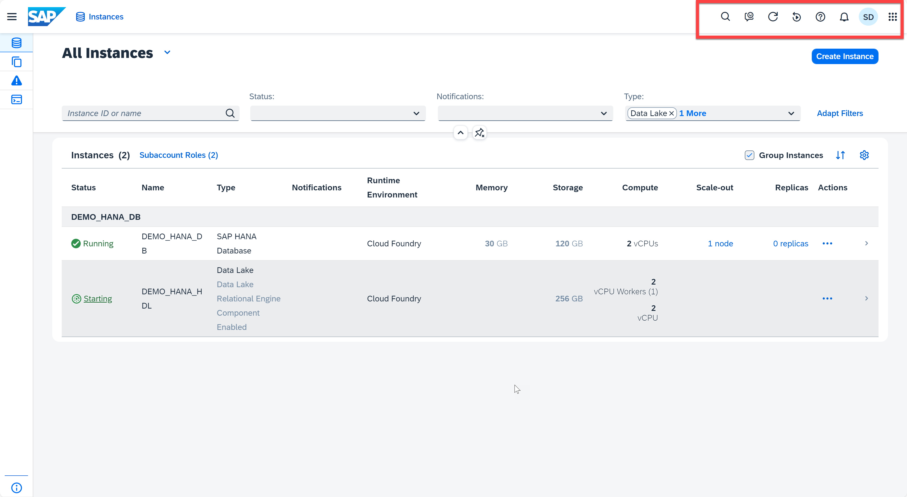
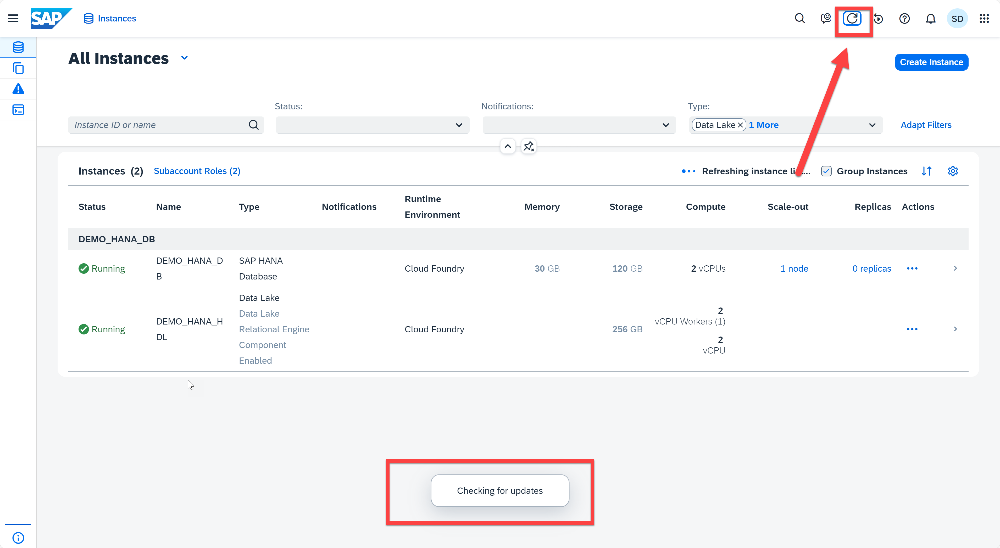
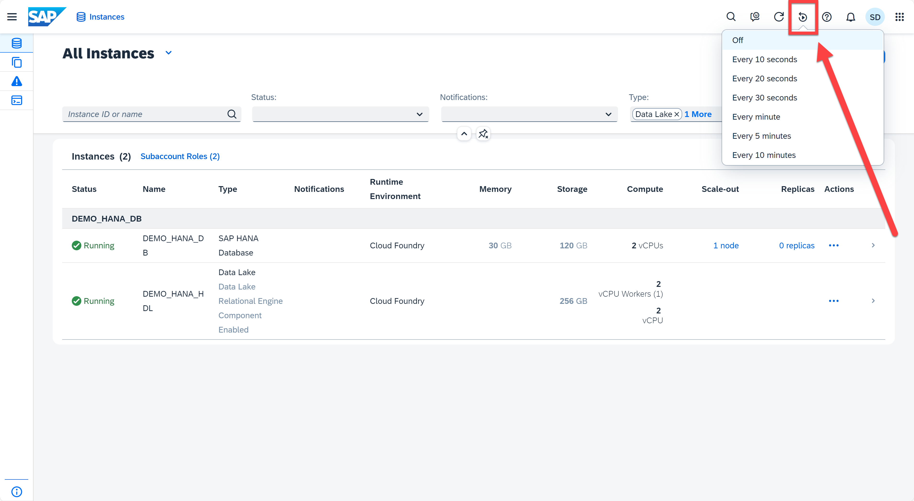
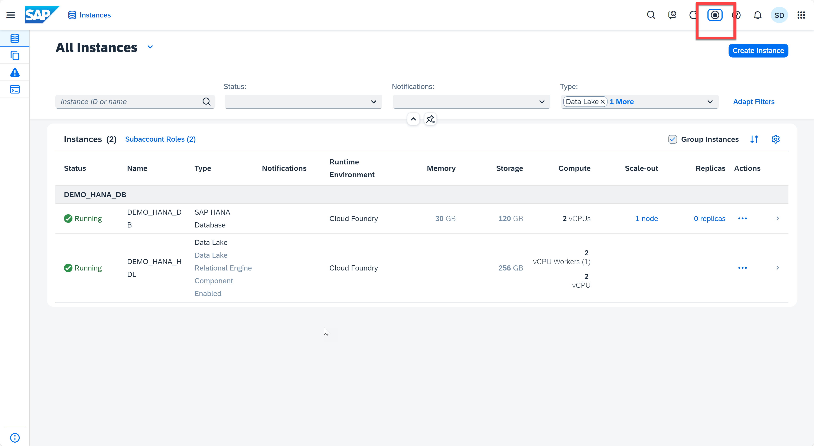
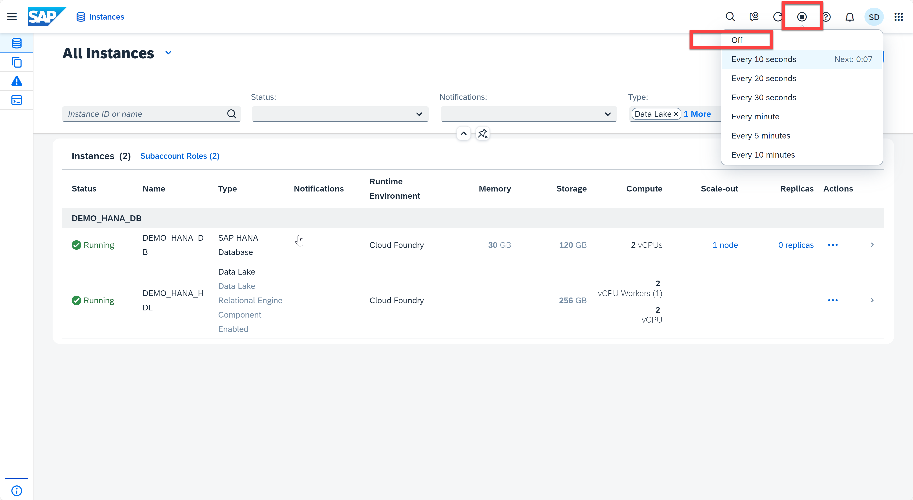

# Exercise 2: Refresh and Auto-Refresh

This exercise will teach you the usage of manual refresh and auto-refresh button.

  
1. At the top right of the **SAP HANA Cloud Central**, you 'll find the tool bar. It contains the **Search Commands** (in exercise 5), the **give feedback** button, the manual **refresh** and **auto-refresh** button ( will be cover in this exercise), the help button (for content-specific online help), the notification button, the user button (for user-specific settings and options), and the switch product button.
    <kbd>
    
    </kbd>
2. To refresh the database, you can simply click the **Refresh** button, and you will see a meesage "Check for updates" on the buttom.
   <kbd>
    
    </kbd>
3. To avoid manual refreshing, you can also use the auto-refreshing. Click the **Auto-refresh** button. The interval can be every 10/20/30 seconds or 1/5/10 minutes. Choose the interval you prefer. Notice that the icon will change once you set up auto-refreshing.
   <kbd>
    
    </kbd>
    <kbd>
    
    </kbd>
4. To disable auto-refreshing, just click the auto-refresh button again and select **Off**
    <kbd>
    
    </kbd>
Continue to - [Exercise 3: Create Instances](../ex3-Instance/README.md)
