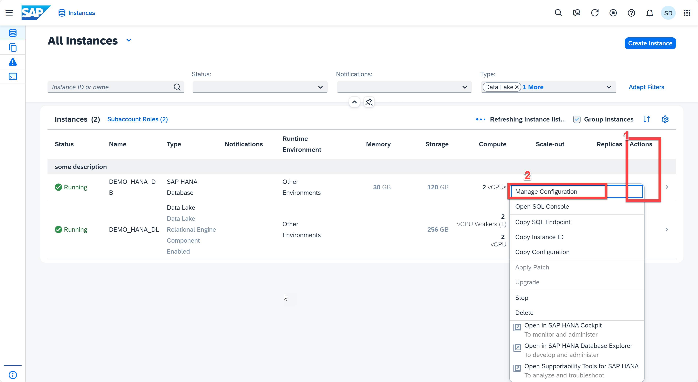
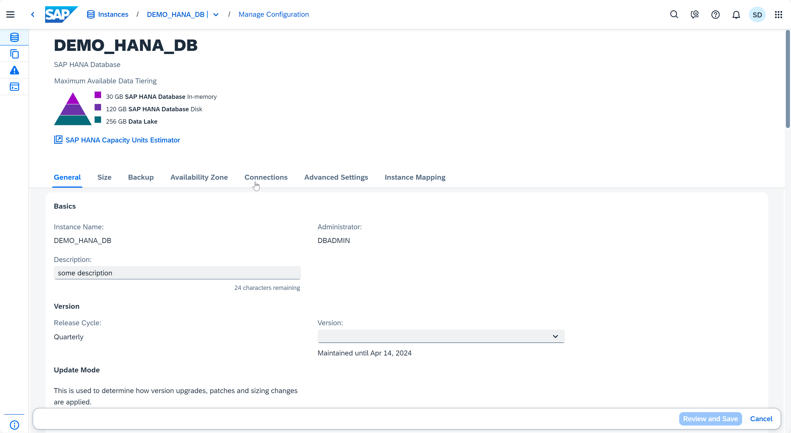
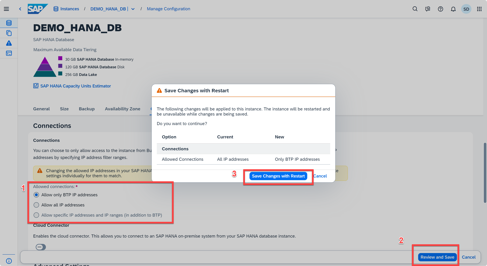

# Exercise 3: Action Menu

## Exercise 3.1: Edit Instance

In this exercise, we will discuss the *Manage Configuration* functionality across all the instance types. An existing instance can be modified after creation as per requirement through the *Manage Configuration* functionality. Let's edit the **DEMO_HANA_DB** (or **DA262** if you are using the SAP BTP Shared Subaccount) instance.

 1. Click on the '...' icon (under the Actions menu in the instances list) to see the operations that can be performed on the DEMO_HANA_DB ( or DA262) database. Click on Manage Configuration.

    

2. An Edit instance dialog opens and you can see all the relevant fields that can be modified. As we scroll down the dialog, we see other fields that we can edit such as connections, upgrade mode, and instance mapping.
   
   

3. Let's make a change: in the Connections section, select 'Allow all only BTP IP addresses' (or use a different option if that's already selected). The Save button will only be enabled when you make a valid change. Click on *Review and Save* button at the bottom right. Then you can review the changes you made. Click *Save Changes with Restart*, it will bring you to the SAP HANA Cloud Central instance page. The edited instance restarts to adapt itself to the recently made changes.
    
    

## Exercise 3.2: Start, Stop, Upgrade Instance
In this section, we will discuss about how to start, stop, and upgrade instances from the SAP HANA Cloud Central application.

Continue to - [Exercise 4 - Refresh and Auto-Refresh](../ex4-Refresh/README.md)
