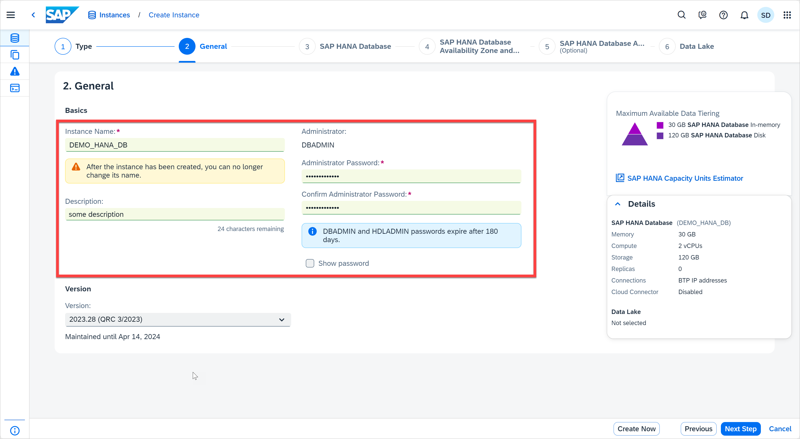
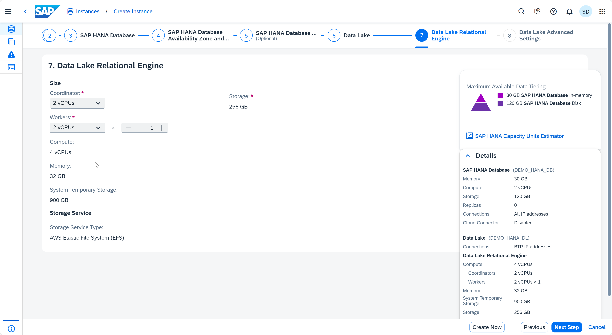
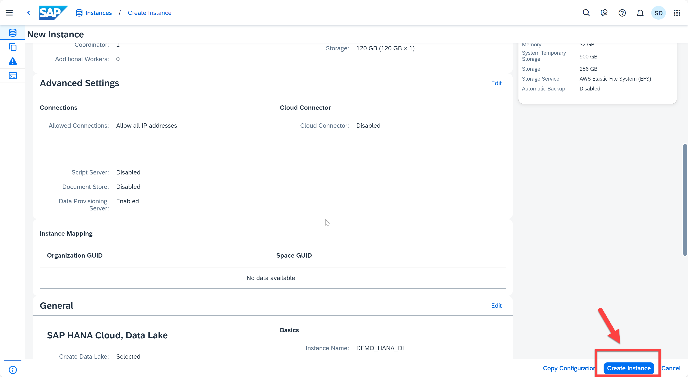

# Exercise 3: Create Instances

> **Warning**
Before we start the exercise, please read the following important instruction.

As a prerequisite, we have already created an SAP HANA Cloud, SAP HANA Database instance: "DEMO_HANA_DB". Your trial account allows creation of only one database instance. 
* If you've already created "DEMO_HANA_DB", you may not be able to create another database instance in this exercise; however, please continue to follow the steps to learn the process. 
* If you are a non-trial user, you'll be able to create another instance, but be sure to provide a different instance name as SAP HANA Cloud does not allow creation of instances with same names. 
* If you are using the SAP BTP Shared Subaccount for this exercise, please follow the steps to learn the process, but **cancel** the creating at the end of step 5. 

> Creating a new SAP HANA Cloud instance takes approx. 10 mins.

Let's see how to create SAP HANA Cloud, SAP HANA Database and SAP HANA Cloud, Data Lake instances directly from the SAP HANA Cloud Central Overview page.

1. Click the **Create Instance** button in the top right. This will navigate you to the create instance wizard.
   
   

   * In this page, you can see options to create 
     *  SAP HANA Cloud, SAP HANA Database
     *  SAP HANA Cloud, Data Lake instances 
        *  You may not see this option if you are using the shared subaccount for DA262
     *  (Cloned) SAP HANA CLound, SAP HANA Database
     
    You can choose the type of instance you would like to create and click on 'Next Step'. Let's create an SAP HANA Cloud, SAP HANA Database instance. Select that option and click on Next Step.
    

2. Below are the field details that you see on this Create Instance screen, the values they take and the steps to successfully create an SAP HANA Cloud instance.

   * Instance Name - The name of the instance. The name must start and end with an alphanumeric character. The name can include the underscore character _.
   * Description - A description of the instance.
   * Administrator Password - The password of the database 'superuser' DBADMIN. The password must have at least 8 characters and comprise at least one uppercase letter, two lowercase letters, and at least one number. The password must not include the user name, the characters ' " ` \ ; [ ], or control characters, such as newline, backspace, tab.
   * Version - The new instance you create can be of a specific supported version. By default, the latest version is used when creating a new SAP HANA Cloud instance.
> Note that certain fields display helpful tips on what constitutes a valid entry (for example instance name, administrator password). You can also open the Help dialog by clicking its button on the toolbar in the top right. The contents of the Help are dynamic, meaning that they change depending on the dialog you're working on. In this case, you see additional information on the different fields of this page.

Click on Next Step once you complete all the fields.
    

3. Details of the fields that you see on this screen:

    * **Memory** - The size of your (compressed) in-memory data in your SAP HANA database.
    * **Storage** - The disk storage space of your SAP HANA database. The disk storage space is allocated according to the memory size of your SAP HANA database.
    * **Compute** - The number of vCPUs of your SAP HANA database. The number of vCPUs is allocated according to the size of memory of your instance.
  
   If you are using a non-trail account, you will be able to choose between different performance classes.
    * **High Compute** - Optimized to support compute-intensive workloads that require less memory resources
    * **Compute** - Optimized to support compute-intensive workloads
    *  **Memory** - Default compute-memory ratio, which is suitable for most workloads
    *  **High Memory** - Optimized to support the processing of large data sets that require a lot of memory
  
        

   The default performance class for trail account is **Memory**. You can also use the SAP HANA Cloud Capacity Unit Estimator on the right side to estimate the number of Capacity Units (CU) required for your particular use case. We will use default sizes for this exercise.

   

4. Click on the Next Step button once the memory and storage configurations are completed. In this step, you have an option to choose availability zones. Basically, it specifies where the database instances are placed. You can also deploy replicas of your SAP HANA database instance. Important notes:

    * Availability zones and replicas are not available in SAP HANA Cloud trial instances.
    * You cannot change the availability zone of an instance once it is created. If you want to change the availability zone for an instance, delete the instance and re-create it with the preferred availability zone.
    
    

5. Click on Next Step. There is an Additional Features section to make configurations on Script Server (to execute application function libraries) and Document Store (for native operations on JSON documents) capabilities. Then you have an option to make configurations related to allowed connections like IP address settings. Select Allow all IP addresses.

    

   > **Note**
   If you are using the **SAP BTP Shared Subaccount for DA262**, click the *Cancel* button and then *Leave* button to return to the ALL Instances view in SAP HANA Cloud Central. Otherwise, you can continue with following steps.

6. Click on Next Step to proceed to Data Lake related settings. In this step, you have the option to create an SAP HANA Cloud, data lake instance along with creating an SAP HANA Database instance. To do so, you must enable the Create Data Lake toggle button and fill in the related details. After clicking on Create Data Lake toggle button, enter the Data Lake instance name, make configurations to the required Storage services. Click on Next Step.
    
    

7. Adjust the size if necessary and click on Next Step.
    
    

8. Here you have the liberty to make configurations on the IP address settings as per your requirements. You can choose to only allow access to the instance from SAP Business Technology Platform (default) or only from trusted IP addresses by specifying IP address filter ranges. Up to 45 entries can be specified. Click on Review and Create button.

     

9. You can now review the instance details in this page.
    

10. Click the Copy Configuration button in the bottom right corner. A pop-up window will appear that provides a JSON-compliant string to create a new SAP HANA database with the same configuration details you have just entered. There is the option of copying the configuration to the clipboard or downloading it as a JSON file. This allows you to save the entered configuration so that you can re-use it in the future.
    
    

11. **If you are using the SAP HANA Cloud trial and already have a database instance, click the Cancel button and then the Leave button to return to the All Instances view in SAP HANA Cloud Central (recall that you can only have 1 database instance in SAP HANA Cloud trial, so you cannot create a second one).** Otherwise, click on Create Instance button and you will be redirected to the SAP Cloud Central overview page to see the instance you have just created. 
    <kbd>
    
    </kbd>
    
> Creating a new instance takes approximately 10 mins.
    
    

12. If using a non-trial account, on the SAP HANA Cloud Central overview page, you'll see a status CREATING next to the instance you just provisioned. 
        

    * By clicking on this status (hyperlink) we get details on when the instance creation was initiated. 
     
    
    * Once the instance is created, the status will be changed to Running.
    
 

Continue to - [Exercise 4 - Actions Menu](../ex4-ActionsMenu/README.md)
