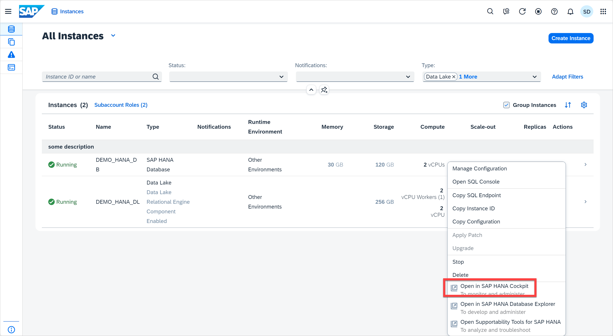
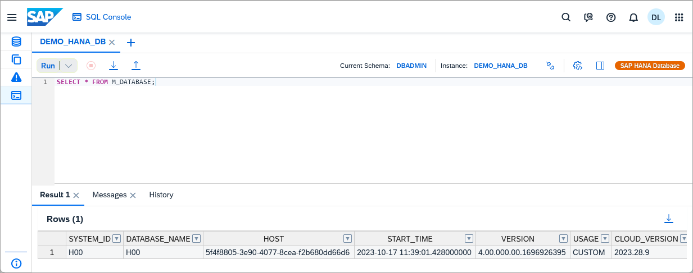

# Exercise 4: Actions Menu

## Exercise 4.1: Edit Instance

In this exercise, we will discuss the *Manage Configuration* functionality across all the instance types. An existing instance can be modified after creation as per requirement through the *Manage Configuration* functionality. Let's edit the **DEMO_HANA_DB** (or **DA262** if you are using the SAP BTP Shared Subaccount) instance.

 1. Click on the '...' icon (under the Actions menu in the instances list) to see the operations that can be performed on the DEMO_HANA_DB (or DA262) database. Click on **Manage Configuration**.

    

2. An Edit instance dialog opens, and you can see all the relevant fields that can be modified. As we scroll down the dialog, we see other fields that we can edit such as connections, upgrade mode, and instance mapping.
   
   

3. Let's make a change: in the *Connections* section, select 'Allow all only BTP IP addresses' (or use a different option if that's already selected). The Save button will only be enabled when you make a valid change. Click on **Review and Save** button at the bottom right. Then you can review the changes you made. Click **Save Changes with Restart**, it will bring you to the SAP HANA Cloud Central instance page. The edited instance restarts to adapt itself to the recently made changes.
    
    

## Exercise 4.2: Start, Stop, Upgrade Instance
In this section, we will discuss about how to start, stop, and upgrade instances from the SAP HANA Cloud Central application.

1. Click the "..." button under Actions column for the DEMO_HANA_DB or DA262 database.
   

> **Note**
Stopping and Starting an instance can take up to 5 minutes. You may choose to do so, or proceed without stopping your instance and continue to step 6 of the exercise.

> **Warning**
Please do not stop your instance if you are using the SAP BTP Shared Subaccount for DA262. 

2. Click the **Stop** menu item. A pop up shows up, confirming that you want to continue with stopping the instance. Click the **Stop** button.
    
    

3. You'll see the instance's status changing to 'Stopping' and you can see more details by clicking on that word (it's a hyperlink). Stopping the instance will take a few minutes. Use Refresh or Auto Refresh (covered in exercise 2) to update the screen during this process.
    

4. After the instance stops, let's start it again. Click the "..." button under the Actions column. Click on **Start**.
    

5. We can see that the instance has moved to status 'Starting'. On clicking the 'Starting' hyperlink we see details on the date and time when the instance was initiated and updated.
   

6. We also have another option that allows us to Upgrade the SAP HANA Cloud instance. Once the instance is running again, click the "..." button under the Actions column to see if there is any upgrade available. If an upgrade is not available, that menu item will be disabled.
   
   

7. Clicking on the Upgrade menu item opens the Upgrade dialog. If you choose to upgrade, a pop up appears saying that a new revision for the instance is available and if we want to continue with the Upgrade process. If you are using the SAP BTP Subaccount for DA262, the instance has already upgrade to latest version. For this workshop, we will not perform an upgrade, so click the Cancel button.
    > **Note**
    A similar procedure is available if you want to apply a patch to your SAP HANA Cloud instance.

## Exercise 4.3: Other Actions

Now let us talk about the other Actions available for each of the instances. 

1. Click on the "..." button under the Actions column for the DEMO_HANA_DB or DA262 instance. Click on **Open in SAP HANA Cockpit** menu item in the Actions list. We can directly open the SAP HANA Cockpit to administer the SAP HANA instance from the SAP HANA Cloud Central page.
   

2. SAP HANA Cockpit opens in an adjacent new tab. Fill in the credentials (username is DBADMIN, password is what you provided when creating the instance).
   
    

3. You are now on the SAP HANA cockpit's Database Overview page. Here, you can perform various monitoring and administrating operations on our SAP HANA Cloud instance. You will learn more about the SAP HANA cockpit in future exercises.
   

4. We can also open the SAP HANA Database Explorer to create SQL scripts and run them. Switch to the tab with SAP HANA Cloud Central and click on **Open in SAP HANA Database Explorer** menu item in the Actions column for the SAP HANA database. SAP HANA Database Explorer opens in an adjacent new tab.
    
    

5. Return to SAP HANA Cloud Central. Click the "..." button under the Actions column for the DEMO_HANA_DB instance again. Now click on **Open SQL Console** menu item. It opens the SQL Console in the same tab. More exercises related to SQL Console are available in exercise 7. 
   
    

6. Return to SAP HANA Cloud Central by clicking the **Instance** button on the top left nav bar. Click the "..." under the Actions column for the DEMO_HANA_DB instance again. We have 3 copy options: 
   
   * **Copy SQL Endpoints:** Upon clicking this, the SQL endpoint is copied to the clipboard. We get a success message saying that the SQL endpoint is copied to the clipboard. SQL Endpoints are useful when you want to connect to your SAP HANA Cloud instance from other applications or if you want to access it from the command line.
  
   * **Copy Instance ID:** This will help us copy the instance ID to the clipboard. This function is similar to the previous copy option we discussed. On clicking Copy Instance ID option, we get a success message. The instance ID is required when connecting to data lake Relational Engine using Interactive SQL.
  
   * **Copy Configuration:** Click on Copy Configuration. A popup opens with options to copy configuration to clipboard or download it as a JSON file. Depending on how often you will use your instance configuration, either copy or save the JSON-compliant string.
    

Continue to - [Exercise 5 - Command Palette](../ex5-CommandPalette/README.md)
