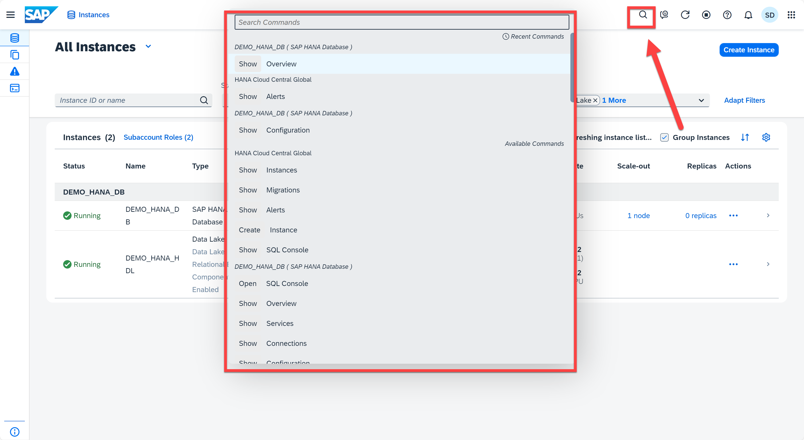
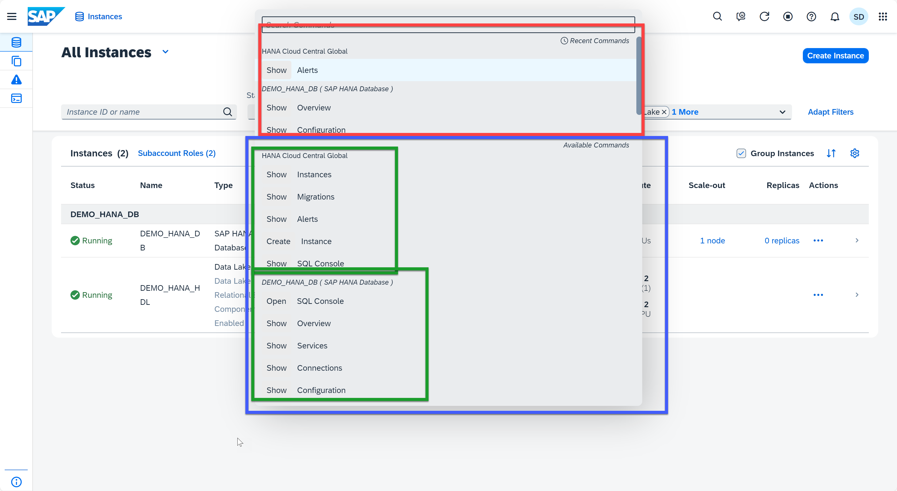
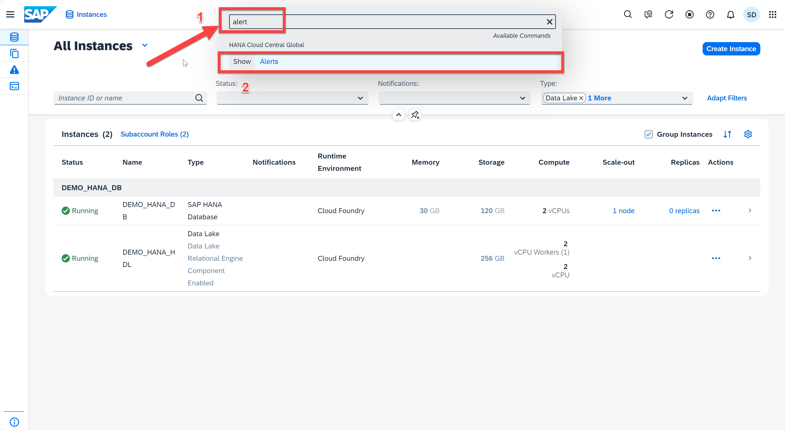
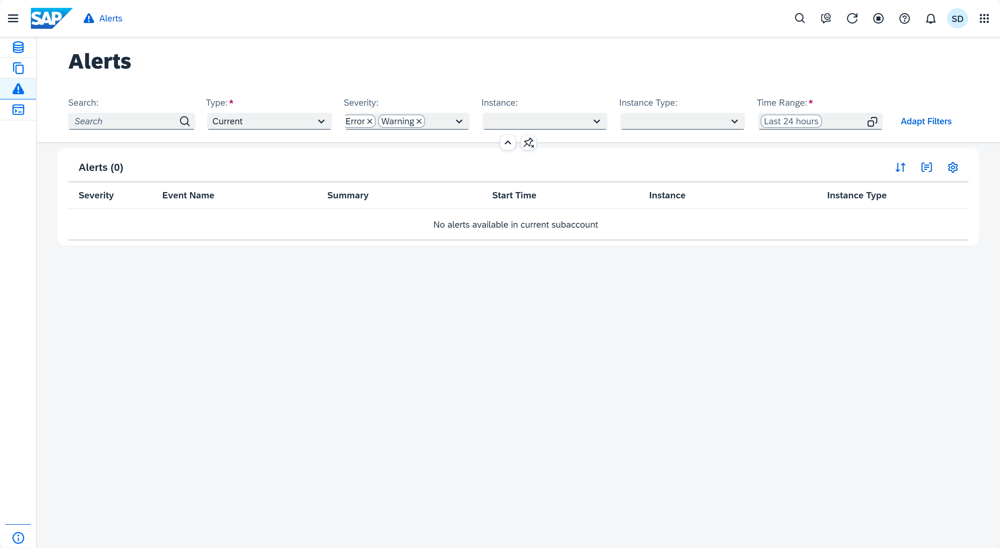

# Exercise 5: Command Palette

One of the powerful feature in SAP HANA Cloud Central is the Command Palette, designed to enhance user control and simplify navigation within SAP HANA Cloud Central. With this tool at your disposal, you can effortlessly access various commands by clicking a dedicated button. It helps to simplify your user experience and enhance productivity, ensuring that your interactions with our platform are both efficient and user-friendly. 

In this exercise, you will learn how to use the Command Palette.

1. Open the SAP HANA Cloud Central. At the top you will find the toolbar -> Click the Search button  now you can see a list of available commands
    <kbd>
    
    </kbd>
2. Now you can see a list of available commands. In here, you are able to see the recent command that you used, and all the available commands for different database.
   <kbd>
    
    </kbd>
3. You can also search a command by typing key words into the search bar. For example, we can type "alert", and click the "Show Alerts" command. By doing that, the system will take you to the **Alert** application, which will be cover in the next exercise.
   <kbd>
    
    </kbd>
    <kbd>
    
    </kbd>

Continue to - [Exercise 6: Alerts](../ex6-alerts/README.md)
