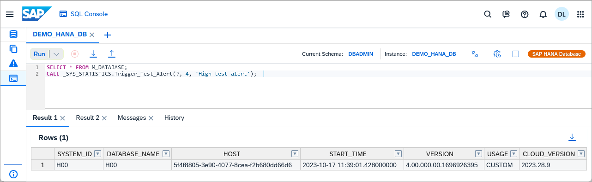

# Exercise 6 - SQL Console

This exercise will demonstrate the functionality in the SQL Console that is included in SAP HANA Cloud Central.  The same SQL Console component is also available in the [SAP HANA database explorer](https://marketplace.visualstudio.com/items?itemName=SAPSE.hana-database-explorer) extension for Visual Studio Code and the SAP Business Application Studio.   

## Exercise 6.1 Open the SQL Console

1. The SQL Console can be opened in multiple ways as shown below.  Explore the various ways the SQL Console can be opened.

    * It can be opened from the apps sidebar.
    
        

    * It can be opened from the action menu.

        

    * It can be opened from details page.

         

    * It can be opened from Search Commands.
    
        
    
2. Once opened and connected, it can be used to run SQL queries from within SAP HANA Cloud Central.

    ```SQL
    SELECT * FROM M_DATABASE;
    ```

    

## Exercise 6.2 Themes
A theme can be selected for SAP HANA Cloud Central which includes the SQL Console.  

1. Navigate to **Settings** > **Appearance** and try out a few of the theme options.  The default theme is SAP Morning Horizon.

    

## Exercise 6.3 Connect Instance Dialog

1. An instance that the SQL Console is connected to can be changed in the instance dialog.

    

2. There is a filter for SAP HANA database and data lake Relational Engine instances and a search bar.  Previously specified connections can be reused so the user name and password for the database does not need to be re-entered.

    

## Exercise 6.4 Multiple SQL Tabs
1. Additional SQL Console tabs can be opened enabling connections to different instances or to the same instance but with a different set of credentials.

    

## Exercise 6.5 Download or Import SQL
1. The contents of a SQL Console can be downloaded or imported.  

    

    The contents of a SQL Console are not preserved between browser reloads in the current version.

## Exercise 6.6 Create Database Objects
1. Execute the below SQLScript to create a usergroup, two users, two roles with privileges, a schema, a few tables, a view, a function, and a stored procedure.  **If you are attending SAP TechEd and are using the shared DA262 instance, this SQL will already have been executed**.

    ```SQL
    CREATE USERGROUP HOTEL_USER_GROUP SET PARAMETER 'minimal_password_length' = '8', 'force_first_password_change' = 'FALSE';
    CREATE USER USER1 PASSWORD Password1 no force_first_password_change SET USERGROUP HOTEL_USER_GROUP;
    CREATE USER USER2 PASSWORD Password2 no force_first_password_change SET USERGROUP HOTEL_USER_GROUP;

    GRANT CREATE SCHEMA TO USER1;
    CREATE ROLE HOTEL_ADMIN;
    CREATE ROLE HOTEL_READER;
    GRANT RESOURCE ADMIN TO HOTEL_ADMIN; --allow viewing of diagnostic files
    GRANT CATALOG READ TO HOTEL_ADMIN;   --allow access to system views
    GRANT HOTEL_ADMIN TO USER1;
    GRANT HOTEL_READER TO USER2;

    CONNECT USER1 PASSWORD Password1;
    CREATE SCHEMA HOTEL;
    GRANT ALL PRIVILEGES ON SCHEMA HOTEL TO HOTEL_ADMIN;
    GRANT SELECT ON SCHEMA HOTEL TO HOTEL_READER;

    SET SCHEMA HOTEL;

    CREATE COLUMN TABLE HOTEL(
        hno INTEGER PRIMARY KEY,
        name NVARCHAR(50) NOT NULL,
        address NVARCHAR(40) NOT NULL,
        city NVARCHAR(30) NOT NULL,
        state NVARCHAR(2) NOT NULL,
        zip NVARCHAR(6),
        location ST_Point(4326)
    );

    CREATE COLUMN TABLE ROOM(
        hno INTEGER,
        type NVARCHAR(6),
        free NUMERIC(3),
        price NUMERIC(6, 2),
        PRIMARY KEY (hno, type),
        FOREIGN KEY (hno) REFERENCES HOTEL
    );

    CREATE COLUMN TABLE CUSTOMER(
        cno INTEGER PRIMARY KEY,
        title NVARCHAR(7),
        firstname NVARCHAR(20),
        name NVARCHAR(40) NOT NULL,
        address NVARCHAR(40) NOT NULL,
        zip NVARCHAR(6)
    );

    CREATE COLUMN TABLE RESERVATION(
        resno INTEGER NOT NULL GENERATED BY DEFAULT AS IDENTITY,
        rno INTEGER NOT NULL,
        cno INTEGER,
        hno INTEGER,
        type NVARCHAR(6),
        arrival DATE NOT NULL,
        departure DATE NOT NULL,
        PRIMARY KEY (
            "RESNO", "ARRIVAL"
        ),
        FOREIGN KEY(cno) REFERENCES CUSTOMER,
        FOREIGN KEY(hno) REFERENCES HOTEL
    );

    CREATE COLUMN TABLE MAINTENANCE(
        mno INTEGER PRIMARY KEY,
        hno INTEGER,
        description NVARCHAR(100),
        date_performed DATE,
        performed_by NVARCHAR(40)
    );

    CREATE OR REPLACE VIEW RESERVATION_VIEW AS
        SELECT
            R.RESNO,
            H.NAME AS HOTEL_NAME,
        R.ARRIVAL,
        R.DEPARTURE,
            CUS.TITLE,
            CUS.FIRSTNAME,
            CUS.NAME AS CUSTOMER_NAME,
            CUS.ADDRESS AS CUSTOMER_ADDRESS
        FROM RESERVATION R
            LEFT JOIN HOTEL H ON H.HNO = R.HNO
            LEFT JOIN CUSTOMER CUS ON CUS.CNO = R.CNO
        ORDER BY H.NAME, R.ARRIVAL DESC;

    CREATE OR REPLACE FUNCTION AVERAGE_PRICE(room_type CHAR(6))
    RETURNS avg_price NUMERIC(6, 2)
    AS
    BEGIN
        DECLARE EXIT HANDLER FOR SQLEXCEPTION avg_price := '-1';
        SELECT TO_DECIMAL(ROUND(sum(PRICE)/COUNT(*), 2, ROUND_HALF_UP)) INTO avg_price FROM ROOM WHERE TYPE = :room_type GROUP BY TYPE;
    END;

    CREATE OR REPLACE PROCEDURE RESERVATION_GENERATOR(
        IN numToGenerate INTEGER
    )
        LANGUAGE SQLSCRIPT AS
    BEGIN
        USING SQLSCRIPT_PRINT AS PRTLIB;
        DECLARE val INT :=0;
        DECLARE stmt NVARCHAR(256) := '';
        DECLARE rno INT :=0;
        DECLARE cno INT :=0;
        DECLARE hno INT :=0;
        DECLARE roomType STRING := '';
        DECLARE arriveDate DATE := null;
        DECLARE arriveDateString STRING := '';
        DECLARE departDate DATE := null;
        DECLARE departDateString STRING := '';
        DECLARE randomDaysFromCurrent INT :=0;
        DECLARE randomLengthOfStay INT :=0;
        DECLARE rType INT :=0;
        DECLARE EXIT HANDLER FOR SQL_ERROR_CODE 301
        SELECT ::SQL_ERROR_CODE, ::SQL_ERROR_MESSAGE FROM DUMMY;
        WHILE (val < numToGenerate) DO
            -- generate random room number from 100-300
            rno := FLOOR(RAND_SECURE() * 201) + 100;
            -- generate random customer number from 1000-1014
            cno := FLOOR(RAND_SECURE() * 15) + 1000;
            -- generate random hotel number from 10-26
            hno := FLOOR(RAND_SECURE() * 17) + 10;
            -- generate random number from 1-3 to determine room type
            rType := FLOOR(RAND_SECURE() * 3) + 1;
            IF (rType = 1) THEN
                roomType := '''single''';
            ELSEIF (rType = 2) THEN
                roomType := '''double''';
            ELSEIF (rType = 3) THEN
                roomType := '''suite''';
            END IF;

            -- generate random number of days to be used for arrival date.  
            -- date range is one year in the past to one year in the future
            randomDaysFromCurrent := FLOOR(RAND_SECURE() * 730) + 1 - 365;
            arriveDate := ADD_DAYS( TO_DATE( CURRENT_DATE, 'YYYY-MM-DD' ), randomDaysFromCurrent );
            arriveDateString := '''' || TO_NVARCHAR( arriveDate, 'YYYY-MM-DD' ) || '''';
            -- generate a random number of days to stay
            randomLengthOfStay := FLOOR(RAND_SECURE() * 7) + 1;
            departDate := ADD_DAYS( arriveDate, randomLengthOfStay );
            departDateString := '''' || TO_NVARCHAR( departDate, 'YYYY-MM-DD' ) || '''';

            -- Reservations Columns: RNO, CNO, HNO, Type, Arrival, Departure
            stmt := 'INSERT INTO RESERVATION (RNO, CNO, HNO, TYPE, ARRIVAL, DEPARTURE) VALUES(' || rno || ',' || cno || ',' || hno || ',' || roomType || ',' || arriveDateString || ',' || departDateString || ');';
            PRTLIB:PRINT_LINE(stmt);
            EXEC(stmt);
            val := val + 1;
        END WHILE;
    PRTLIB:PRINT_LINE('Rows inserted: ' || val);
    END;
    ```

    

## Exercise 6.7 Populate Database Objects
1. Execute the following SQL statements to add some data to the tables.  **If you are attending SAP TechEd and are using the shared instance, this SQL will already have been executed**.

    ```SQL
    INSERT INTO HOTEL VALUES(10, 'Congress', '155 Beechwood St.', 'Seattle', 'WA', '98121', NEW ST_POINT('POINT(-122.347340 47.610546)', 4326));
    INSERT INTO HOTEL VALUES(11, 'Regency', '477 17th Avenue', 'Seattle', 'WA', '98177', NEW ST_POINT('POINT(-122.371104 47.715210)', 4326));
    INSERT INTO HOTEL VALUES(12, 'Long Island', '1499 Grove Street', 'Long Island', 'NY', '11716', NEW ST_POINT('POINT(-73.133741 40.783602)', 4326));
    INSERT INTO HOTEL VALUES(13, 'Empire State', '65 Yellowstone Dr.', 'Albany', 'NY', '12203', NEW ST_POINT('POINT(-73.816182 42.670334)', 4326));
    INSERT INTO HOTEL VALUES(14, 'Midtown', '12 Barnard St.', 'New York', 'NY', '10019', NEW ST_POINT('POINT(-73.987388 40.766153)', 4326));
    INSERT INTO HOTEL VALUES(15, 'Eighth Avenue', '112 8th Avenue', 'New York', 'NY', '10019', NEW ST_POINT('POINT(-73.982495 40.767161)', 4326));
    INSERT INTO HOTEL VALUES(16, 'Lake Michigan', '354 OAK Terrace', 'Chicago', 'IL', '60601', NEW ST_POINT('POINT(-87.623608 41.886403)', 4326));
    INSERT INTO HOTEL VALUES(17, 'Airport', '650 C Parkway', 'Rosemont', 'IL', '60018', NEW ST_POINT('POINT(-87.872209 41.989378)', 4326));
    INSERT INTO HOTEL VALUES(18, 'Sunshine', '200 Yellowstone Dr.', 'Clearwater', 'FL', '33755', NEW ST_POINT('POINT(-82.791689 27.971218)', 4326));
    INSERT INTO HOTEL VALUES(19, 'Beach', '1980 34th St.', 'Daytona Beach', 'FL', '32018', NEW ST_POINT('POINT(-81.043091 29.215968)', 4326));
    INSERT INTO HOTEL VALUES(20, 'Atlantic', '111 78th St.', 'Deerfield Beach', 'FL', '33441', NEW ST_POINT('POINT(-80.106612 26.312141)', 4326));
    INSERT INTO HOTEL VALUES(21, 'Long Beach', '35 Broadway', 'Long Beach', 'CA', '90804', NEW ST_POINT('POINT(-118.158403 33.786721)', 4326));
    INSERT INTO HOTEL VALUES(22, 'Indian Horse', '16 MAIN STREET', 'Palm Springs', 'CA', '92262', NEW ST_POINT('POINT(-116.543342 33.877537)', 4326));
    INSERT INTO HOTEL VALUES(23, 'Star', '13 Beechwood Place', 'Hollywood', 'CA', '90029', NEW ST_POINT('POINT(-118.295017 34.086975)', 4326));
    INSERT INTO HOTEL VALUES(24, 'River Boat', '788 MAIN STREET', 'New Orleans', 'LA', '70112', NEW ST_POINT('POINT(-90.076919 29.957531)', 4326));
    INSERT INTO HOTEL VALUES(25, 'Ocean Star', '45 Pacific Avenue', 'Atlantic City', 'NJ', '08401', NEW ST_POINT('POINT(-74.416135 39.361078)', 4326));
    INSERT INTO HOTEL VALUES(26, 'Delta', '110 Erb St. W', 'Waterloo', 'ON', 'N2L0C6', NEW ST_POINT('POINT(-80.528404 43.463327)', 4326));

    INSERT INTO ROOM VALUES(10, 'single', 20, 135.00);
    INSERT INTO ROOM VALUES(10, 'double', 45, 200.00);
    INSERT INTO ROOM VALUES(12, 'single', 10, 70.00);
    INSERT INTO ROOM VALUES(12, 'double', 13, 100.00);
    INSERT INTO ROOM VALUES(13, 'single', 12, 45.00);
    INSERT INTO ROOM VALUES(13, 'double', 15, 80.00);
    INSERT INTO ROOM VALUES(14, 'single', 20, 85.00);
    INSERT INTO ROOM VALUES(14, 'double', 35, 140.00);
    INSERT INTO ROOM VALUES(15, 'single', 50, 105.00);
    INSERT INTO ROOM VALUES(15, 'double', 230, 180.00);
    INSERT INTO ROOM VALUES(15, 'suite', 12, 500.00);
    INSERT INTO ROOM VALUES(16, 'single', 10, 120.00);
    INSERT INTO ROOM VALUES(16, 'double', 39, 200.00);
    INSERT INTO ROOM VALUES(16, 'suite', 20, 500.00);
    INSERT INTO ROOM VALUES(17, 'single', 4, 115.00);
    INSERT INTO ROOM VALUES(17, 'double', 11, 180.00);
    INSERT INTO ROOM VALUES(18, 'single', 15, 90.00);
    INSERT INTO ROOM VALUES(18, 'double', 19, 150.00);
    INSERT INTO ROOM VALUES(18, 'suite', 5, 400.00);
    INSERT INTO ROOM VALUES(19, 'single', 45, 90.00);
    INSERT INTO ROOM VALUES(19, 'double', 145, 150.00);
    INSERT INTO ROOM VALUES(19, 'suite', 60, 300.00);
    INSERT INTO ROOM VALUES(20, 'single', 11, 60.00);
    INSERT INTO ROOM VALUES(20, 'double', 24, 100.00);
    INSERT INTO ROOM VALUES(21, 'single', 2, 70.00);
    INSERT INTO ROOM VALUES(21, 'double', 10, 130.00);
    INSERT INTO ROOM VALUES(22, 'single', 34, 80.00);
    INSERT INTO ROOM VALUES(22, 'double', 78, 140.00);
    INSERT INTO ROOM VALUES(22, 'suite', 55, 350.00);
    INSERT INTO ROOM VALUES(23, 'single', 89, 160.00);
    INSERT INTO ROOM VALUES(23, 'double', 300, 270.00);
    INSERT INTO ROOM VALUES(23, 'suite', 100, 700.00);
    INSERT INTO ROOM VALUES(24, 'single', 10, 125.00);
    INSERT INTO ROOM VALUES(24, 'double', 9, 200.00);
    INSERT INTO ROOM VALUES(24, 'suite', 78, 600.00);
    INSERT INTO ROOM VALUES(25, 'single', 44, 100.00);
    INSERT INTO ROOM VALUES(25, 'double', 115, 190.00);
    INSERT INTO ROOM VALUES(25, 'suite', 6, 450.00);

    INSERT INTO CUSTOMER VALUES(1000, 'Mrs', 'Jenny', 'Porter', '1340 N. Ash Street, #3', '10580');
    INSERT INTO CUSTOMER VALUES(1001, 'Mr', 'Peter', 'Brown', '1001 34th St., APT.3', '48226');
    INSERT INTO CUSTOMER VALUES(1002, 'Company', NULL, 'Datasoft', '486 Maple St.', '90018');
    INSERT INTO CUSTOMER VALUES(1003, 'Mrs', 'Rose', 'Brian', '500 Yellowstone Drive, #2', '75243');
    INSERT INTO CUSTOMER VALUES(1004, 'Mrs', 'Mary', 'Griffith', '3401 Elder Lane', '20005');
    INSERT INTO CUSTOMER VALUES(1005, 'Mr', 'Martin', 'Randolph', '340 MAIN STREET, #7', '60615');
    INSERT INTO CUSTOMER VALUES(1006, 'Mrs', 'Sally', 'Smith', '250 Curtis Street', '75243');
    INSERT INTO CUSTOMER VALUES(1007, 'Mr', 'Mike', 'Jackson', '133 BROADWAY APT. 1', '45211');
    INSERT INTO CUSTOMER VALUES(1008, 'Mrs', 'Rita', 'Doe', '2000 Humboldt St., #6', '97213');
    INSERT INTO CUSTOMER VALUES(1009, 'Mr', 'George', 'Howe', '111 B Parkway, #23', '75243');
    INSERT INTO CUSTOMER VALUES(1010, 'Mr', 'Frank', 'Miller', '27 5th St., 76', '95054');
    INSERT INTO CUSTOMER VALUES(1011, 'Mrs', 'Susan', 'Baker', '200 MAIN STREET, #94', '90018');
    INSERT INTO CUSTOMER VALUES(1012, 'Mr', 'Joseph', 'Peters', '700 S. Ash St., APT.12', '92714');
    INSERT INTO CUSTOMER VALUES(1013, 'Company', NULL, 'TOOLware', '410 Mariposa St., #10', '20019');
    INSERT INTO CUSTOMER VALUES(1014, 'Mr', 'Antony', 'Jenkins', '55 A Parkway, #15', '20903');

    INSERT INTO RESERVATION VALUES(1, 100, 1000, 11, 'single', '2020-12-24', '2020-12-27');
    INSERT INTO RESERVATION VALUES(2, 110, 1001, 11, 'double', '2020-12-24', '2021-01-03');
    INSERT INTO RESERVATION VALUES(3, 120, 1002, 15, 'suite', '2020-11-14', '2020-11-18');
    INSERT INTO RESERVATION VALUES(4, 130, 1009, 21, 'single', '2019-02-01', '2019-02-03');
    INSERT INTO RESERVATION VALUES(5, 150, 1006, 17, 'double', '2019-03-14', '2019-03-24');
    INSERT INTO RESERVATION VALUES(6, 140, 1013, 20, 'double', '2020-04-12', '2020-04-30');
    INSERT INTO RESERVATION VALUES(7, 160, 1011, 17, 'single', '2020-04-12', '2020-04-15');
    INSERT INTO RESERVATION VALUES(8, 170, 1014, 25, 'suite', '2020-09-01', '2020-09-03');
    INSERT INTO RESERVATION VALUES(9, 180, 1001, 22, 'double', '2020-12-23', '2021-01-08');
    INSERT INTO RESERVATION VALUES(10, 190, 1013, 24, 'double', '2020-11-14', '2020-11-17');

    INSERT INTO MAINTENANCE VALUES(10, 24, 'Replace pool liner and pump', '2019-03-21', 'Discount Pool Supplies');
    INSERT INTO MAINTENANCE VALUES(11, 25, 'Renovate the bar area.  Replace TV and speakers', '2020-11-29', 'TV and Audio Superstore');
    INSERT INTO MAINTENANCE VALUES(12, 26, 'Roof repair due to storm', null, null);
    ```

## Exercise 6.8 Change User
1. The user can be changed with the connect statement and viewed with the CURRENT_USER function.

    ```SQL
    CONNECT USER1 PASSWORD Password1;
    SELECT CURRENT_USER, CURRENT_SCHEMA FROM DUMMY;
    ```

    

    Notice that the schema also changes when the connected user is changed.

    Another technique to see the current user is to view the instance details dialog.
    
    TODO feature coming soon.  

## Exercise 6.9 Change Schema
1. An example of changing the schema is shown below.  

    ```SQL
    SELECT * FROM CUSTOMER;
    SELECT * FROM HOTEL.CUSTOMER;
    SET SCHEMA HOTEL;
    SELECT * FROM CUSTOMER;
    ```

    Press **Skip** when the SQL Execution Error dialog appears.

    
    
    The SQL Execution Error dialog enables you to specify what should occur when an error is encountered when running multiple SQL statements.
    
    

    Notice that when the first SQL statement is executed, the schema is still set to USER1 and the select statement fails as the CUSTOMER table is in the schema HOTEL.  The last SELECT statement succeeds because the schema has been changed to HOTEL.

    Alternatively, the schema can be set using the schema selection dialog.

    

    The schemas that the current user has access to are displayed.

## Exercise 6.10 Connection Settings
1. Examine the **Connection Settings**.  

    

    Execute the following SQL which is used to illustrate the settings.

    ```SQL
    SELECT * FROM M_SYSTEM_INFORMATION_STATEMENTS;

    SELECT COUNT(*) FROM SYS.TABLE_COLUMNS;
    SELECT * FROM TABLE_COLUMNS;
    ```

    Notice that only the first 1024 bytes from the column STATEMENT are displayed in the results view for the Blocked Transactions row.  These limits can be adjusted in the connection settings dialog.

    

    Notice that over 6000 rows are in TABLE_COLUMNS.

    

     The first 1000 are displayed.

    

## Exercise 6.11 Specifying Input Parameters
1. Execute the following SQL statement.

    ```SQL
    --SELECT AVERAGE_PRICE('single') FROM DUMMY;
    SELECT AVERAGE_PRICE(room_type => ?) FROM DUMMY;  --room type values are single, double, or suite
    ```

    As an input parameter is needed, a section will appear where values can be entered as shown below.

    

## Exercise 6.12 Messages and History Tabs
1. Execute the following SQL statements.

    ```SQL
    SELECT AVERAGE_PRICE('single') FROM DUMMY;
    SELECT * FROM TABLE_COLUMNS;
    ```

    Open the **Messages** tab in the results.  Notice that metrics such as **client elapsed time** and **peak memory consumed** are shown.

    

    Open the **History** tab.  Notice that a summary of the statements executed is available.

    

    >The contents of the Messages and History tabs can be cleared by refreshing the browser.

## Exercise 6.13 Result Viewers
1. Execute the following SQL statements.

    ```SQL
    SELECT'{ "name":"John", "age":30, "cars": { "car1":"Ford", "car2":"BMW", "car3":"Fiat" }}'
    AS JSON_EXAMPLE FROM DUMMY;

    SELECT '<?xml version="1.0" encoding="UTF-8"?>
        <breakfast_menu>
            <food>
                <name>Belgian Waffles</name>
                <price>$5.95</price>
                <description>
            Two of our famous Belgian Waffles with plenty of real maple syrup
            </description>
                <calories>650</calories>
            </food>
            <food>
                <name>French Toast</name>
                <price>$4.50</price>
                <description>
                Thick slices made from our homemade sourdough bread
                </description>
                <calories>600</calories>
            </food>
        </breakfast_menu>' XML_EXAMPLE FROM DUMMY;
    ```

    Double click on a result and notice the result is formatted or can be shown in raw text. 

    

## Exercise 6.14 Statement Help
1. Click on the **Statement Help** icon.  Notice that details of the table and function used in the current statement is shown.

    

## Exercise 6.15 Shortcut Keys
1. A few of the common shortcut keys are listed below.  Try a few of them out.

    Action | Shortcut
    ------ | ------
    Add Comment Block | Ctrl+Shift+/
    Comment/Uncomment Line | Ctrl+/
    To Uppercase | Ctrl+Alt+U
    To Lowercase | Ctrl+Shift+U
    Go to Next Error | Alt+E
    Go to Previous Error | Alt+Shift+E
    Go to Line | Ctrl+L
    Jump to Matching Brackets | Ctrl+P
    Run All | F8
    Run Statement |	F9
    Text Completion | Ctrl+Space 

    >The shortcut keys may vary depending on the browser used.

## Exercise 6.16 Download or Copy Results
1. Execute the followng SQL statement.

    ```SQL
    SELECT * FROM RESERVATION_VIEW;
    ```

    Results can be downloaded directly from the SQL Console as shown below.

    

    Options are provided on how to format the data.

    

    Rows can also be selected and then copied to the clipboard by pressing **Ctrl+C**.

    

## Summary

You now have an overview of the features of the SQL Console in SAP HANA Cloud Central.  Further details can be found in the tutorial [Query Databases Using the SQL Console in SAP HANA Cloud Central](https://developers.sap.com/tutorials/hana-dbx-hcc.html).

Continue to - [Exercise 7 - Alerts](../ex7-Alerts/README.md)

