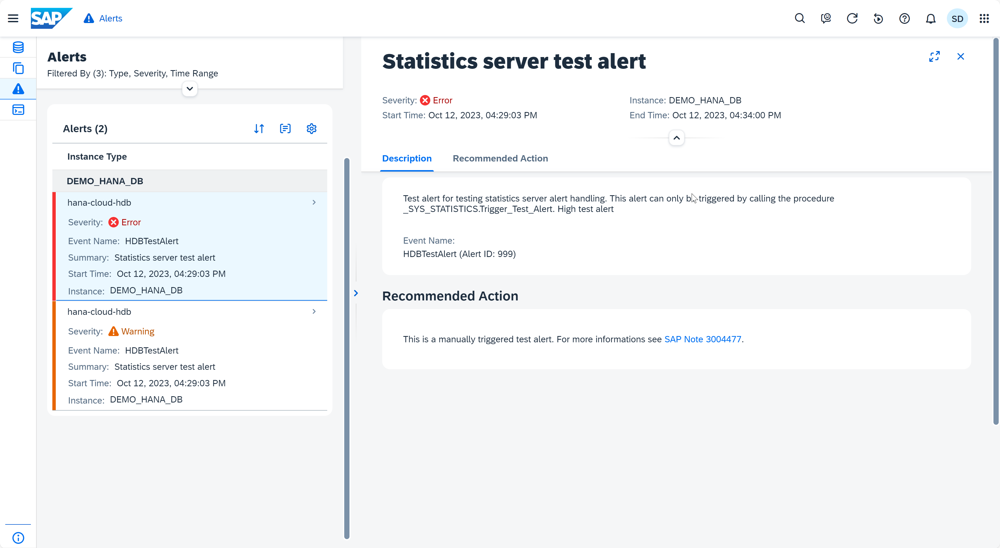

# Exercise 7: Alerts 
As an administrator, you actively monitor the status of the system, its services, and the consumption of system resources. However, you are also alerted of critical situations through the Alerts application. For example: memory utilization is reaching a critical level, or a server has stopped.

The internal monitoring infrastructure of the SAP HANA instance is continuously collecting and evaluating information about status, performance, and resource usage from all components of the SAP HANA instance. In addition, it performs regular checks on the data in system tables and views and when configurable threshold values are exceeded, issues alerts. In this way, you are warned of potential problems. The priority of the alert indicates the severity of the problem and depends on the nature of the check and configured threshold values.

In this exercise, you'll examine the Alerts card, with a focus on obtaining more information about raised alerts and configuring alert thresholds.

1. Click the *Alert* icon on the left panel to access the Alerts application.
    <kbd>
    
    </kbd>

2. The Alert Definition screen allows you to choose from many existing alerts, search for them and manage how the different SAP HANA alerts are triggered. You can also filter the alerts. Click **Type**, and select **All** alerts. You will see the testing alerts that you generated in SQL Console exercise.
    <kbd>
    
    </kbd>

3. Click on the alert to navigate to the Alert Details screen to see detailed information about the alert, along with a proposed solution.
    <kbd>
    
    </kbd>

4. Close the detail and click the *database* icon on the left panel to return to the Database Overview page.

Continue to - [Exercise 8 - The Database Overview Page](../ex8-dboverview/README.md)