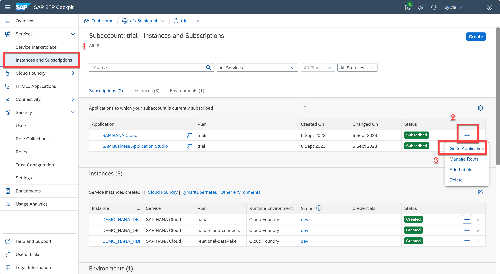
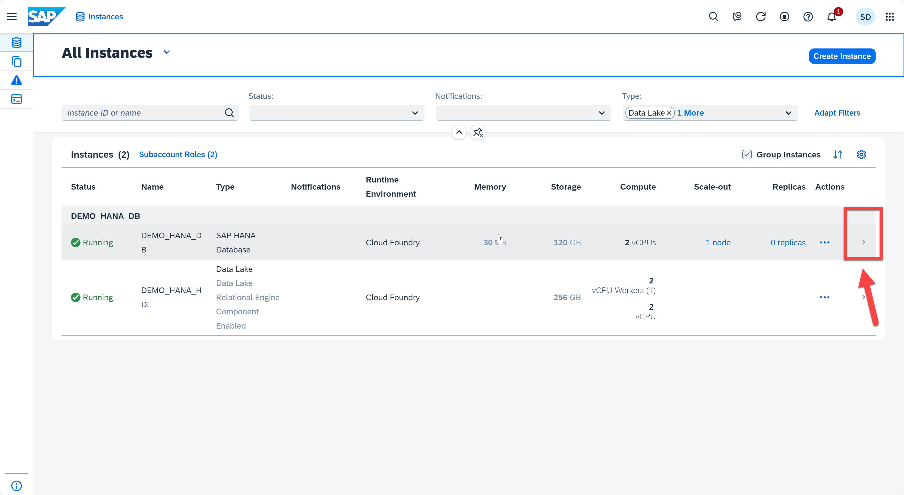
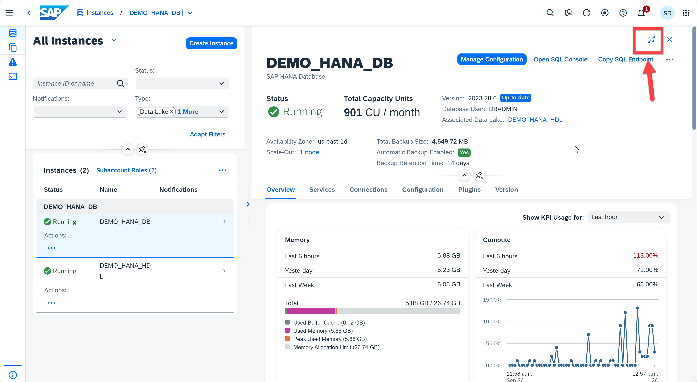
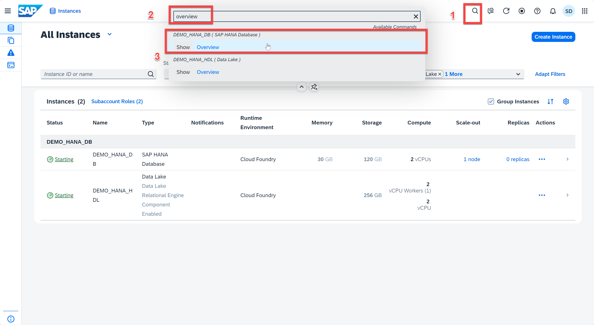
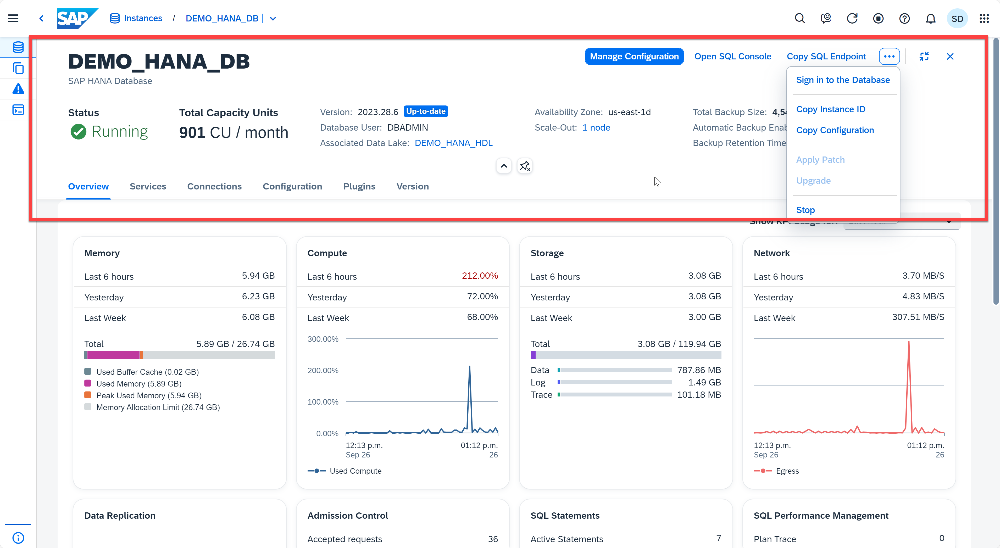
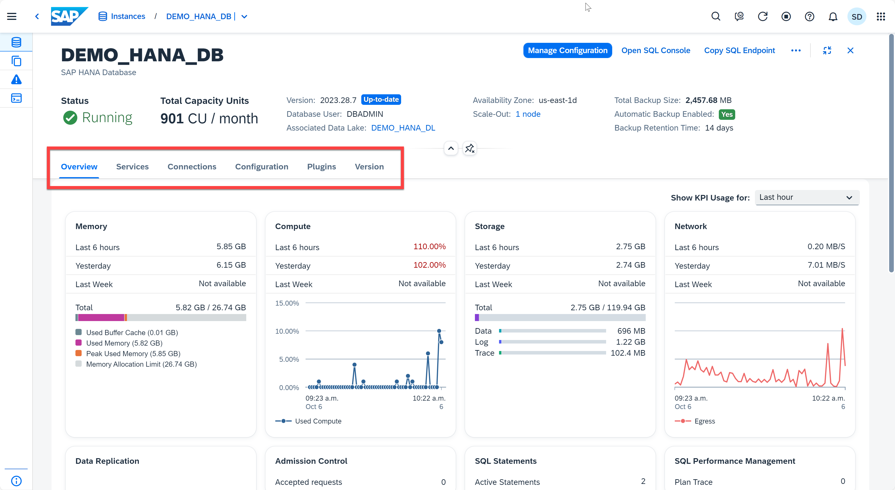
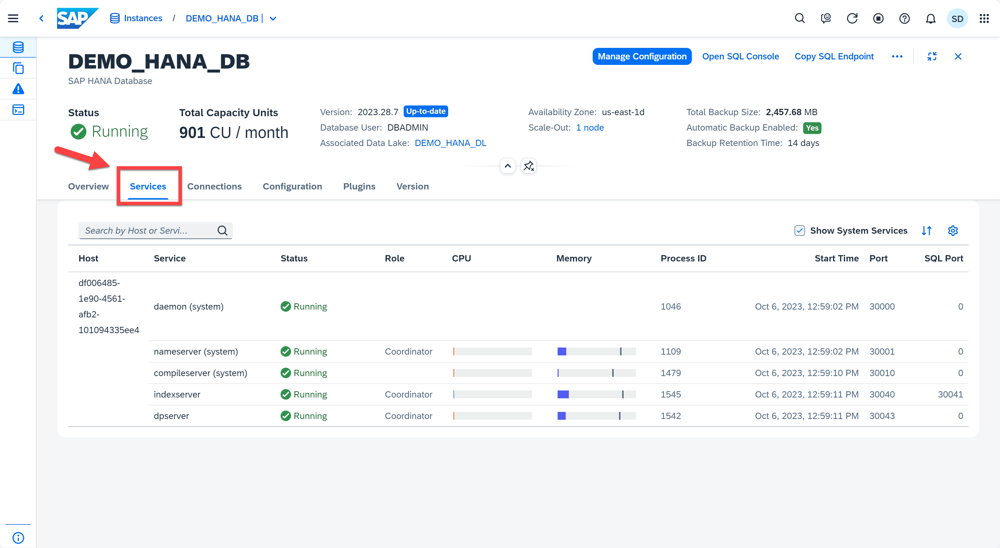
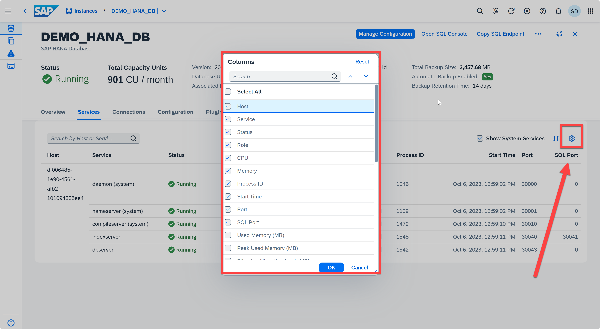

# Exercise 8: The Database Overview Page

Through the Database Overview page, you can view key health indicators for this specific database, such as database status and resource utilization. You also have access to tools that allow you to perform database administrations tasks, such as performance analysis and executing SQL statements. Different parts of a single card can link to different views or applications. This way, you can see various components in a single view and make the decision whether to further examine issues by drilling down.

This exercise will teach you the basics of navigating the Database Overview page and how to find the information you need as a database administrator.

1. Open the **SAP HANA Cloud Central** application
    <kbd>
    
    </kbd>
2. On the bottom panel, you'll find a list of instances. Click the right arrow on the bery right end of instance DEMO_HANA_DB (or DA262) to access the database overview page.
    <kbd>
    
    </kbd>
    Click the expand button to get full screen
    <kbd>
    
    </kbd>

3. Alternativly, you can use the command palette. Click the search button on the toolbar -> type "overview" -> Select "Show Overview" for DEMO_HANA_DB (or DA262). It will take you to the same page as we get in step 2.
   <kbd>
    
    </kbd>
4. Below the toolbar you see the collapsible header, where you'll find the status of the database, the database user you're connecting as, the host name, and associated Data Lake. From the header, you can also manage configuration, open the SQL Console, and copy SQL endpoint. 
    <kbd>
    
    </kbd>

    By default, when you first access the Database Overview page you see a quick synopsis of the database status, as well as the utilization of Memory, CPU, Storage and Network.
    
    As you scroll down, you see high-level performance metrics in the form of the number of threads, sessions and long-running statements. You also see general information about your SAP HANA Cloud database.
    
    Down further, you see security settings, such as User & Authorization Management. There are also a number of hyperlinks to launch additional administration applications.

5. Below the collapsible header, you will find a navigation bar where you can find the overview of database, the services, connections, configuration, plugins, and version of current instance.
    <kbd>
    
    </kbd>

6. In the **Service** section, you can find the status of different services, the Role, CPU usage, Memory usage, Start Time, Port, etc. You can also select the columns that you are interested by clicking the gear icon.
    <kbd>
    
    </kbd>
    <kbd>
    
    </kbd>
7. Click the **Overview** button on the left of **Service** to return to the Database Overview section for next exercise.
   
Continue to - [Exercise 9: Monitoring Memory Usage](../ex9-Memory/README.md)
