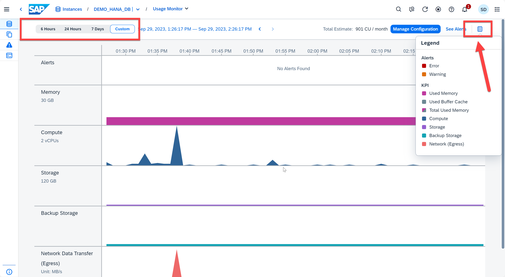
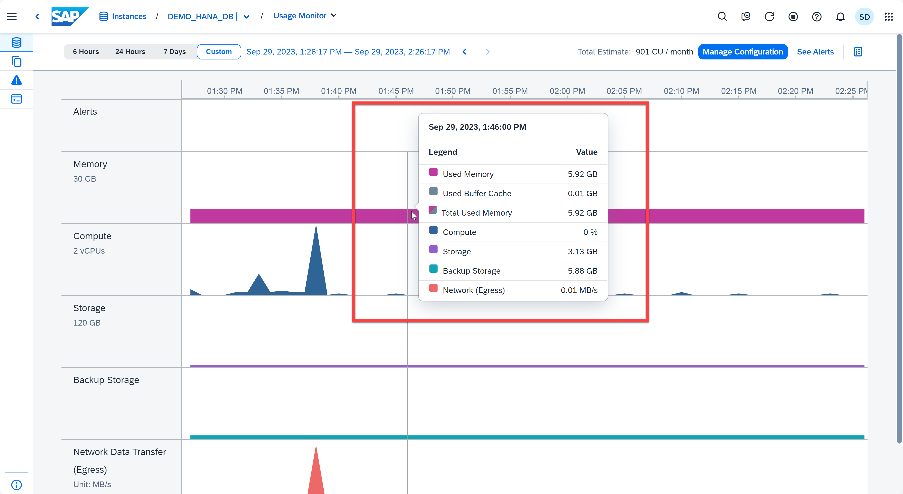

# Exercise 9: Monitoring Memory Usage

SAP HANA administrators must carefully monitor system computing resources to ensure optimal operation of the database. There are many metrics available to monitor in the SAP HANA Cloud Central, including memory, CPU, storage and network. You can view precise consumption details for those resources, as well as historical utilization information.

1. Open the database overview page for DEMO_HANA_DB (exercise 8). Locate the **Memory** card. It displays how much memory the host has consumed for the past 6 hours, yesterday, and last week. There are also **Compute**, **Storage**  and **Network** cards, showing the respective metrics for the same time period. Let's investigate the memory utilization for this database. Click the **Memory** card. 
   
   **Note:** You can also access the Usage Monitor app by clicking the Compute, Storage, and Network cards.
    <kbd>
    
    </kbd>
   Alternatively, you can use the **Command Palette** to go to the Usage Monitor application. To do that, just type "usage monitor" in the search bar -> Click "Show Usage Monitor" for DEMO_HANA_DB 
    <kbd>
    
    </kbd>
2. This opens the Usage Monitor application allowing you to see KPIs for memory usage. You can switch between different time range. The legend will be display when you click the button on the top right corner.
   <kbd>
    
    </kbd>   
3. You can obtain details for a specific point in time by simply hovering the mouse cursor over the line.
    <kbd>
    
    </kbd>

Continue to - [Exercise 1 - Exercise 1 Description](../ex1/README.md)
