# Appendix 9: HDI Administration
An HDI (SAP HANA Deployment Infrastrcture) administrator is responsible for configuring general SAP HDI parameters, creating and dropping HDI container groups, moving HDI containers between groups, and managing the privileges of HDI container-group administrators. This exercise will introduce you to the HDI Administration tool and some of the main tasks an HDI administrator can perform.

## Appendix 9.1: HDI Administration Overview
1. Open the HANA Cockpit. Type *Database Administration* in the search bar to locate the **Database Administration** card on the Database Overview page. Click **HDI Administration**.
    <kbd>
    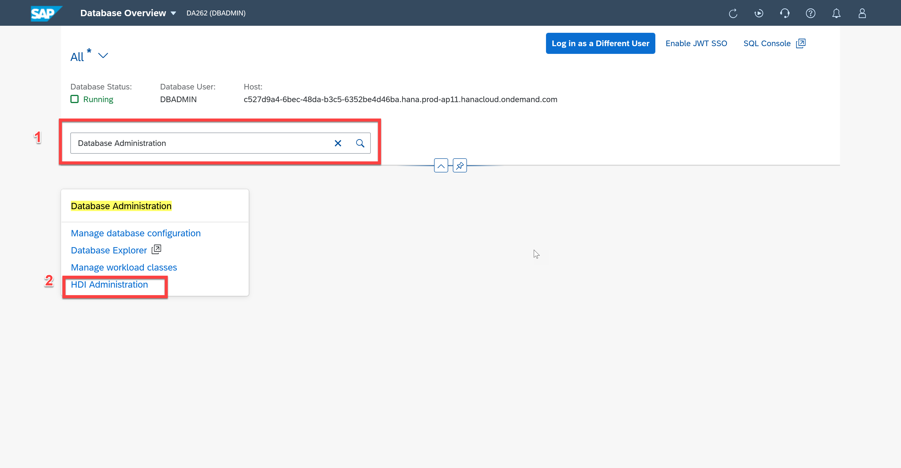
    </kbd>

2. The HDI Administration tool includes a window on the left side that displays the *Groups & Containers* and  *Users & Roles* tabs. The window on the right displays the *Privileges* of the selected user. The Groups & Containers tab is selected by default.
    <kbd>
    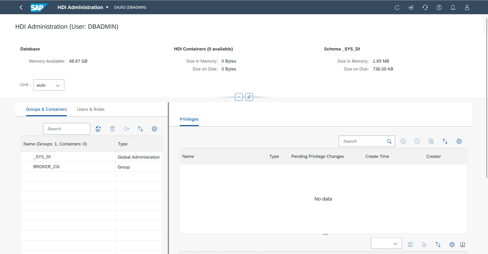
    </kbd>
   
3. Click the **Users & Roles** tab. You should see the two users that have already been created.
    <kbd>
    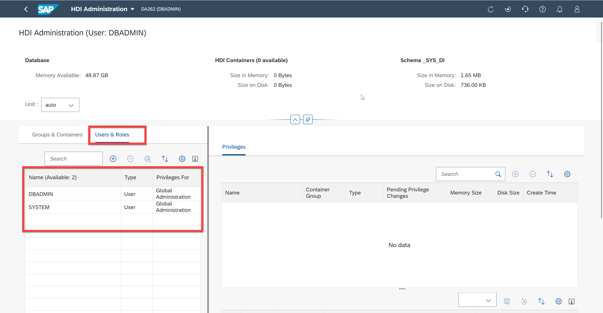
    </kbd>

4. Click on the **Groups & Containers** tab. Select **_SYS_DI**.
    <kbd>
    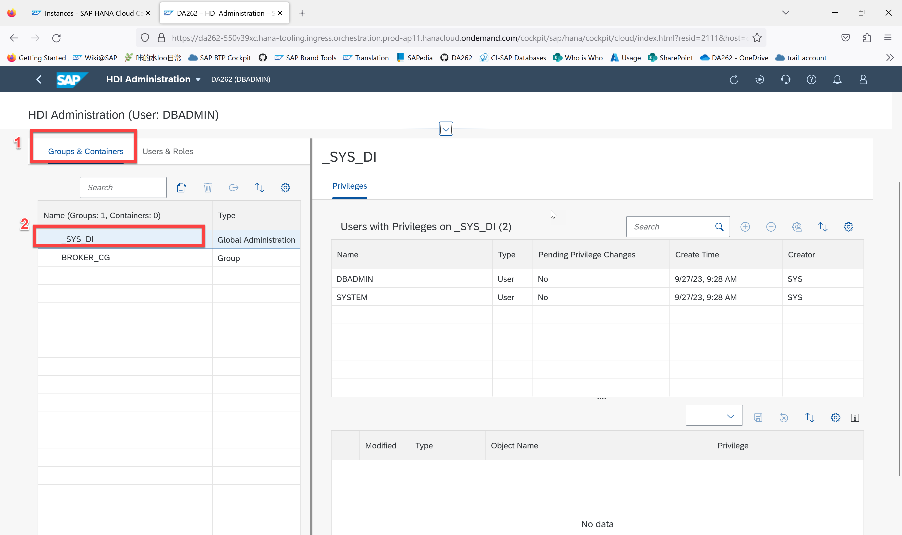
    </kbd>

5. In the *Privileges* tab, you can select the name of the user to whom you want to grant HDI Administration. Click **DBADMIN**. In the *Privileges of Selected User* section, all selected privileges will be displayed.The selected privileges can be modified by clicking the checkbox to select a privilege. Changes can be saved using the **Save** button in the top right corner of the table. 
    <kbd>
    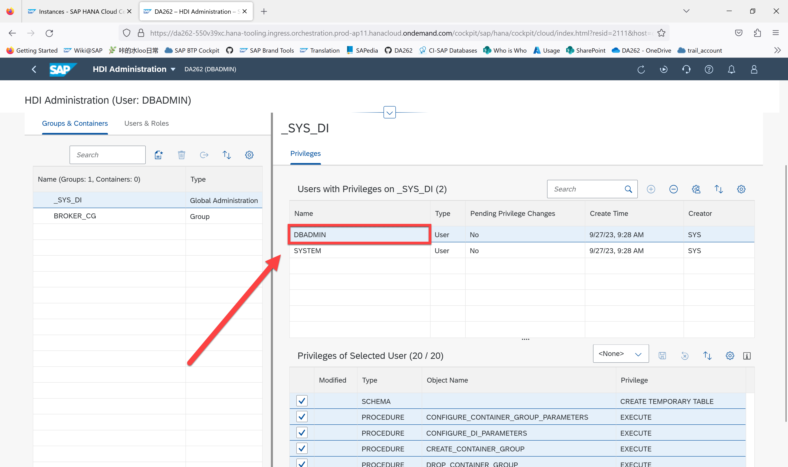
    </kbd>

    > **NOTE**
    Do not save privilege changes. The purpose of the following actions are for you to gain familiarity with the HDI Administration tool.

## Appendix 9.2: Maintaining the SAP HDI
To perform actions as an HDI administrator, the user must have HDI administrator privileges. In the case that a current user does not have such privileges, they must be assigned prior to performing HDI administration tasks. This can be acheived, as follows:
* From the Database Overview page, open SAP HANA cockpit's *User Management* tool.
* In the* Users* list, choose *Add* (plus sign in the header bar of the table). In the pop-up list, choose **Create User**, provide the information required, and choose **Save**.

1. Adding the user to HDI automatically assigns the new user a default set of common HDI privileges. To add the new user to SAP HDI, open the *HDI Administration tool*. In the **Users & Roles** tab, click the plus sign in the header bar of the table.
    <kbd>
    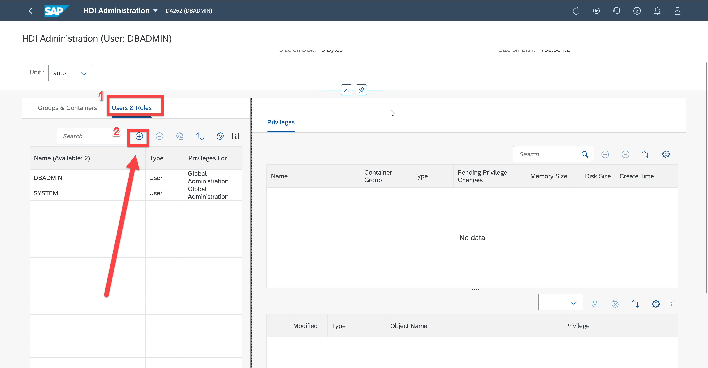
    </kbd>

2. Select *TECHNICAL_USER* that you previously created. Click **OK**. You will see a message says "Success".
    <kbd>
    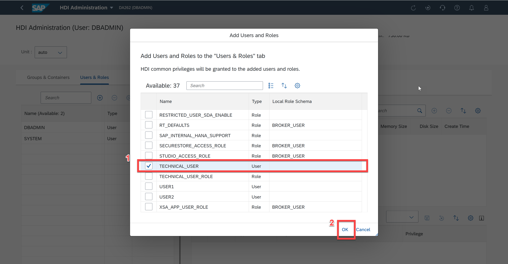
    </kbd>
    <kbd>
    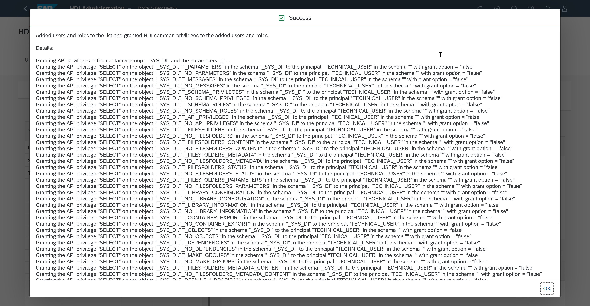
    </kbd>

3. In the **Groups & Containers** tab, select *_SYS_DI*. In the *Privileges* tab, select *TECHNICAL_USER*. If the user is not in the list, click the plus sign to add an HDI user.
    <kbd>
    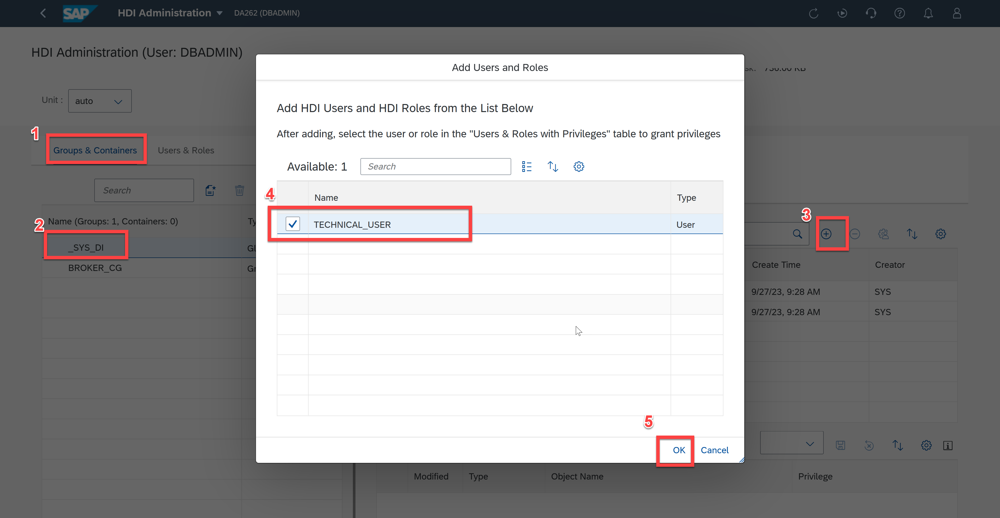
    </kbd>

4. Select *TECHNICAL_USER*. In the *Privileges of Selected User* pane, choose*CONFIGURE_DI_PARAMETERS* from the drop-down list. Choose Save to grant user privileges. Click **OK**. Now we add a new userto SAP HDI.
    <kbd>
    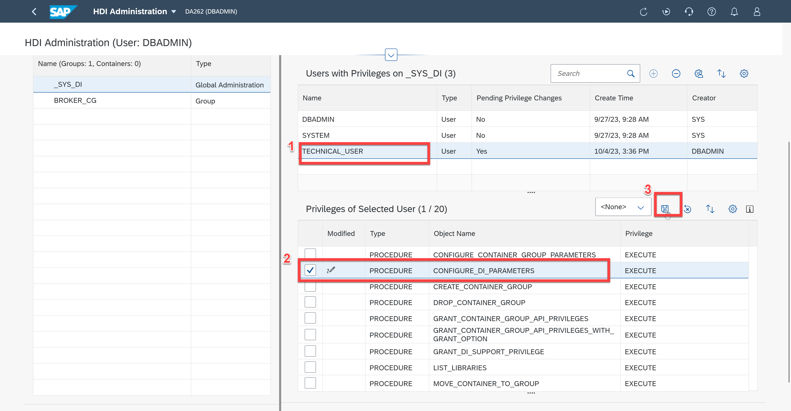
    </kbd>

5. In SAP HANA Deployment Infrastructure (HDI), an HDI container group is used for administrating a set of HDI containers. The HDI administrator can create an HDI container group. In the *Groups & Containers* tab, choose the indicated icon to create a container group or container. In the Create Wizard, choose *Container Group* and specify a name for the new container group. You can also define details of the trace tool in the *Optional Parameters* pane.
    <kbd>
    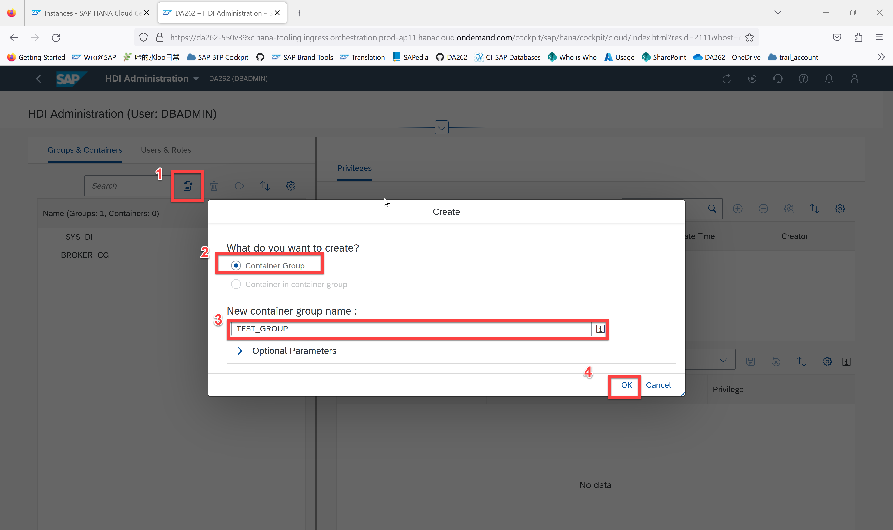
    </kbd>

6. An HDI container group can also be dropped by selecting the container group and choosing the trash can icon, as indicated.
    <kbd>
    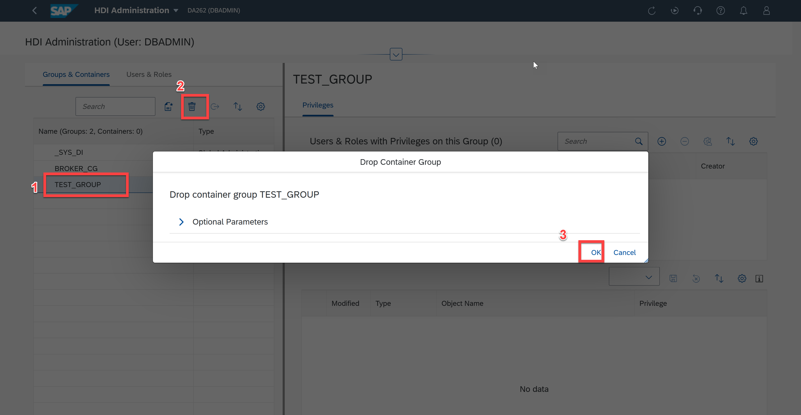
    </kbd>

7. An HDI Container group can be moved to another container group. In the *Groups & Containers* tab, locate and select the HDI container that you want to move. Click the icon. Select the target container. In the *Move Container* window, use the drop-down list to specify the container group to which you want to move the selected HDI container.
    <kbd>
    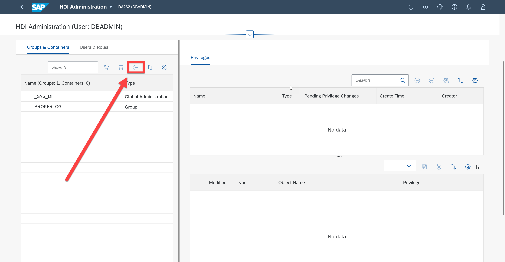
    </kbd>

You should now be familiar with common SAP HDI Administration activities within the SAP HANA Cockpit.

Back to - [DA262 - SAP HANA Cloud from an administrator's perspective](../../../README.md)
