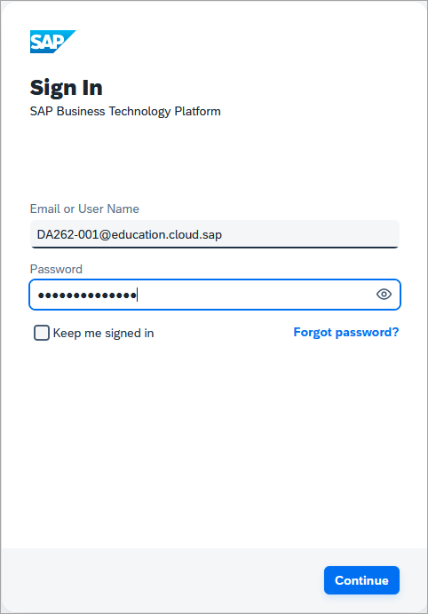
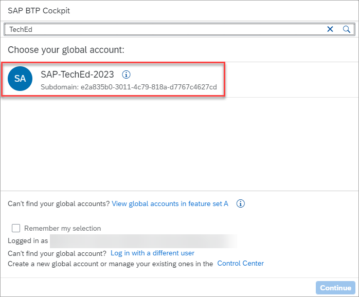
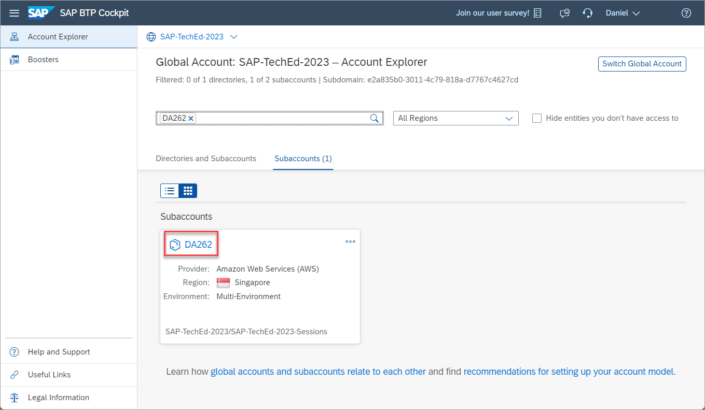
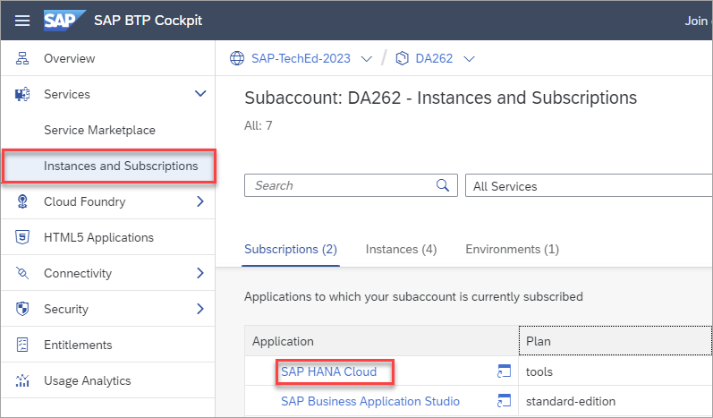

# Exercise 1 - Access the SAP BTP Shared Subaccount for DA262

This exercise will provide instructions on how to access the shared subaccount provided for attendees of this SAP TechEd hands-on workshop.  

1. Open the [SAP BTP Cockpit](https://cockpit.btp.cloud.sap/).

2. Login with the provided SAP BTP user and password provided in the hands-on workshop.

    

3. Select the **SAP-TechEd-2023** global account.

    

4. Navigate into the subaccount **DA262**.

    

5. Under **Instances and Subscriptions**, click on the subscription **SAP HANA Cloud** to open SAP HANA Cloud Central.

    

    The SAP HANA Cloud tools subscription has already been created.  Additional instructions are  provided in [Register for a Trial SAP BTP Account](../ex2/README.md) on the steps required to subscribe to this service and how to assign the appropriate role collections to your SAP BTP user but this is not required when using the provided subaccount DA262.

## Summary

You now have opened the SAP BTP Cockpit, navigated into the DA262 subaccount, and have opened SAP HANA Cloud Central which is the central tool used for administration of SAP HANA Cloud instances.

Continue to - [Exercise 3 - Overview of the SAP Business Technology Platform](../ex3/README.md)