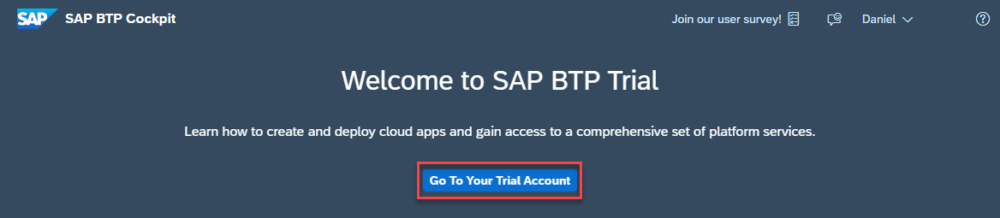
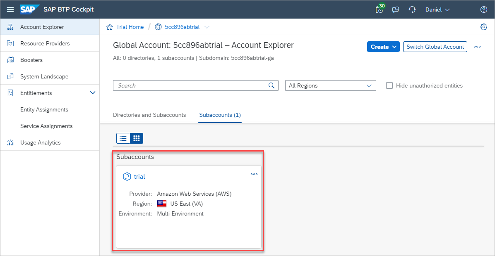
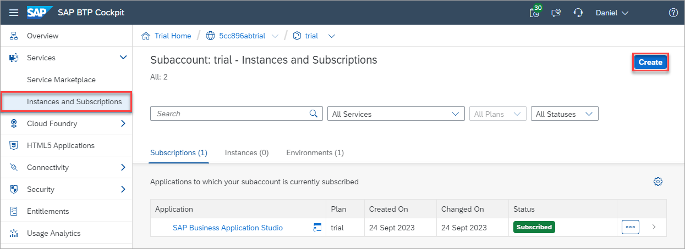
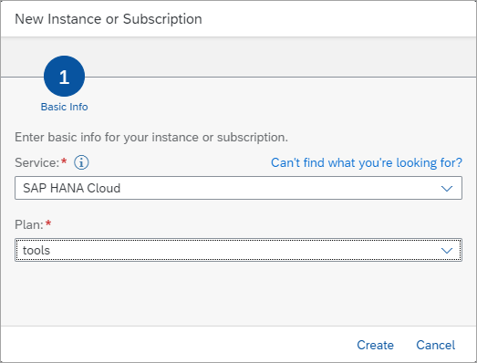
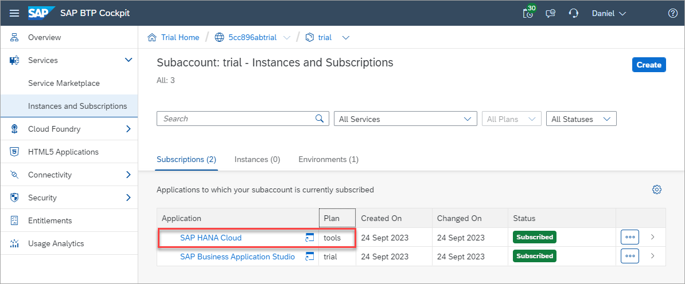
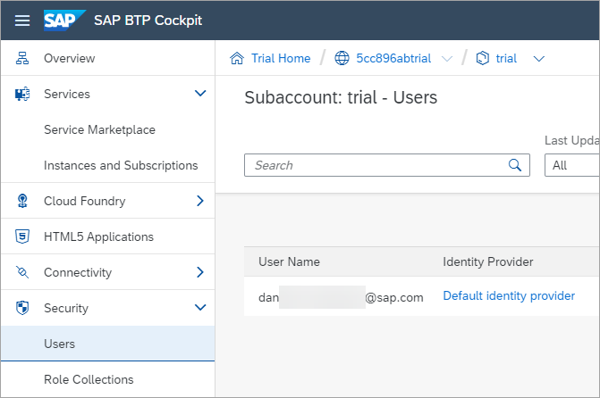
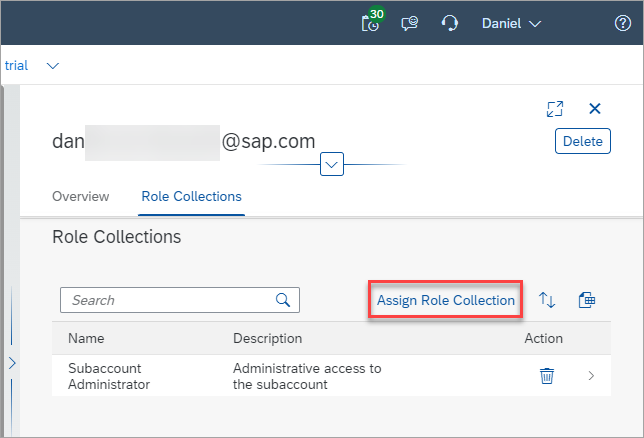
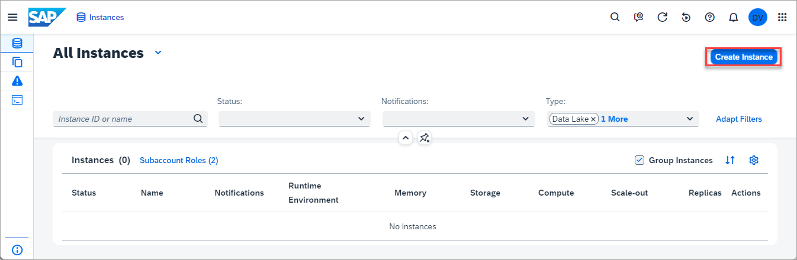
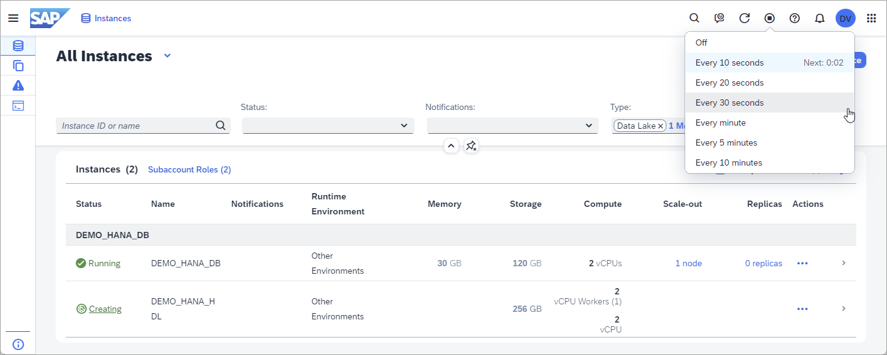

# Register for a Trial SAP BTP Account
If you wish to continue the exercises outside of SAP TechEd and do already have an SAP BTP account to use, you can register for a trial account at https://www.sap.com/cmp/td/sap-hana-cloud-trial.html.  A [free tier](https://developers.sap.com/tutorials/btp-free-tier-account.html) account can also be used but it does require providing a credit card number.  A benefit of using free tier is that the account can be upgraded to a paid service plan without having to re-create the account.

After registering for a trial account using the link above, open your SAP BTP Cockpit and get started by creating a SAP HANA Cloud instances.

1. Open the [welcome page](https://account.hanatrial.ondemand.com/trial/#/home/trial) and go to your trial account.
    

2. Enter the subaccount.

    

3. Navigate to **Instances and Subscriptions** and then add a subscription to the **SAP HANA Cloud tooling**.  

    

    For the service select **SAP HANA Cloud** and for the plan select **tools**.

    

    A new subscription to SAP HANA Cloud Central will appear.

    

4. To access the tools three roles are provided:

    * SAP HANA Cloud Administrator 

    *  SAP HANA Cloud Security Administrator - provides the ability to reset the DBADMIN and HDLADMIN passwords

    * SAP HANA Cloud Viewer - provides read-only access to SAP HANA Cloud Central

    Navigate to **Security > Users** and click on your user.  

    
    
    Click on **Assign Role Collection**.

    
    
     Add the role collection **SAP HANA Cloud Administrator**.

5.	Under Instances and Subscriptions, open SAP HANA Cloud Central.

    

6.	Click the button **Create** in the top right and select SAP HANA Cloud, SAP HANA Database to invoke the Create Instance wizard.  
    > Only one instance of a HANA Cloud database can be created in trial or free tier accounts.  If you already have an SAP HANA Cloud database instance created, it can be used.
    
    

7.  Choose **SAP HANA Cloud, SAP HANA Database** and click the button **Next Step**.

8.  Use default values for the remainder of the wizard, with the following exceptions:
    * In Step 2 (General), enter **DEMO_HANA_DB** for the instance name. Enter and confirm your administrator password – ***PLEASE REMEMBER IT AND/OR WRITE IT DOWN!***
    * In Step 6 (Data Lake), turn on the toggle switch to Create Data Lake. Enter **DEMO_HANA_HDL** for the instance name.

9.	Complete the wizard.

    The SAP HANA Cloud instances DEMO_HANA_DB and DEMO_HANA_HDL will be created, and this process may take  approx. 10 minutes.  The frequency of updates to the page can be set using the auto-refresh feature in the top right.  Once the instances are created, their status will change to RUNNING.

    

Feel free to move to the next exercise on the SAP BTP while waiting for the SAP HANA Cloud, SAP HANA database instance to switch to a running status.

## Summary

You now have opened the SAP BTP Cockpit and have opened SAP HANA Cloud Central which is the central tool used for administration of SAP HANA Cloud instances.

Continue to - [Exercise 3 - Overview of the SAP Business Technology Platform](../ex3/README.md)